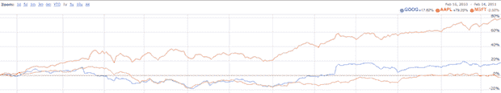

# 苹果现在以 1000 亿美元成为最有价值的科技公司；谷歌逼近微软 

> 原文：<https://web.archive.org/web/https://techcrunch.com/2011/02/14/apple-eats-microsoft/>

# 苹果现在以 1000 亿美元成为最有价值的科技公司；谷歌逼近微软

很难相信，当我写下下面这篇帖子的时候，甚至还不到一年:[苹果在价值上超过微软会发生什么？是的，当](https://web.archive.org/web/20230203032525/https://techcrunch.com/2010/03/26/apple-microsoft-stock/)。更难以置信的是，有多少人认为我说这话是疯了——仅仅两个月之后,[就发生在](https://web.archive.org/web/20230203032525/https://techcrunch.com/2010/05/26/apple-microsoft-market-cap-2/)!虽然很多人似乎认为苹果成为最有价值的科技公司的火炬传递是短暂的，但让我们看看今天我们在哪里。截至今天下午收盘时，苹果市值已经超过微软整整 1000 亿美元。

是的，苹果是世界上最有价值的科技公司，价值 1000 亿美元。从某种角度来看:惠普的市值是 1050 亿美元。苹果现在比其他任何一家科技公司都更值得一个惠普。

当我去年 3 月写第一篇文章时，苹果的市值为 2080 亿美元，而微软为 2610 亿美元。到 5 月份苹果超过微软时，两家公司的市值都在 2270 亿美元左右。截至今天，苹果的市值为 3300 亿美元，而微软为 2280 亿美元。在过去的 9 个月里，苹果公司的市值增加了 1000 亿美元。微软？10 亿美元。

事实上，现在很明显的是，微软不仅不会很快夺回最有价值的科技公司的桂冠，而且他们正在考虑被挤到第三位，甚至第四位。在过去的一年里，虽然微软的股价略有下跌，但谷歌的股价却上涨了近 100 美元。这使得这家搜索巨头的市值超过了 2000 亿美元。他们现在距离微软只有 280 亿美元。

换句话说，就市值而言，谷歌比我去年写那篇文章时的苹果更接近微软。又是一个杀手季度，谷歌或许也能拿下他们。

与此同时，IBM 接近 2020 亿美元。他们的股票在过去一年上涨了近 40 点。他们也有机会超过微软。

只是为了先发制人所有不可避免的“市值不代表任何东西”的评论，时间已经证明它可能意味着什么。当苹果去年超过微软时，微软在收入和利润方面仍遥遥领先于苹果。华尔街不在乎。投资者看到了不祥之兆。果不其然，到 10 月份，苹果公司的收入二十年来首次超过了微软公司。这一季度，微软能够在利润上保持与 T2 的微弱优势，但这很可能在下一季度也会下降。苹果是最有价值的科技公司，这是有充分理由的。

哦，如果你想知道的话，苹果距离成为世界上最有价值的上市公司还有 900 亿美元。埃克森美孚的市值为 4220 亿美元——和苹果一样，该股也在持续上涨。