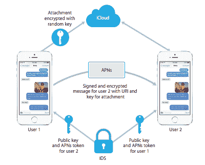

# 苹果解释了 iMessage 到底有多安全

> 原文：<https://web.archive.org/web/https://techcrunch.com/2014/02/27/apple-explains-exactly-how-secure-imessage-really-is/>

每天都有数百万人使用 iMessage。但是有多少人知道*到底*幕后发生了什么，或者一旦你发送了一条信息会发生什么？

可能有几个。到目前为止，我们对 iMessage 内部运作的绝大多数了解都来自逆向工程和最佳猜测。然而，本周，苹果悄悄发布了一份文件，对这一切进行了分解。

如果你对密码学有所了解，你可以[在这里找到这份文件。](//web.archive.org/web/20230331055802/https://images.apple.com/iphone/business/docs/iOS_Security_Feb14.pdf)iMessage 部分从第 20 页开始，但里面还有各种关于云钥匙链和硬件安全的疯狂有趣的东西。

如果你不太了解 crypto，我会试着在下面分解一下。我承认我的密码知识有很多空白，但是我已经和比我更了解这个话题的人反复核对过了。

在我们深入到更深的东西之前，你必须理解这里起作用的一个总体概念。这在技术领域是一个相当标准的概念，但大多数人从来没有考虑过这个问题。这就是所谓的公钥密码。

简单来说:假设你有一个邮箱。这个盒子有两把钥匙。一把钥匙让你把邮件放进投信口，一把钥匙让你把邮件取出来。输入键和拾取键*完全*不同；一个永远不能用来取代另一个。你可以分发一百万份你的输入键，除了把邮件*放入*之外，没有人可以用它做任何事情。除非他们找到你的收件钥匙的副本或发现你的邮箱设计的弱点，否则你的邮件是安全的。

这是公钥加密背后的思想。您的“公钥”就像邮件槽密钥。你可以和全世界分享，任何人都可以加密消息发送给你。但是公钥只在一个方向起作用。一旦消息被加密，公钥就不能被用来解密或逆转加密。一旦加密，你的*私有*密钥(在上面的类比中，是邮件拾取密钥)是将消息恢复到其原始可读形式的唯一方法(除非利用超级计算机的暴力)。

**至此，iMessage 的工作方式如下:**

*   当用户第一次启用 iMessage 时，您的设备会创建两组私钥和公钥:一组用于加密数据，一组用于签名数据(阅读:签名数据是数据的二级模糊描述，有助于验证加密文本在发送到服务器后未被修改。如果这两样东西不匹配，危险信号就会响起。)
*   您的公钥被发送到苹果的服务器。您的私钥存储在您的设备上。苹果永远看不到你的私钥。
*   当有人开始与您进行 iMessage 对话时，他们会从 Apple 的服务器获取您的公钥。在信息离开发送者的设备之前，它被加密成只有你的设备知道如何解密的东西。
*   So if Apple never has your private key, how do messages arrive at all of your devices in a readable form? How do your private key(s) get from one device to the other?

    简单的回答是:他们没有。实际上，你添加到 iCloud 的每台设备都有一套密钥，每条 iMessage 都是针对每台设备独立加密的。因此，如果你有两台设备——比如说一台 iPad 和一台 iPhone——发送给你的每条信息实际上都被加密了(AES-128)，并在苹果的服务器上存储了两次(T0 和 T1)。每个设备一次。当你拉下一条信息时，它是专门为你所在的设备加密的。

*   一些数据(“如时间戳和 APN 路由数据”，苹果说)没有加密。
*   所有这些独立加密/未加密的数据在你的设备和苹果服务器之间的传输过程中作为一个整体被加密。这使得位于你和苹果服务器之间的攻击者很难弄清楚什么数据是什么，以及他们实际上应该尝试解密什么。
*   对于长消息和图片，情况有所改变，苹果可以在 iCloud 服务器上保存照片和其他媒体，但无法查看它们。在这种情况下，您的设备会生成一个新的随机密钥和一个 URI(读取:服务器上某些内容的地址),它会对 iCloud 服务器上存储图像/媒体的位置进行编目。苹果向你的设备发送密钥和 URI(同样，只有你的私钥可以解密)，你的设备从苹果的服务器上下载图像，并将其转换成可读的东西。
*   一旦你的设备检索到一条信息，这条信息的加密副本就会从苹果的服务器上删除。如果您有多台设备，另一个针对另一台设备的加密副本可能会保留在它们的服务器上，直到过期。邮件最多可保存七天。

太久了，没看？基本上:除非苹果遗漏了什么，或者他们的多层深度加密中隐藏了某种后门(虽然不太可能，[并非不可思议](https://web.archive.org/web/20230331055802/http://arstechnica.com/security/2014/01/how-the-nsa-may-have-put-a-backdoor-in-rsas-cryptography-a-technical-primer/))否则他们真的*不可能*不付出相当大的努力就能读取你的 iMessages。当然，理论上他们可以强行通过你的私钥。或者他们可以废弃整个系统，用有明显安全漏洞的东西取而代之，希望没人注意到。

但同样的情况也适用于其他人甚至临时存储你的信息的任何服务——当你把东西放进一个黑盒时，即使你认为你确切地知道那个黑盒是如何工作的，你也相信黑盒没有改变。如果苹果公司打算潜伏在你的 iMessages 中，他们已经让自己很难做了。

**更新:**正如一些人指出的那样，事实上，这种安全模式存在潜在的故障点。例如:因为苹果公司为每台设备加密一次信息/数据，并控制着密钥基础设施，他们可能(如果，比如说，通过法院命令)能够将另一个公钥扔进组合中——从而允许在那之后发送给你的信息被任何拥有相应私钥的人读取。

