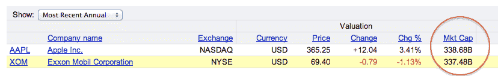
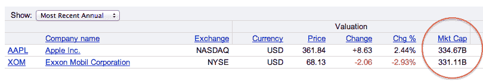
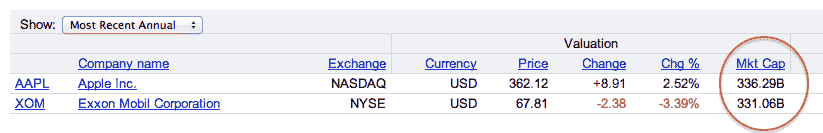
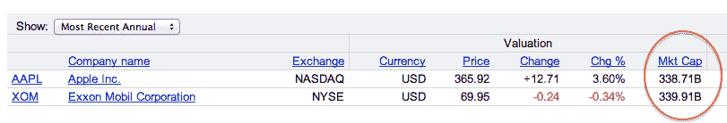
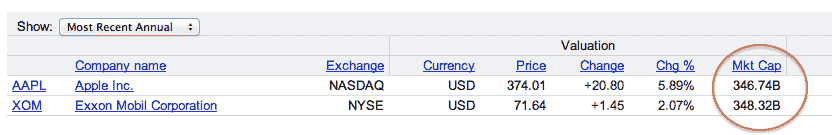

# 苹果超越埃克森成为世界上最有价值的上市公司 

> 原文：<https://web.archive.org/web/https://techcrunch.com/2011/08/09/apple-exxon-valuable-company/>

# 苹果超越埃克森成为世界上最有价值的上市公司

嗯，直到秋天，我才想到会发生这种事——但我也没想到股市会崩盘。然而，我们在这里。经过昨天的暴跌和今天的反弹，苹果刚刚超过埃克森美孚成为世界上最有价值的上市公司。

这个壮举发生在今天早上，在埃克森美孚再次略微领先之前*(更新如下)*。截至目前，两者相差不到 5 亿美元。当你想到就在三周前，也就是我发表这篇文章的时候，这两者相差 600 亿美元*时，你会觉得很不寻常。*

 *但是，现在已经是不同的时代了。三周前，埃克森美孚的市值为 4100 亿美元。如今，市值仅略高于 3400 亿美元。股价从 85 美元暴跌至 70 美元。随着大盘的崩溃，埃克森美孚的股价仅昨天一天就下跌了近 5 美元。一天之内市值蒸发了近 250 亿美元。

苹果公司昨天也遭受重创，但没有埃克森公司那么严重。今天，虽然埃克森的股票仍然低迷，但苹果的股票一直在上涨。因此，换岗。

我们会看到股票最终以什么价格收盘，但在这一点上看起来很明显，苹果将在不久的某个时候正式成为世界上最有价值的上市公司。

**更新**:苹果现在又领先埃克森了。这一差距似乎正在扩大——苹果领先超过 10 亿美元。

**更新 2** :随着两只股票都在下跌，苹果领先优势正在增加。现在超过 35 亿美元。

**更新 3** :离收盘还有一个小时，苹果现在领先 50 亿美元。

**更新 4** :在只剩 30 分钟的时候，埃克森美孚已经大幅反弹，重新领先。

**更新 5** :最后一分钟的大幅上涨见证了埃克森美孚在苹果市值之前收盘。

**更新 6** :一天后，苹果前进了。*