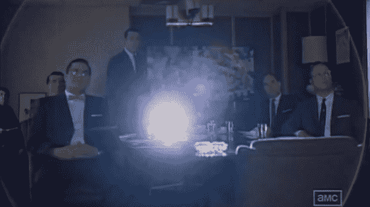

# 这就好像苹果雇佣了唐·德雷珀

> 原文：<https://web.archive.org/web/https://techcrunch.com/2010/07/10/apple-facetime-commercial/>

前几天，我和一位老朋友聊天。这位朋友不仅是技术领域之外的人，他几乎是技术通的对立面。他基本上是个勒德分子。事实上，我很惊讶他竟然和我聊天，他很少在线。但我更惊讶的是他问我的问题。"*你觉得新 iPhone 怎么样？*

知道什么是 iPhone 是一回事，但他知道有一款*新* iPhone 的事实让我有点措手不及。他和我谈这件事也是一样。我让他看我的评论。但是他看了一眼那 3500+字，立马回我了。"*我就想知道有没有好的*"我告诉他我认为这是最好的。他向我道谢并道别。但在我让他走之前，我问他到底为什么想知道。我的意思是，再一次，这是一个毫无疑问使用[这种手机](https://web.archive.org/web/20221207112202/https://beta.techcrunch.com/2010/05/21/not-just-for-drug-dealers-and-15-year-olds-kickin-it-old-school-with-a-prepaid-phone/)的家伙。他说他现在经常出差，想在旅途中和女朋友有更好的联系方式。我问他:“为什么是 iPhone？”他的回答？[商业广告](https://web.archive.org/web/20221207112202/http://www.youtube.com/watch?v=bCzzh-nexpg)。

再次看苹果的 iPhone 4 FaceTime 广告，让我想起了一件事:*广告狂人*。再过几周，这部电视剧的第四季就要开始了，但是这个广告把我带回到第一季的结尾——一集叫做“轮子”事实上，我在《T3》之前已经和《T2》谈过这一集，因为它包含了可能是整个系列中最好的一个场景。其中，广告人 Don Draper 向柯达做了一个演示，展示了为什么 Sterling Cooper 应该负责他们新的图片投影仪的客户。

广告词(你可以在这里看到[的](https://web.archive.org/web/20221207112202/http://www.youtube.com/watch?v=suRDUFpsHus)，但遗憾的是我不能嵌入)开始于柯达的两位高管承认围绕这个“轮子”创作广告很难，因为“*轮子并不真正被视为令人兴奋的技术，尽管它们是最初的*。”德雷珀回击道:“技术是一种闪闪发光的诱惑。但是很少有公众能够在 flash 之外的层面上参与进来的时候。如果他们对产品有感情纽带。”

在 iPhone 4 FaceTime 的广告中，这正是苹果所强调的。众所周知，视频聊天，甚至在手机上，都不是什么新鲜事。当然，苹果已经简化了它，但他们并没有真正在这里展示。相反，他们直击心弦。他们正在做一些相当不可思议的事情。他们在传达如果你使用该产品，你会有什么样的感受，让你感觉和广告中的人一样。他们在创造这种情感纽带。

德雷珀继续说道，谈到了他曾经共事过的一位老版权人泰迪。"*他还谈到了与产品更深层次的联系。怀旧。很精致。但是很有效。*“德雷珀启动了投影仪。泰迪告诉我，在希腊语中，怀旧的字面意思是“旧伤的疼痛”这是你内心深处远比记忆本身更强烈的痛苦。"

又是这个 FaceTime 广告。不是老图，但是更厉害。是你有段时间没见的亲人，是你远离的人，就在你面前，活着。德雷珀说:“它把我们带到了一个我们渴望再去的地方。*它让我们像孩子一样旅行。转了一圈又一圈，回到了家。去一个我们知道被爱的地方。*

苹果公司更进一步。苹果并没有像婴儿在床上爬行、母亲带着婴儿、祖父母带着即将毕业的孙子那样渲染家庭纽带，而是展示了一位怀孕的妻子正在接受超声波检查，她的丈夫在军队中，可能在海外，正在观看。当妻子按下按钮翻转相机，在显示器上显示未出生的婴儿时，他们切换到丈夫的镜头，他的脸沉了下来，好像要哭了。这是非常强大的东西。

然后，苹果将它提升了一个档次。他们展示了一个女朋友通过 FaceTime 向男朋友挥手，就像其他情侣一样。只有这样，他们才发现男朋友是聋子。但是多亏了视频功能，这两个人可以互相签名。广告结束时，他们每个人在签名告别后都敬畏地看着手机，好像他们刚刚做了令人难以置信的事情。对他们来说非常重要的东西。他们做到了。很精致。但是很有效。

苹果公司聘请好莱坞导演萨姆·门德斯(*《美国丽人》*、*《革命之路》*)执导这部广告片，应该不足为奇。人们在看电影时经常感受到的情绪水平很少会影响到广告。但是他们在这个 FaceTime 广告中，就像他们在 Draper 的 Kodak 演示中一样。这就好像苹果的广告借用了德雷柏在那一集里谈到的剧本中的一页。

当然，苹果有着出色的广告宣传历史。从 1984 年的超级碗广告(由另一位好莱坞导演雷德利·斯科特执导)，到 1984 年的 Think Different 运动，再到 1984 年的 Get a Mac 广告，每一个广告都有效地传达了品牌的不同信息。但是这个最新的广告是第一个(据我所知)真正旨在与人们建立深层情感联系的广告。这将帮助苹果销售大量的 iPhone 4s。像我朋友这样的人。

【YouTube = http://www . YouTube . com/watch？v = bCzzh-NEX pg & HL = en _ US & fs = 1 & w = 630]