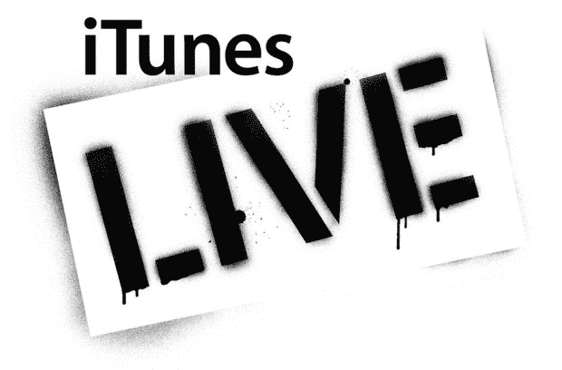
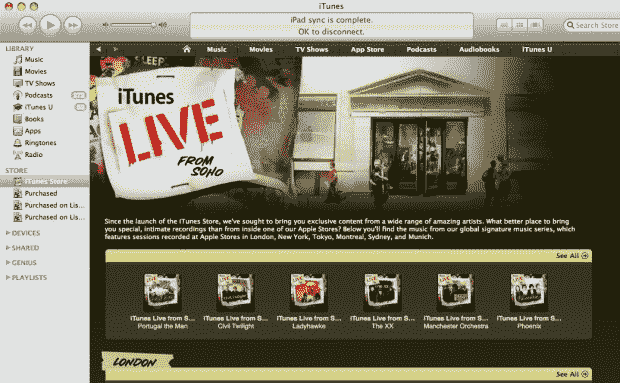

# 苹果申请“iTunes Live”商标 

> 原文：<https://web.archive.org/web/https://techcrunch.com/2010/05/09/apple-files-for-itunes-live-trademark/>

# 苹果申请“iTunes Live”商标

[苹果](https://web.archive.org/web/20221007223016/http://www.apple.com/)最近申请了相当多的商标，其中大部分被[PatentlyApple.com](https://web.archive.org/web/20221007223016/http://www.patentlyapple.com/)等网站严格跟踪和剖析。但不知何故，苹果商标通讯员 [Lisa G. Widup](https://web.archive.org/web/20221007223016/http://www.trademarkia.com/correspondent-lisa-g-widup-1-777827) 最近提交的申请却无人问津。直到今天。

看起来苹果本周早些时候申请了 iTunes Live 的商标，这可能没有任何意义，但也可能表明这家位于 Cupertino 的公司即将在 iTunes 上增加其特色现场音乐会议服务，主要是在世界各地苹果商店的特别音乐会上预先录制的现场表演(迄今为止，伦敦、蒙特利尔、纽约、东京、悉尼和慕尼黑都有店内音乐会)。

该商标由风格化的词语“iTunes Live”组成(见上图)，分为两类:

–娱乐领域的在线零售店服务，提供预先录制的音乐、音频和视听内容

娱乐服务，即安排和举办音乐会和现场音乐表演

也许这并不意味着什么，但这不应该阻止音乐迷希望在不久的将来 iTunes 上有更多的店内音乐会。

