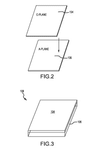
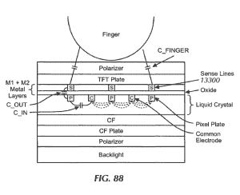

# 苹果、Hyperion 离子炮以及为什么未来的 iPhones 可能会有蓝宝石屏幕 

> 原文：<https://web.archive.org/web/https://techcrunch.com/2013/11/11/apple-fires-its-ion-cannons/>

上周晚些时候，我们发表了一篇关于[为什么苹果想要建立一个工厂](https://web.archive.org/web/20221002010411/https://beta.techcrunch.com/2013/11/08/why-apple-bought-578m-worth-of-sapphire-in-advance/)来生产蓝宝石晶体，以及为什么它可能想要预先拥有价值超过 5 . 7 亿美元的生产。今天，通过连接更多的点，我们可以拼凑出它如何克服价格和产量障碍，以便在智能手机屏幕上使用这种材料。

让我们回到 2012 年 3 月，当时一家名为 Twin Creeks 的[公司从相对隐秘的](https://web.archive.org/web/20221002010411/http://cl.ly/SPYZ)中走出来，谈论它为制造更便宜更薄的光伏(太阳能)电池而创建的新生产系统，名为 Hyperion 3。大多数太阳能电池板的制造过程包括制造一块蓝宝石或其他晶体硅，然后用锯子从上面切下 0.2 毫米厚的薄片。

Twin Creeks 的氢离子粒子加速器(基本上是一个离子炮)允许他们将晶片放在设备的边缘，并用氢离子粉碎它们。下面是来自极限科技的[过程的描述:](https://web.archive.org/web/20221002010411/http://www.extremetech.com/extreme/122231-solar-panels-made-with-ion-cannon-are-cheap-enough-to-challenge-fossil-fuels)

> 粒子加速器用氢离子轰击这些晶片，通过精确控制加速器的电压，氢离子在离每个晶片表面 20 微米的地方精确积累。然后，机械臂将晶片运送到熔炉，在那里离子膨胀成氢气，导致 20 微米厚的层被切掉。

这一过程，当应用于太阳能时，接着是用柔性金属支撑薄板。结果是在不使用锯的情况下大幅减少了板材的厚度。这导致了成本的大幅降低。

为什么我们关心一个很酷，但深奥的太阳能电池板制造过程？好吧，回到我们上周的文章，你可能记得苹果正在与一家名为 GT Advanced Technologies 的公司进行制造交易。该交易将使苹果建立一个工厂，GT Advanced 将在其中大批量生产蓝宝石玻璃。

大规模生产用于智能手机屏幕的蓝宝石的唯一问题是，大多数分析师会告诉你，这根本不划算。《麻省理工技术评论》去年年初的一份报告援引研究公司 Yole dédevelopment 的分析师 Eric Virey 的话说，蓝宝石显示屏的价格可能在 30 美元左右，或者在“几年内”降至 20 美元左右。相比之下，大猩猩玻璃的普通屏幕价格不到 3 美元。【T2

这就是乐趣所在。看，GT Advanced 实际上在 2012 年末收购了一家名为 Twin Creeks Technologies 的[公司。随着那次收购，GT Advanced 获得了一堆专利和设备，包括其 Hyperion 离子注入机(如上图)。虽然离子炮主要用于半导体衬底和太阳能晶片，GT Advanced 在其发布中提到了另一种用途。](https://web.archive.org/web/20221002010411/http://investor.gtat.com/releasedetail.cfm?ReleaseID=728679)

“此外，GT 预计将继续开发薄蓝宝石层压板，用于盖和触摸屏设备等应用**，”新闻稿中写道(重点是我们的)。“Hyperion 离子注入机有可能最大限度地减少或在某些情况下消除对晶片锯的需求，这将大大降低生产成本”**

因此，Hyperion 技术应该能够使 GT Advanced 显著降低为智能手机构建蓝宝石屏幕的相关成本。但是制造成本低廉的超薄晶圆只是问题的一半。另一半是层压过程，蓝宝石与另一片材料相匹配。

这让我们想到了几个月前，苹果公司[提交了一项名为“蓝宝石层压板](https://web.archive.org/web/20221002010411/http://appft.uspto.gov/netacgi/nph-Parser?Sect1=PTO2&Sect2=HITOFF&p=1&u=%2Fnetahtml%2FPTO%2Fsearch-adv.html&r=1&f=G&l=50&d=PG01&S1=(428%2F157.CCLS.+AND+20130912.PD.)&OS=ccl/428/157+and+pd/9/12/2013&RS=(CCL/428/157+AND+PD/20130912))的专利，其中讨论了将蓝宝石板与其他蓝宝石板或玻璃层压在一起的各种方法。有各种各样的抽象，但关键是一种方法，它将两个单独的表匹配在一起，以创建一个“块”。我们在这里看到的关键声明是“一种玻璃组件，包括:玻璃板；和粘附到玻璃片上的蓝宝石片，其中该组件的厚度小于或约等于 1 毫米

该权利要求概述了一种生产玻璃片并与蓝宝石片配合以制造屏幕的工艺(另一项权利要求也描述了一种使用两块蓝宝石片的“夹层工艺”)。为什么屏幕下面是玻璃，上面是蓝宝石？

因为玻璃比蓝宝石便宜得多，苹果一直用它来制造内置触摸屏。2012 年末提交的另一项专利解释了这一过程(通过 apple insider[):](https://web.archive.org/web/20221002010411/http://appleinsider.com/articles/12/08/14/apples_newly_patented_in_cell_touchscreen_tech_could_be_bound_for_next_gen_iphone)

> 通过集成 LCD 和触摸传感器的分层结构，可以实现各种好处。这种集成可以包括组合或交织上述分层结构。集成还可以包括消除冗余结构和/或找到特定层或结构的双重目的(例如，一个目的用于触摸功能，另一个目的用于显示功能)。这可以允许去除一些层，这可以降低触摸屏 LCD 的成本和厚度，以及简化制造。

基本上，苹果将把触摸电路与 LCD 显示屏融合在一起，创造出一个更薄的单一部分。如果生产价格下降，这显然会使设备更薄，更具成本效益。这适用于标准面板和面内切换(IPS)面板，苹果最近开始使用这种面板。不幸的是，到目前为止，还没有任何针对 in-cell 技术和蓝宝石晶体的商业解决方案。

相反，苹果的专利概述了一种方法，可以将 GT Advanced 制造的超薄蓝宝石片与便宜得多的玻璃片融合在一起。

通过这样做，与传统方法相比，苹果可以将蓝宝石片的成本降低到令人难以置信的低水平。它将能够从制造一整块蓝宝石盖玻片所需的相同数量的原材料中制造出许多这样的超薄蓝宝石片。然后，它可以像目前处理 iPhones 一样将组件层压在一起(但 iPads 不会这样做，即使是新款 air 也不会)。

通过这样做，苹果可以充分扩展蓝宝石的生产和成本因素，以支持制造全尺寸显示器盖板，而不仅仅是小型可穿戴面板、按钮或保护性相机外壳。反过来，这可能意味着你的 iPhone 上的蓝宝石盖板比标准玻璃材料更硬更韧，比大多数分析师预测的要早几年。