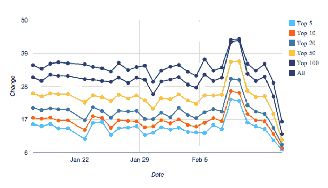
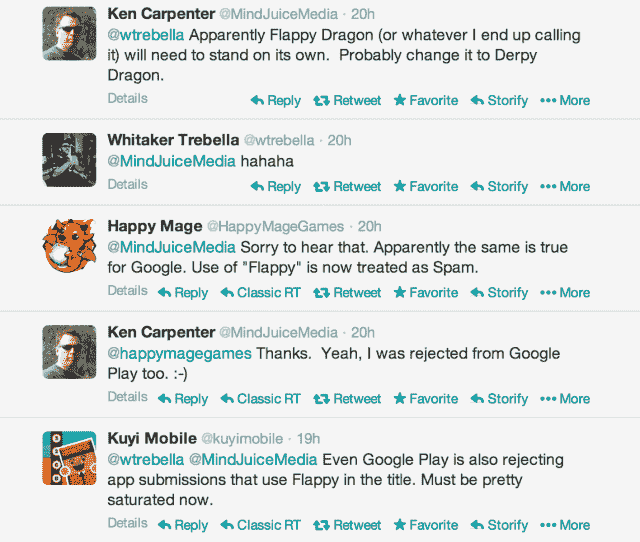

# 苹果和谷歌开始拒绝标题中带有“Flappy”的游戏 

> 原文：<https://web.archive.org/web/https://techcrunch.com/2014/02/15/apple-google-begin-rejecting-games-with-flappy-in-the-title/>

尽管原创者 Dong Nguyen 从 App Store 中删除了最初的标题，但 Flappy Bird 现象并没有放缓的迹象，他的新名声显然变得太大了。尽管“Flappy Bird”本身可能已经消失，但今天应用商店的[排行榜上充满了模仿这款令人上瘾、令人沮丧的游戏的克隆](https://web.archive.org/web/20230201160004/https://techcrunch.com/2014/02/10/gone-but-not-forgotten-flappy-bird-clones-fill-the-app-stores-top-charts/)，这款游戏成为了今年的热门游戏。

然而，这种情况可能不会持续太久。有消息称，苹果和谷歌现在都拒绝标题中带有“flappy”字样的游戏。

据来自 [Mind Juice Media 的游戏设计师 Ken Carpenter 称，](https://web.archive.org/web/20230201160004/http://www.mindjuice.net/)苹果在应用商店拒绝了他的一款名为“Flappy Dragon”的应用。苹果告诉他“我们发现你的应用程序名称试图利用一个流行的应用程序，”卡彭特说。

苹果告诉他，该应用违反了 App Store 审查指南的以下部分:

> 原因:
> 
> 22.2:包含虚假、欺诈或误导性陈述的应用将被拒绝
> 22.2
> 我们发现您的应用和/或其元数据包含可能误导用户的内容，这不符合 App Store 审查指南。
> 我们发现您的应用名称试图利用一款流行的应用。

显然,“Flappy Dragon”唯一可以利用的应用程序是“Flappy Bird ”,明确地说，从技术上讲，它已经不在 App Store 中了。

卡彭特似乎不是唯一受到政策转变影响的游戏开发商。来自 Kuyi Mobile 的一条[推文](https://web.archive.org/web/20230201160004/https://twitter.com/kuyimobile/status/434520121097207808)指出，一小撮试图推出他们自己的“Flappy”克隆产品的开发者也因为同样的原因被拒绝:

这有点奇怪，因为市场上已经有几个类似名字的游戏，包括“Flappy Bee”，“Flappy Plane”，“Flappy Super Hero”，“Flappy Flyer”，甚至“Flappy Bird Flyer”，Carpenter 指出。另外，有一些克隆版本的标题中不包含“Flappy”，比如“Splashy Fish”和“iron pants”——目前在 App Store 的排行榜中排名第一和第二。与此同时，其他包含“Flappy”但不使用它的网站也表现不错:排名第三的是“城市鸟 Flappy Flyer”，排名第七的是“飞鸟 Flappy Bird Flyer”。

换句话说，App Store 的排行榜正在被“Flappy Bird”的克隆体彻底摧毁。用户们仍在大量食用它们。

但也许适可而止？苹果可能不希望 App Store 充斥着这些衍生产品，尤其是因为它们的泛滥可能会引起消费者的困惑。“Flappy Bird”热潮席卷了主流媒体，这意味着日常用户可能不会关注这个正在进行的传奇中的每个转折点，而只会访问应用商店并搜索下载。

不幸的是，如果苹果试图阻止这些“Flappy Birds”的克隆产品占领 App Store 的顶级市场，他们已经太迟了。现在，新的拒绝有可能被视为不公平，因为有些人的“Flappy”仿冒品仍然是活的，排名很好……并且还赚了很多额外的钱。公平的做法是强迫每个人给他们的“flappy”游戏重新命名，或者把“flappy”从他们的关键词中去掉。(**更新**:可能是这样！见下文。)

同样值得注意的是，就在开发者们在 Twitter 上讨论“Flappy”被拒事件的同时，苹果排行榜的移动陷入了停滞。下面是一张图表，显示了 [MobileDevHQ](https://web.archive.org/web/20230201160004/http://www.mobiledevhq.com/) 提供的 iOS 排行榜的平均变化次数。你可以看到它跌落悬崖，这意味着截至 2014 年 2 月，排行榜实际上被“冻结”了。

图表很快恢复正常，MobileDevHQ 表示，这看起来更像是苹果方面的短暂错误，而不是算法变化。

## 谷歌也拒绝“Flappy”

然而，苹果并不是唯一一个决定从 app store 中剔除“Flappy Bird”克隆产品的公司。 [Kuyi Mobile](https://web.archive.org/web/20230201160004/https://twitter.com/kuyimobile/status/434506519267143681) 和 [Happy Mage Games](https://web.archive.org/web/20230201160004/https://twitter.com/HappyMageGames/status/434492825678270467) 都表示，谷歌也拒绝在标题中使用“Flappy”的应用程序提交。

木匠说，“是的，我也被 Google Play 拒绝了。”

“我第一次认为这是因为我加入了一句话，说‘Flappy Dragon’是最好的扑翼游戏，因为‘Flappy Bird’已经死了。卡彭特解释说:“我的应用程序最初出版时没有发行，在网上可以搜索几个小时。

不久之后，谷歌将其从搜索中移除，但仍可通过其直接链接看到。大约 24 小时后，他收到了停职通知。“没有谷歌声称在采取此类行动前发出的‘合理警告’邮件。我反复检查我的垃圾邮件文件夹，以确保万无一失。卡彭特说:“他们在没有任何警告的情况下擅自删除了应用程序。“他们发给我的信息只是提到了 Google Play 条款中的‘垃圾邮件’条款，并没有明确指出我的违规之处，”他补充道。

在移除描述中竞争对手的应用名称后，卡彭特重新提交了游戏。几个小时后，它也从搜索中消失了。

我们联系了苹果和谷歌寻求评论，但鉴于现在是周末(苹果通常不会回应关于 App Store 政策变化的询问)，这两家公司可能不会立即回应这篇文章的更新。

*帽子尖:[Ouriel Ohayon](https://web.archive.org/web/20230201160004/https://twitter.com/OurielOhayon/status/434486416060329984)；本人* *法师信用:Flappy tee，发推[@ kunaalarya](https://web.archive.org/web/20230201160004/https://twitter.com/kunaalarya/status/434448555982344192)；注意:文章在发表后更新了卡彭特的附加评论。*

**更新**，2014 年 2 月 19 日:在这篇文章发表后，另一位开发人员主动表示，他的应用程序在标题中带有“Flappy”，但该应用程序从未在任何国家的排名中列出。这与我们现在听到的一致:这些不是全面的拒绝，而是本质上更加微妙。