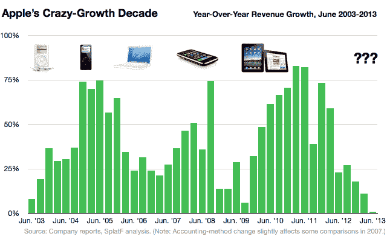

# 苹果的增长火箭碰壁了。什么能让它重新开始？

> 原文：<https://web.archive.org/web/https://techcrunch.com/2013/07/23/apple-growth-decade/>

苹果过去十年的惊人增长是所有科技领域最大的故事之一。即使公司推出了一个又一个新产品，规模越来越大，其增长速度继续*加速*，[远远超过竞争对手](https://web.archive.org/web/20221209210442/http://readwrite.com/2012/01/24/apple_sales_growth_rate)。

在过去的十年里，苹果公司每个季度都公布了年同比收入增长，几乎总是超过 25%，经常超过 50%。在这期间，它从一个季度销售额不到 20 亿美元的公司变成了一个(曾经)超过 500 亿美元的公司。2011 年连续两个季度，随着 iPad 和 iPhone 的增长，苹果公布的增长率*超过 80%——*每个季度都比去年同期增加了 100 多亿美元的新销售额。对于这么大的公司来说，这太疯狂了。

但是现在，这个令人难以置信的增长火箭已经回到了地球。今天报道的苹果最近一个季度，仅比去年增长 1%。这不是侥幸:增长已经下滑了一年多。在 2011-2012 年的一个伟大的冬天之后，当苹果的销售额增长 73%，然后是 59%，现在是 23%，27%，18%，11%，现在是 1%。苹果预计下一个季度的同比增长率将在 3%至 5%之间。

发生了什么事？有些只是有趣的时机:一年前发布产品，下一年又发布。随着产品的成熟和市场的稳定，库存调整——例如，这在过去一个季度疲软的 iPad 销售中发挥了作用。特别是今年，苹果在新设备方面一直很安静，因为设计老板 Jony Ive 重新包装了其 iOS 操作系统，可能是为了圣诞节期间的新 iPhones、iPods 和 iPads。这就是任意的季度标记期有时会模糊镜头的地方。

但还有一个更大的趋势是苹果无法复制的:向智能手机和平板电脑的巨大转变——“后 PC”革命。苹果出色地抓住了这一趋势，尽管销售相对较少，主要是高端设备，但仍主导了行业的[销售和利润](https://web.archive.org/web/20221209210442/http://www.businessinsider.com/apples-incredible-profits-and-small-market-share-2013-5)。而且它可能会继续这样做。但是这种首次采用的循环不会再发生了。至少在苹果最强的市场不会，在那里运营商补贴允许如此高的利润率，比如美国。

那么假设苹果想要继续增长，它接下来能做什么呢？(一个安全的假设。)

一个显而易见的答案是将其现有产品线向低端转移。对于苹果来说，这总是一个棘手的命题，因为该公司发誓永远不会发布一款它不引以为豪的低质量产品。(而且不应该。)到目前为止，这意味着以低价出售旧 iPhones，这相当成功。但如果这种增长发生在更低端的细分市场，苹果甚至可能不得不寻找更便宜的产品。从设计和质量角度来看，竞争的底线在哪里？我们可能会在今年发现[传言的低价 iphone](https://web.archive.org/web/20221209210442/https://beta.techcrunch.com/2013/07/06/low-cost-iphones-plastic-case-shows-up-in-alleged-video-and-photo-leak/)是否是真的。

当然，另一种可能性是进军新市场。多年来，人们一直猜测苹果将开始销售电视机。最近的话题是关于可穿戴电脑——苹果公司的腕上设备，就像耐克公司的 Fuelband。

可穿戴设备的好处在于，与智能手机一样，也不同于台式电脑，它们是那种家里每个人都需要自己的设备，这意味着一个更大的潜在市场。但与手机不同的是，补贴、运营商分销甚至定价都没有现成的先例。苹果能设计出你想整天戴在身上的东西吗？我们走着瞧。这会像智能手机的崛起一样创造同样的需求水平、优惠价格和高利润率吗？大概不会。尽管如此，如果它大获成功，肯定会推动苹果公司的显著增长。

因此，这是未来的一个大问题:有什么能像过去 6 年 iPhone 和 iPad 以及之前的 iPod 和 Mac 那样推动苹果的增长吗？

苹果资深分析师吉恩·蒙斯特(Gene Munster)在今天的财报电话会议上问了这个问题的一个版本:“有没有足够大的产品类别来推动苹果的发展？”苹果公司首席执行官蒂姆·库克的回应:“我们走着瞧，吉恩。我们正在开发一些我们真正引以为豪的东西，我们将拭目以待。”而且，以典型的苹果风格，“我们会在准备好的时候宣布。”

丹·弗罗默是科技新闻网站 [SplatF](https://web.archive.org/web/20221209210442/http://www.splatf.com/) 和移动旅游初创公司 [City Notes](https://web.archive.org/web/20221209210442/http://citynotes.io/) 的创始人。他之前帮助创建了 Business Insider，负责苹果的报道。在 Twitter 上通过[@ frome home](https://web.archive.org/web/20221209210442/https://twitter.com/fromedome)关注 Dan。