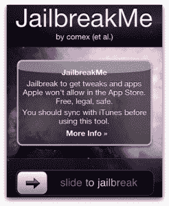

# 苹果雇佣 iPhone 黑客越狱黑客(@Comex)

> 原文：<https://web.archive.org/web/https://techcrunch.com/2011/08/26/apple-hires-iphone-hacker-nicholas-allegra-comex/>

苹果刚刚雇佣了 iPhone 越狱社区的另一名成员，越狱黑客，在 Twitter 上也被称为“ [@comex](https://web.archive.org/web/20230204080351/https://twitter.com/#!/comex) ”。Allegra 最出名的是 [JailBreakMe 网站](https://web.archive.org/web/20230204080351/http://www.jailbreakme.com//)，它让越狱 iPhone 的过程变得像使用移动 Safari 访问网页一样简单。

这位来自纽约州查帕夸的 19 岁黑客在 Twitter 上发布了他被雇佣[的消息，称他将于下周开始在苹果公司实习。](https://web.archive.org/web/20230204080351/https://twitter.com/#!/comex/status/106863873952448512)

 Allegra 是越狱社区中最引人注目的成员之一，定期发现苹果 iOS 软件中的安全漏洞，这使得黑客攻击 iPhones、iPod Touches 甚至 ipad 成为可能。通常，这些漏洞是通过使用专门的越狱软件应用程序来利用的，这些应用程序要求手机或其他设备通过 USB 电缆连接到计算机。

但是 JailBreakMe 更容易使用——访问者只需从他们的移动设备上启动网站。该网站在页面底部有一个熟悉的“滑动越狱”栏。一个简单的手势，设备就被黑了。它使得任何人都可以越狱，甚至是非技术用户。

传统上，苹果不鼓励越狱，因为它允许在官方 iTunes 应用商店之外安装第三方应用程序。令人担忧的是，一旦手机或其他设备被越狱，非法盗版应用程序就更容易了，否则这些应用程序会在 App Store 中出售，从而为开发者和苹果等公司带来收入。

然而，并非所有越狱者都对窃取应用感兴趣——有时，就像他们的 Android 对手一样，他们只想控制自己的手机。在越狱的 iOS 设备上，用户可以通过 Cydia、Icy 和 ThemeIt 等第三方“越狱”应用商店对软件进行调整，并安装小工具、主题和其他未经批准的应用程序。

最近几个月，苹果已经开始注意到现在蓬勃发展的越狱社区，估计包括所有 iPhones 的 10%。例如，[苹果在 6 月](https://web.archive.org/web/20230204080351/https://techcrunch.com/2011/06/03/apple-hires-the-guy-who-hacked-together-a-better-ios-notifications-system/)雇佣了彼得·哈贾斯，他是一款流行的越狱应用“移动通知”的开发者，这款应用与 iOS5 中的新通知系统有着惊人的相似之处。此举引发了关于苹果是否正在重新考虑其在越狱方面的立场的讨论——也许它现在被认为是一个发现新人才的农场联盟？

今年越狱变得更加主流，这要归功于它有史以来第一次名为 [MyGreatFest](https://web.archive.org/web/20230204080351/http://mygreatfest.net/) 的黑客大会。据活动组织者称，阿莱格拉计划参加会议，但现在还不清楚他是否会参加。

MyGreatFest 组织者克雷格·福克斯(Craig Fox)说，“我认为这对 Allegra 来说是一个伟大的举动，但对于越狱社区来说，失去这样一个聪明而年轻的黑客是令人悲伤的。”

*图片来源:[福布斯](https://web.archive.org/web/20230204080351/http://www.forbes.com/sites/andygreenberg/2011/08/01/meet-comex-the-iphone-uber-hacker-who-keeps-outsmarting-apple/)，本月早些时候曝光了@ comex】*