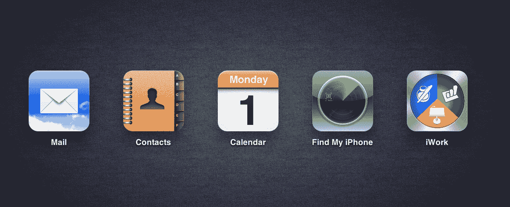
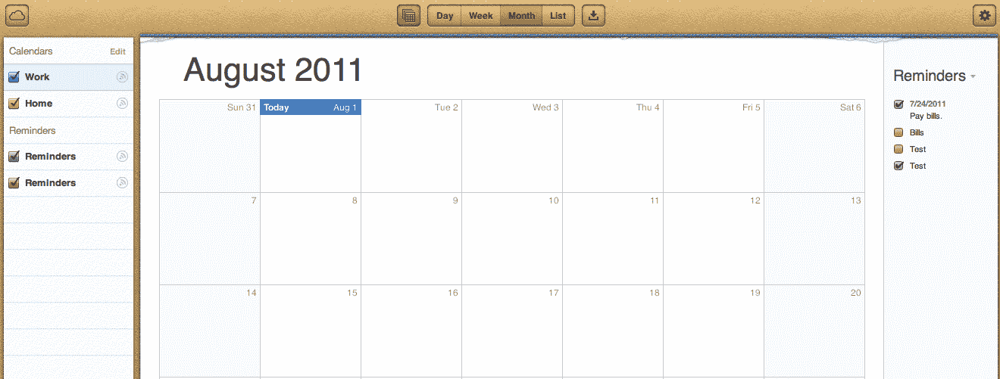
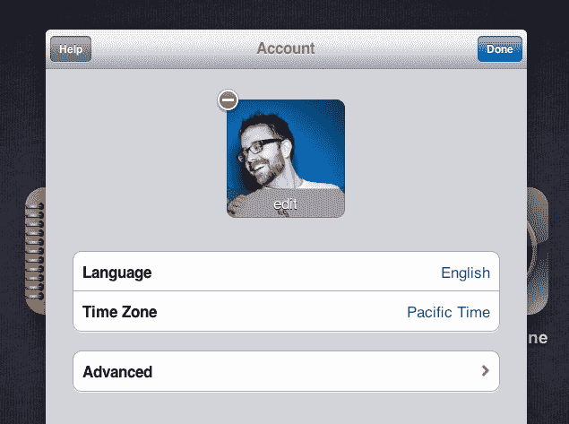
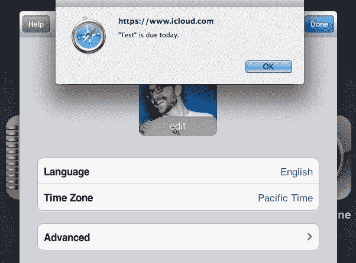
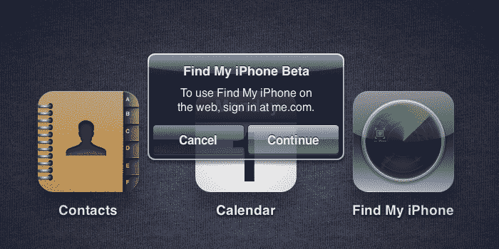
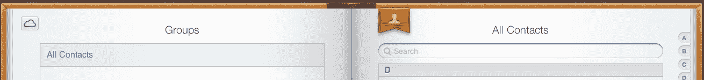
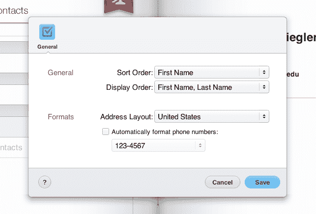
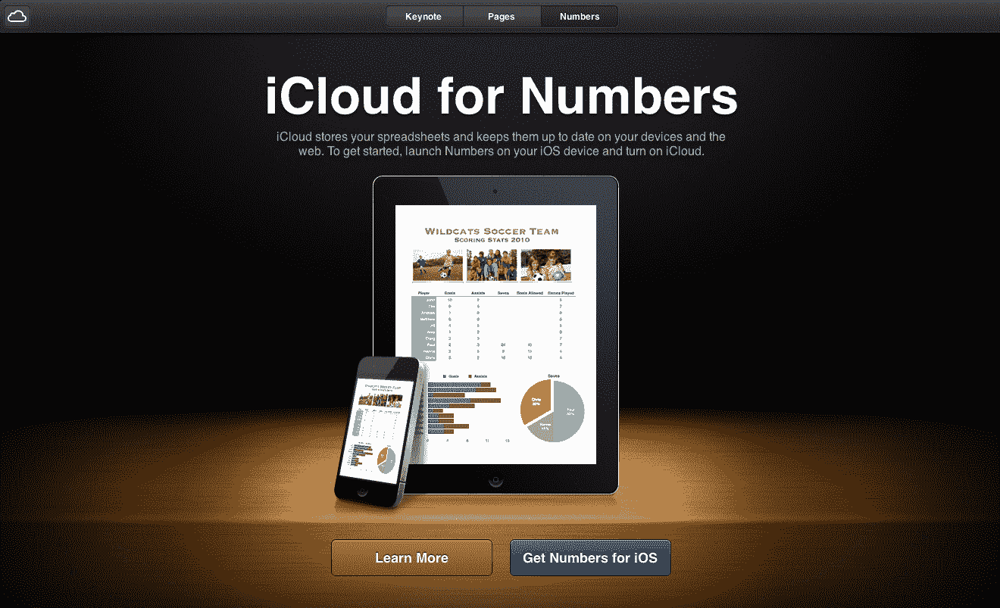
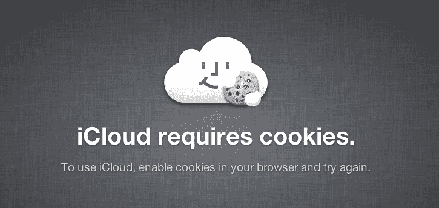

# iCloud Web 应用不仅存在，而且非常漂亮 

> 原文：<https://web.archive.org/web/https://techcrunch.com/2011/08/01/apple-icloud-dot-com-web-apps/>

# iCloud Web 应用不仅存在，而且非常漂亮

也许你还记得，早在 6 月份，对于苹果即将推出的 iCloud 产品套件是否会有网络应用，人们有些困惑。虽然我们从一开始就坚持说[我们听说会有](https://web.archive.org/web/20230215134419/https://techcrunch.com/2011/06/08/apple-icloud-google-cloud/)，但有些人确信[不会有](https://web.archive.org/web/20230215134419/http://thisismynext.com/2011/06/13/icloud-apple-strategy-flaw/)—[再次反驳了](https://web.archive.org/web/20230215134419/https://techcrunch.com/2011/06/14/apple-hates-the-internet-except-not/)。无论如何，这最终让苹果澄清，是的，[会有 iCloud 的网络应用](https://web.archive.org/web/20230215134419/https://techcrunch.com/2011/06/24/icloud-on-the-web/)。不过，还不清楚它们会有多强劲，或者在“今年秋天”之后何时上市。今天，我们得到了更多的答案。

iCloud.com 刚刚上线。这似乎是一个很好的迹象，表明 web 组件将在未来几个月的某个时候与 iCloud 一起推出。如果登录界面有任何暗示的话，网络应用将会非常漂亮。

但实际上，我们不必仅仅依赖登录屏幕，因为虽然这可能意味着开发者可以进行测试(只有他们可以使用 iOS 5 中的 iOS 同步功能)，但实际上，任何人都可以登录并查看 iCloud.com 应用程序的外观。还是很漂亮。

这并不奇怪。苹果的优势之一一直是审美。但是同样好的是这些应用程序的功能有多灵活。在 Safari 和 Chrome 中，所有的应用都感觉反应灵敏，并具有许多微妙的过渡触摸，可能使用了 HTML5。

除了 iCloud.com 上线，苹果还发布了更多关于 iCloud 定价的信息。“5GB 的免费存储空间对大多数人来说已经足够了。但如果你需要额外的空间，你可以随时购买额外的存储空间，”苹果在网站上写道。这些价格是:

*   10gb 附加空间，每年 20 美元
*   20 GB 的额外空间，每年 40 美元
*   以每年 100 美元的价格额外增加 50 GB

请注意，您从 iTunes/App Store 购买的 iCloud 照片流、iOS 应用程序、音乐和电视节目不计入您的 5GB 免费存储空间。

