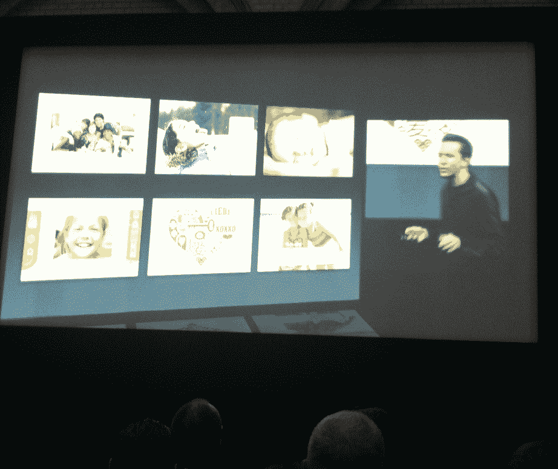
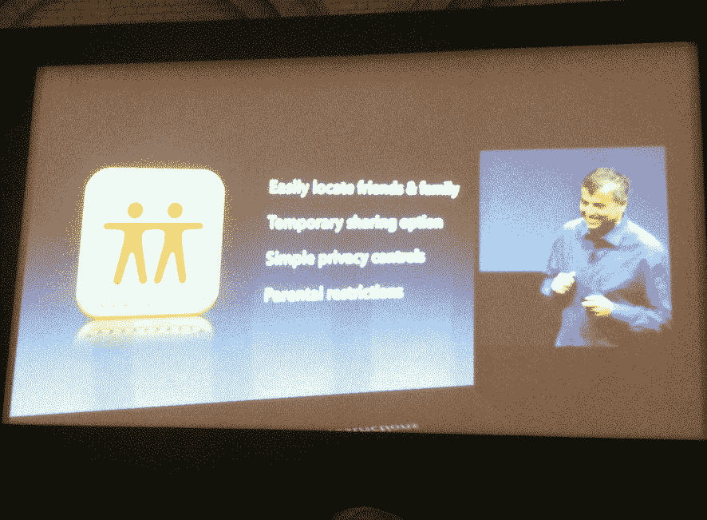
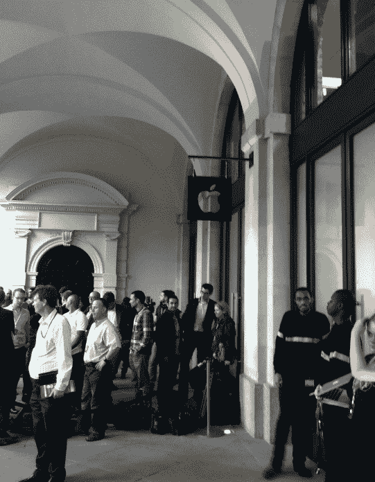

# 伦敦现场直播:苹果远程 iPhone 活动 

> 原文：<https://web.archive.org/web/http://techcrunch.com/2011/10/04/apple-iphone-event-2011-live/>

上周，当媒体发出邀请参加今天的苹果 iPhone 发布会时，我想“糟了，我要去伦敦了”。事实证明，这并不是一件坏事。苹果已经在这里的科文特花园苹果店设置了活动直播。我在这里，准备好从 5000 英里外直播博客。

我们会看到什么？iPhone 5？iPhone 4S ( [看起来的确如此](https://web.archive.org/web/20230203055214/https://techcrunch.com/2011/10/04/apples-japanese-site-leaks-iphone-4s-launch-date-october-14/))。iOS 5？细微差别驱动的语音控制？新 iPods？没有 iPods？还有别的吗？

*(这是 live blog——我们原本计划使用 ScribbleLive，但它已经关闭了，所以我们还是用老办法！)*

**蒂姆·库克登台**

早上好。这是我被任命为首席执行官后的第一次产品发布会。我肯定你不知道。很高兴今天能招待您。我喜欢苹果。

这个校园是我们许多人的第二个家。这有点像邀请你来我们家。这个房间是我们的市政厅。它有相当的历史。就在 10 年前，我们在这里推出了最初的 iPod。它进而彻底改变了我们听音乐的方式。一年前，我们做了新的 MacBook Air。

一些更新:苹果有强劲的势头。苹果商店。中国的两家新店。两人都创造了新纪录。在上海，100，000 游客为开幕周末。在洛杉矶，当我们在一个月内做到 10 万的时候，我们认为这很棒！

香港店。酷炫的螺旋楼梯“只有苹果能做到”。

库克现在正在展示一个简短的视频，展示“围绕我们零售的兴奋和活力”。

视频结束。“我想我看了 100 遍了。我可以更容易地观看它”

现在在中国有 6 家店——我们会做得更多！11 个国家的 357 家商店。

**Mac**

谈论 Mac 就不能不谈 Lion。评论简直不可思议。沃尔特·莫斯伯格喜欢它。我们第一次只提供 Lion 的数字下载。结果令人震惊。我们已经下载了超过 600 万份 Lion 。比雪豹多了 80%。

Windows 7 用了 20 周才达到 10%的安装量。 **Lion 在两周内完成了这件事**。

我们还发布了新款 MacBook Air。我们的顾客喜欢它。

MacBook Pro 和 iMac 是美国最畅销的笔记本电脑和笔记本电脑。Mac 的销量比 PC 市场增长了 6 倍多。我们已经连续五年这样做了。**我们现在在全球接近 6000 万用户**。

我们的市场份额稳步增长。**美国零售苹果电脑现在约占商店销售的四分之一。不久前，这个数字还在个位数左右。但是 77%的人还是在买别的东西。这只是意味着我们有一个很高的上限。**

**音乐**

iPod 的十年。它提醒了我们所有人我们是多么热爱音乐。它又成了我们生活的一部分。它成为世界上排名第一的音乐播放器。在美国，市场份额很长一段时间都在 70%以上。我们现在已经累计卖出了 3 亿多台 iPods。索尼花了 30 年才卖出 20 万台随身听。

对于苹果来说，iPod 仍然是一个巨大而重要的市场。去年我们卖出了 4500 万台 iPods。其中将近一半是给第一次购买 iPod 的人。许多是给被介绍给苹果的人。这对我们来说是一项非常重要的业务。

iTunes 始于 8 年前。最初 20 万首歌曲— **我们现在有 2000 万首歌曲**。它是世界上排名第一的音乐商店。**超过 160 亿首歌曲被下载**。

**iPhone**

iPhone 4 在很短的时间内就卖出了超过我们一直以来销售的 iPhone 总量的一半。这是世界上排名第一的智能手机。

不是消费领域的 jst。93%的财富 500 强公司正在部署或测试 iPhone。顾客满意度排名第一。" iPhone 正在击败竞争对手。"JD Power 连续六次将 iPhone 评为智能手机客户满意度第一名。

iPhone 在全球手机市场上占有 5%的份额。我本可以显示更大的智能手机号码。但我们相信，随着时间的推移，所有手机都会变成智能手机。这个市场每年有 15 亿台。巨大的市场。

更多内容将在 iPhone 上发布……(笑)。

**iPad**

人们对最初的 iPad 和今年早些时候的 iPad 2 激动不已。有很多人喜欢这个产品。

他们到处出现。例如，学校里的 iPads。我们认为它们对老师和学生都有帮助。美国的每个州现在都有 iPad 部署或测试。美国 1000 所大学也都有 iPad 项目。

驾驶舱里也有！飞行员用它来代替 40 磅重的笔记本。也在医院。超过 80%的美国顶级医院正在测试或试用 iPad。92%的财富 500 强公司正在测试或部署 iPad。这是在不到 18 个月的时间里。这是前所未闻的。

“iPad 是世界上无可争议的最畅销平板电脑。”尽管每个人和他们的兄弟都试图与 iPad 竞争，但在美国销售的 4 台平板电脑中有 3 台是 iPad。

**我们已经售出 2.5 亿台 iOS 设备**。

今天我们将会更上一层楼。我要让斯科特·福斯特尔上来给我们展示最新的。

**斯科特·福斯特尔**

我们已经卖出了 2.5 亿台 iOS 设备。它是占据 43%市场份额的头号移动操作系统。

移动浏览，iOS 是 61%的市场。App Store 中超过 50 万个应用。14 万就为了 iPad。它是移动应用的头号商店。

在短短 3 年多一点的时间里，**客户下载了超过 180 亿个应用程序。而且还在加速。现在每月超过 10 亿。**

开发人员已经从这些应用中获得了超过 30 亿美元的报酬。

**苹果的新应用:卡片**。它可以让你用 iPhone 或 iPod touch 制作并邮寄漂亮的卡片。你打完电话后，我们会帮你打印出来。我们甚至会帮你寄出去。如果您在美国邮寄，我们会添加邮政服务条形码，因此您会在邮件送达的当天收到推送通知。非常酷。**美国 2.99 美元，世界任何地方 4.99 美元。10 月 12 日免费下载**。

再来说说 iOS 5。就在几个月前，我们展示了它。我们已经培养了超过 10 万名开发人员。他们喜欢它。快速回顾:200 个新的用户特性。十个关键的新功能(之前[提到过的](https://web.archive.org/web/20230203055214/https://techcrunch.com/2011/06/06/everything-you-need-to-know-about-ios-5/)):通知。iMessage。提醒。Twitter 整合。报摊。相机。游戏中心。游猎。邮件。无 PC。

下周 10 月 12 日将会有免费更新。

**这里是 Eddie Cue 炫耀 iCloud。**

一切都是自动的。没有同步。没什么新东西可学。它只是工作。而且 iCloud 是免费的。

云中的 iTunes。我们销售的超过 1/3 的音乐是从 iOS 设备购买的。保持同步可能会令人沮丧。现在，当我下载一个位置时，它会下载到您的所有设备，包括您的 Mac 或 PC。商店里还有新购买的区域，可以找到你以前购买的歌曲。无需额外费用即可全部获得。

这也适用于电视节目。观看任何节目都不需要额外费用。也在你的苹果电视上。

我们在照片方面做了一些很大的事情。照片流。它们在你的相机胶卷上，但是你希望它们在你所有的设备上。有了 iCloud，他们就可以了。它内置在 iPad 的照片应用程序中。我 Mac 上的 iPhoto 内置了这个功能。在苹果电视上。

云中的文稿—无论何时您在任何设备上启动文稿，它都会保存并储存在 iCloud 中。跨设备更新文档。也有可用的 APIs 我们用它们把它放到 Pages、Number 和 Keynote 中。这些更新将于 10 月 12 日发布。

应用程序也会自动下载到所有设备上。书籍也是如此。联系人已更新。日历已更新。邮件发送到您的所有设备。每日备份。查找我的 iPhone——现在您甚至可以找到您的 Mac。

今天，我们将发布一款名为**寻找我的朋友**的新应用。当您启动它时，您会看到与您共享一个位置的家人或朋友的列表。在迪士尼乐园使用。我甚至能看到我儿子是否顺利到达学校。那太好了，但是暂时分享呢？那真的很简单。海滩野餐——位置共享在周六晚上 7 点结束。位置共享会自动停止。

**有家长设置，所以孩子不能和别人分享。因此，孩子们无法关闭与父母分享位置的功能。**

iCloud 对 iOS 5 用户是免费的。和 Lion 用户。购买物品的无限存储空间。5GB 用于音乐等。你也可以购买更多的空间。

iTunes 匹配。而不是上传你曲库中的每一首歌——这可能需要几周时间。我们会找到每首歌并把它们和我们的匹配起来。将您最常听的歌曲缓存在您的设备上。 **$24.99 一年**。

**10 月 12 日船只。美国 iTunes Match 本月底**。我们正努力在年底前将它推广到其他国家。

iCloud 视频时间。

**菲尔·席勒上台。**

我真的很高兴和你谈论 iPod。我们开始做这个是因为我们热爱音乐。这并没有停止。我们还在做。现在我们来更新其中的两个。

**iPod nano**

顾客喜欢它。我们增加了一些更新，现在使用**更大的图标**可以更容易地导航。

健身是最受欢迎的用途之一。我们已经改进了它。**开箱后，你可以去散步或跑步——无需额外的传感器或设备**。你去跑步，把设备插入 Mac 或 PC，你所有的数据都在那里。这是一种非常好的健身方式。

人们制作了 iPod nano 手表带。我们认为那真的很有趣。**所以我们增加了 16 个新的钟面**。席勒展示了一个经典的，一个 LED 的等等。我们也有迪斯尼人物——米老鼠的手表脸！

现在 iPad nano 16gb 售价 149 美元，8g 售价 129 美元。有史以来最实惠的 nano】。今日上市。

**iPod touch**

我们最受欢迎的 iPod。它也是最受欢迎的便携式游戏机。现在它将运行 iOS 5——所有伟大的功能，iCloud，游戏中心，信息等。

**全新白色版**

8GB 的价格是 229 美元，现在是 199 美元。关键的价格点

32gb–299 美元–64gb–399 美元–全部:**10 月 12 日**。

**下一部:iPhone**

去年我们做了 iPhone 4。竞争对手还没有接近复制它。你是如何跟进的？

我很高兴今天能告诉你关于全新的 iPhone 4S T21 的一切

当然，这是从视网膜移位开始的。前后玻璃。但相反，这一切都是新的。

它有一个新的芯片:A5 芯片，与 iPad 2 相同。这是苹果设计的芯片。双核处理器。CPU 处理任务的速度提高了 2 倍。双核显卡–速度提升 7 倍。对游戏来说太棒了。

舞台上的 Epic Games 展示了使用为 AS 构建的新图形引擎的新游戏——在某些方面，图形比高端游戏机更好，他们说。“这只能在 iPhone 4S 上运行——为什么？因为太牛逼了”。这款新游戏将于 12 月 1 日上市。

菲尔·席勒回来了。

这是您将获得的新性能的一个很好的例子。你会用电池寿命来换取这种能力吗？第一次用 3G 通话 8 小时。14 小时 2G 通话时间。9 小时 WiFi 浏览。6 小时 3G 浏览。

通过 iPhone，我们彻底改变了钢制天线。现在我们有了新的东西——手机可以智能地切换到发送和接收，以提高通话质量。

它现在下载数据的速度是以前的两倍。以前你可以做 5.8 以上和 7.2 以下——现在是 5.8 以上和 **14.4 以下**。这是我们的许多竞争对手在“4G”时所宣称的。我们不会卷入这场争论。这是真实世界的表现。它比这些手机中的一些要快。

另外，这是一部全球电话。**之前它做了 GSM 和 CDMA。现在 iPhone 4S 都有**。当你旅行时，它可以拿起任何东西。

**新相机**。iPhone 4 是 Flickr 上最受欢迎的相机。我们已经比其他手机更好了。我们的目标是让它比傻瓜相机更好。**有一个新的 800 万像素传感器**。你可以打印一张 8×10 的光滑照片——**，比 iPhone 4** 多 60%的像素。但更多的像素有时会让情况变得更糟，但我们有一个新的传感器来收集 73%的光线。捕捉速度也提高了 33%。混合红外过滤器(如高端 DSLR)。5 个定制设计的镜头(iPhone 4 有 4 个)。锐度多 30%。

A5 内部是图像信号处理器。它可以进行人脸检测。白平衡更好。

**超快的照片。拍摄第一张照片的时间— 1.1 秒**。摧毁照相手机的竞争。第二张照片只有 0.5 秒。其他人长 2-3 倍。Droid 用户——你可以拍照，也可以在拍照间隙喝杯咖啡——笑。

视频录制:惊艳高清视频，**现 1080p** 。我们有实时视频图像稳定。时间降噪。展示新品质的视频——大量热气球活动。

对于许多顾客来说，这将是他们拥有的最好的相机，也是他们拥有的最好的摄像机。

接下来:AirPlay。这是 iOS 保守得最好的秘密之一。 **iPhone 4S 正在获得 Apple TV 的 AirPlay 镜像功能**(或者通过 HDMI 线缆实现)。

当然是自带 iOS 5 和 iCloud 的。“这是迄今为止最好的 iPhone”。但是我们还没有告诉你最好的功能。这是一个关于我们声音的专题。几十年来，技术专家一直取笑我们，我们应该能够与我们的机器对话。但是从来没有实现过。我们真正想做的是对着我们的设备说话。“今天天气会怎么样？”想怎么说就怎么说。

**Siri 功能**。你是一个聪明的助手，只要开口就能完成任务。演示时间。这是测试版软件——这是一个棘手的演示，但我们无论如何都要做。Forstall 回到舞台上。

只要按住 home 键几秒钟，你就可以随时进入 Siri。我说的原话并不重要，重要的是这些话背后的含义。单词不同，Siri 揣摩意思。"我今天需要雨衣吗？""今天看起来肯定要下雨。"

我们把它和天气结合起来，还有其他各种各样的东西。就像时钟——巴黎的时间。问它股票的事。告诉它设置一个闹钟。"**我们还与 Yelp** 合作"获取方向。你可以回复信息。在日历上安排某事。Forstall 正在展示这一切——这一切都非常棒。

使用新的提醒应用程序设置提醒。还与 Wolfram Alpha 合作。搜索维基百科。进行货币转换。离圣诞节还有几天？“你能问 Siri 这么多问题”——不能什么都问，但印象深刻。我们决定制作一个指南，告诉你可以问什么。你甚至可以在云端播放 iTunes 上的歌曲。

“你是谁？”“我是一个卑微的私人助理”——掌声。那是 Siri，你是卑微的智能私人助理。

菲尔·席勒回到舞台上。

**Siri 也做听写**。在 iOS 的任何地方输入，你都会看到一个新的麦克风按键。它将它发送到我们的服务器，并返回您的文本。([听起来那笔微妙的交易通过了](https://web.archive.org/web/20230203055214/https://techcrunch.com/2011/05/09/apple-nuance-data-center-deal/))。**通过 WiFi 和 3G 工作。它将内置支持英语，法语，德语。这将是测试版开始。随着时间的推移，我们将增加更多的语言和服务。**

iPhone 4S 的视频。

它有黑白两种颜色。16GB–199 美元。32GB-299 美元。64GB–399 美元(第一次 64GB)

iPhone 4 的售价仅为 99 美元 8GB。

**免费送 8GB 的 iPhone 3GS**。

**iPhone 4G 预购 7 日开始。将于 10 月 14 日上市。**

14 日美国、加拿大、澳大利亚、英国、法国、德国、日本。

**第一次在美国冲刺。**

10 月 28 日–又有 22 个国家。到今年年底，它将在 70 个国家上市。超过 100 家运营商合作伙伴。这是我们有史以来推出 iPhone 最快的一次。

蒂姆·库克重返舞台，回顾刚刚宣布的内容。

让所有这些东西与众不同的是它们的设计方式。只有苹果能确保硬件和软件服务。我为这家公司和所有努力工作的团队感到无比自豪。

那就这么定了。

