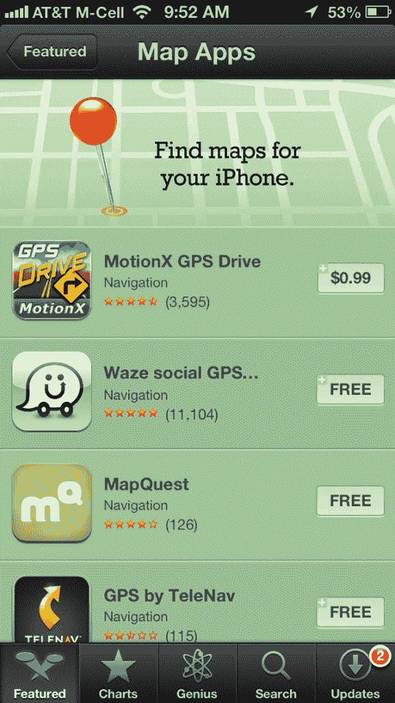
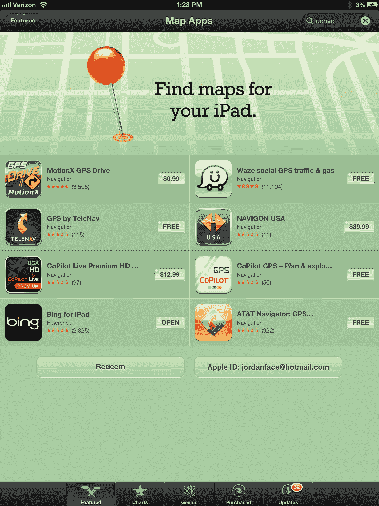

# 苹果在应用商店 TechCrunch 大力推广替代地图应用

> 原文：<https://web.archive.org/web/https://techcrunch.com/2012/09/28/apple-is-heavily-promoting-alternative-map-apps-on-the-app-store/>

# 苹果在应用商店大力推广替代地图应用

现在[苹果已经告诉世界，它并没有为地图](https://web.archive.org/web/20221209163650/https://beta.techcrunch.com/2012/09/28/well-played-on-maps-apple-your-move-google/)提供最好的产品，如果你没有注意到的话，该公司现在正在 App Store 中重点介绍其他地图应用程序:

【T2

这也体现在 iPad 上:

我不得不说，这是苹果公司非常大胆的举措。这对用户有好处，对竞争对手也有好处。哦，谷歌，你在哪里？

苹果公司正在削减这些付费地图应用。聪明。