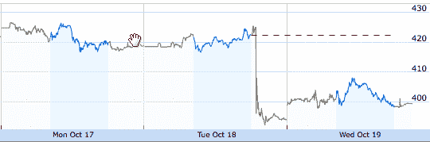

# 如果你今天卖掉了你的苹果股票，你就是个白痴

> 原文：<https://web.archive.org/web/https://techcrunch.com/2011/10/19/apple-laughing-stock/>

在我开始之前，有两点:

1)我不持有任何苹果股票。我对股票是涨是跌完全没有兴趣。

2)有人可能会说，现在卖出苹果股票可能还有其他原因(即史蒂夫·乔布斯去世后的不确定性)，我只是说，由于昨天的收益，今天的股票暴跌是可笑的。

从昨天到今天，看着股票市场跟随苹果第四季度的收益，我想起了史蒂夫·乔布斯的一句名言。“如果你看到一支手写笔，他们就吹了。”改写后，今天的引语会是:“如果你根据苹果分析师进行投资，你就搞砸了。”

[苹果公司的股票](https://web.archive.org/web/20230203071240/http://www.google.com/finance?client=ob&q=NASDAQ:AAPL)今天下跌了 23.62 点，跌幅超过 5.5%。它从每股 422 美元的历史收盘高点跌至每股不到 400 美元。为什么？昨天公布的收益。大约 9 年来，苹果首次未能超出华尔街的预期。

但事情是这样的:这些预期是荒谬的，有缺陷的，再次表明分析师们不知道他们在谈论苹果公司。

在过去的十年里，苹果每个季度都破坏分析师的预测，这让分析师们看起来很愚蠢。苹果公司给他们的指导常常低得可笑，分析师们从这个基础上稍微提高了一点，然后推翻了这两组数字。或许是因为这段愚蠢的历史，在过去的这个季度，分析师们比往常更加乐观。但是他们没有考虑到一个非常关键的因素。它回来咬他们的屁股。

实际上，它回来咬苹果公司股票的屁股。这就是可笑之处。在该公司创纪录的 9 月份季度(T4 有史以来第二好的季度)之后，股票正在受到惩罚，因为分析师被发现打瞌睡。但是因为分析师从来不对任何事情负责——无论是他们通过做“检查”制造的可笑谣言，还是他们传播的关于公司的荒谬想法，以及其他人仅仅因为他们被贴上“专家”的标签和高薪而接受的想法——苹果承担了责任。

事实是这样的。

苹果在第四季度销售的 iPhones 比分析师预测的要少。他们预计销量在 2000 万到 2200 万之间，而苹果实际上卖出了 1707 万部。由于 iPhone 是苹果最大的收入和利润来源，这也拖累了这两个数字。这就是“错过”的全部原因——真的就这么简单。

苹果在第四季度销售了 2000 万至 2200 万部 iPhones，这将是该公司的一项新的历史记录。分析师们无疑在寻找这一点，因为苹果在第三季度卖出了创纪录的 2024 万部 iPhones。通常，第三季度是苹果 iPhone 销售疲软的一个季度，但今年第三季度再次创下纪录。所以第四季度将会大卖，对吗？

不对。

问题是苹果通常在 6 月或 7 月更新 iPhone。自 2007 年该设备首次推出以来，情况一直如此。今年，这种情况没有发生。这意味着通常较弱的第三季度数据仍然强劲，因为没有新的 iPhone 出现。库存和销售仍然很高。相反，iPhone 4S 于 10 月份宣布并上市。这意味着至少在今年，第三季度的下行周期实际上发生在第四季度。

此外，由于之前的新 iPhone 都是在 6 月或 7 月推出的，第四季度(苹果的财政季度，而不是日历季度)传统上一直是 iPhone 销售非常强劲的季度。同样，今年的情况并非如此——事实上，由于上述升级型号上市前的下行周期，情况正好相反。不知何故，分析师们严重忽略了这一点。

一方面，你想放他们一马，因为这是苹果，很难知道他们什么时候会发布什么。此外，苹果打破了典型的 iPhone 发布传统，这也让他们感到有些尴尬。但是拜托，这是他们的工作！每个密切关注苹果的人几个月前就知道，今年夏天不会有新的 iPhone 硬件推出，而是会在秋天推出。

话说回来，即使是那些真正擅长预测的人也搞砸了。因为这些年来分析师们对苹果的态度一直很糟糕，它催生了像[霍勒斯·德迪乌](https://web.archive.org/web/20230203071240/http://www.asymco.com/)这样的业余爱好者(我指的是好的方面)。谈到苹果分析，德迪乌通常非常非常出色。但是这个季度他也搞砸了。

德迪乌的推理——[，他在这里解释自己的推理——](https://web.archive.org/web/20230203071240/http://www.asymco.com/2011/10/19/how-did-i-get-the-iphone-number-so-wrong-part-ii/)——本质上和我在上面列出的一样。他的主要问题是，因为他上个季度搞砸了，这诱使他试图纠正本季度的错误，导致了另一个巨大的失误。他应该坚持一个简单的观点，即由于非典型的 iPhone 发布周期，今年对苹果来说是奇怪的一年。

好吧，所以大家都搞砸了。但是，这里的大问题是，这些失误导致苹果公司的股票今天在没有任何真正原因的情况下暴跌。没错，苹果上个季度表现不如上个季度，但这应该是意料之中的。事实上，这仍然是他们有史以来第二好的季度，并见证了创纪录的 iPad *和* Mac 销售，实际上是非常惊人的。

更重要的是，这一“失误”导致苹果高管在昨天的收益电话会议上变得有点大胆，并在 Q1 假日季度[或多或少地承诺了 iPhone 和 iPad 销售记录](https://web.archive.org/web/20230203071240/https://techcrunch.com/2011/10/18/apples-insanely-great-q1-2012/)。他们实际上预测的是一个 370 亿美元的季度，这将是该公司最大的一个季度，增长近 100 亿美元。记住，这些估计值总是低得可笑。苹果公司很有可能在下个季度拥有 400 亿美元的*收入。这是昨天披露的最重要的事情。*

这一消息的披露应该会导致股价飙升。相反的事情发生了。这就是为什么如果你今天卖掉了你的苹果股票，你就是个白痴。

