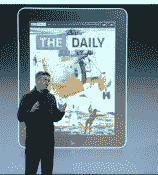

# 苹果在 App Store | TechCrunch 上为内容出版商推出订阅服务

> 原文：<https://web.archive.org/web/https://techcrunch.com/2011/02/15/apple-launches-subscriptions-for-content-publishers-on-the-app-store/>

几周前，我们在[日报的发布会](https://web.archive.org/web/20230320050158/https://techcrunch.com/2011/02/02/one-click-subscriptions-come-to-the-ipad/)上听说，苹果[计划在](https://web.archive.org/web/20230320050158/https://techcrunch.com/2011/02/08/apple-subscription-itunes/)发布一种新的应用程序商店内容出版商订阅模式。今天，苹果正式[宣布](https://web.archive.org/web/20230320050158/http://www.businesswire.com/news/home/20110215005900/en/Apple-Launches-Subscriptions-App-Store)App Store 上的杂志、报纸、视频、音乐等新服务。

这是收入明细:当苹果为该应用带来新用户时，苹果获得 30%的份额；当发行商为该应用带来一个现有的或新的订户时，发行商保留 100%的份额，而苹果则分文未得。我们已经粘贴了下面的版本。

苹果还表示，如果出版商在应用程序之外销售数字订阅，必须以相同或更低的价格向应用程序商店的客户提供相同的订阅服务(我们之前曾报道过)。此外，出版商可能不再在其应用程序中提供链接，允许客户购买应用程序之外的内容或订阅。

从新闻稿来看，还不清楚是否有出版商(除了日报)已经签约使用新模式。观察杂志和报纸公司对这种新模式的反应应该很有趣。这种新模式还可能影响网飞和 Hulu 等视频内容公司的订阅，以及亚马逊在 App Store 上的 Kindle 应用。

**更多** : [苹果的大订阅赌注:辉煌，厚颜无耻，还是 Batsh*t 疯狂？](https://web.archive.org/web/20230320050158/https://techcrunch.com/2011/02/15/apple-in-app-subscriptions/ "Apple’s Big Subscription Bet: Brilliant, Brazen, Or Batsh*t Crazy?")

> 苹果在应用商店推出订阅服务
> 
> 加利福尼亚州库比提诺——苹果公司今天宣布了一项新的订阅服务，面向 Store℠上所有基于内容的应用发行商，包括杂志、报纸、视频、音乐等。这与苹果公司最近通过新闻集团的“The Daily”应用程序推出的创新数字订阅计费服务相同。
> 
> “我们的理念很简单——当苹果为这款应用带来新用户时，苹果会获得 30%的份额；当发行商为应用带来一个现有的或新的订户时，发行商保留 100 %,而苹果不赚"
> 从应用商店内购买的订阅将使用已经用于购买数十亿应用和应用内购买的相同应用商店计费系统来销售。出版商设定订阅的价格和期限(每周、每月、每两个月、每季度、每两年或每年)。然后，只需一次点击，客户就可以选择订阅时长，并根据他们选择的承诺时长(每周、每月等)自动付费。).客户可以从他们的个人帐户页面查看和管理他们的所有订阅，包括取消订阅的自动续订。苹果处理所有的支付，保持与今天其他应用内购买相同的 30%的份额。
> 
> “我们的理念很简单——当苹果为这款应用带来新用户时，苹果会获得 30%的份额；苹果公司首席执行官史蒂夫·乔布斯说:“当出版商为应用程序带来一个现有的或新的订户时，出版商将获得 100%的利润，而苹果公司则分文未得。”。“我们所要求的是，如果出版商在应用程序之外提供订阅服务，应用程序内部也要提供相同(或更好)的服务，这样客户就可以在应用程序中只需点击一下鼠标即可轻松订阅。我们相信，这一创新的订阅服务将为出版商提供一个全新的机会，将他们内容的数字访问扩展到 iPad、iPod touch 和 iPhone 上，让新老订户都感到高兴。”
> 
> 在应用程序中使用苹果订阅服务的出版商也可以利用其他方法在应用程序之外获得数字订户。例如，出版商可以在其网站上出售数字订阅，或者可以选择向现有订户提供免费访问。由于苹果没有参与这些交易，因此与苹果没有收入分成或客户信息交换。发布者必须在应用内部为在应用外部注册的订阅者提供他们自己的认证过程。然而，苹果确实要求，如果出版商选择在应用程序之外单独销售数字订阅，则必须以相同或更低的价格向希望在应用程序内订阅的客户提供相同的订阅服务。此外，出版商可能不再在他们的应用程序中提供链接(例如，到网站的链接)，这些链接允许客户购买应用程序之外的内容或订阅。
> 
> 保护客户隐私是所有 App Store 交易的一个关键特征。通过 App Store 购买订阅的客户可以选择在订阅时向出版商提供他们的姓名、电子邮件地址和邮政编码。此类信息的使用将受出版商的隐私政策而非苹果公司的隐私政策管辖。发行商可以向 App Store 客户寻求额外信息，前提是这些客户有明确的选择，并被告知任何额外信息都将根据发行商的隐私政策而非苹果的隐私政策进行处理。
> 
> 革命性的应用商店为 90 个国家的消费者提供超过 350，000 款应用，其中包括超过 60，000 款原生 iPad 应用。全球超过 1.6 亿 iOS 设备的客户可以从 20 个类别的大量应用程序中进行选择，包括游戏、商业、新闻、体育、健康、参考和旅游。
> 
> 苹果设计了世界上最好的个人电脑 MAC，以及 OS X、iLife、iWork 和专业软件。苹果凭借其 iPods 和 iTunes 在线商店引领着数字音乐革命。苹果正在通过其革命性的 iPhone 和 App Store 彻底改造手机，并于最近推出了其神奇的 iPad，它正在定义移动媒体和计算设备的未来。