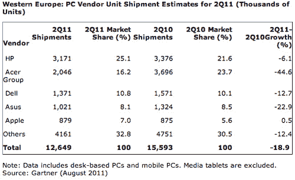

# 苹果引领西欧个人电脑增长，竞争对手击败 

> 原文：<https://web.archive.org/web/http://techcrunch.com/2011/08/18/apple-leads-in-west-european-pc-growth-competitors-tank/>

# 苹果引领西欧个人电脑增长，竞争对手陷入困境

对于个人电脑制造商来说，西欧现在是一个艰难的地方。根据技术研究公司 Gartner 的一份报告，销售额几乎全面下降，只有一个例外:苹果公司。

公平地说，尽管苹果是唯一一家实现正增长的制造商，但这些数字并不值得大书特书。苹果只获得了 0.5 个百分点的增长——至少可以说这是一个非常温和的增长——但几乎所有苹果的竞争对手最终都是负面的。宏碁首当其冲，销量下降 44.6%，但华硕(-22.9%)、戴尔(-12.7%)和亚军惠普(-6.1%)也好不到哪里去。

据报道，上网本占了大部分损失，平板电脑吞噬了对移动计算工具的大部分需求。华硕和宏碁销量的大幅下滑至少部分归咎于它们对上网本性能的过度依赖。两家公司都已经进军平板电脑市场，但这可能标志着一个更加协同努力的开始，以从 iPad 赢回一些市场空间。

因此，[苹果连续第二个季度摘得](https://web.archive.org/web/20230203081725/http://www.zdnet.co.uk/blogs/jacks-blog-10017212/european-pc-sales-plunged-in-q1-says-gartner-10022492/)桂冠。不过，虽然增长就是增长，但我不确定库比蒂诺的任何人对他们的表现非常满意:在 Q1，他们实现了 10%的增长。惠普正在慢慢改善，有了他们在 TouchPad 背后的资金，我们可能会看到他们在下个季度反弹。

华硕和宏碁，坦白说，应该有点担心。自去年 Q1 会议以来，两者都大幅下降，除非他们继续努力，否则他们的未来会有更多的赤字。正如我提到的，我认为他们在平板电脑方面的努力将是未来几个月的关键。特别是宏碁一直是低成本个人电脑的粉丝，如果他们开始放弃上网本(至少目前如此)而转向平板电脑，他们可能会获得一些急需的市场。这看起来很糟糕，但在接下来的几个月里，一些坚实的步骤可能会扭转华硕，戴尔，宏基和惠普的一切。这里列出的所有公司都将不得不调整策略，加快步伐，因为西欧开始看起来像是蛮荒的西部。

