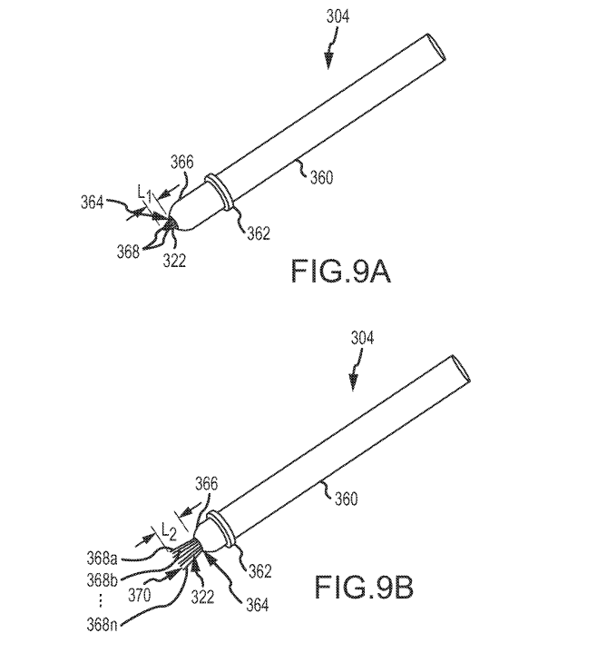

# 苹果公司正在研究一种具有光线和动作感应功能的智能手写笔 

> 原文：<https://web.archive.org/web/https://techcrunch.com/2014/03/20/apple-looking-into-a-smart-stylus-with-light-and-motion-sensing-powers/>

苹果公司今天在美国专利商标局公布了一项新的专利申请(通过 [AppleInsider](https://web.archive.org/web/20221007025853/http://appleinsider.com/articles/14/03/20/apple-investigating-stylus-with-extendable-multitouch-nib-onboard-light-and-motion-sensors) )，该申请详细描述了一种带有笔尖的触控笔，该笔尖可以延伸以利用多点触摸功能获得更宽的笔触，并且内置了光传感器，因此它可以充当真实世界的基本滴管工具，从物理对象中捕捉颜色以用于数字绘画。

该专利详细介绍了多种不同的触控笔笔尖或笔尖选项，包括一种大小可变的选项，以确定它与设备屏幕的接触程度。例如，延长笔尖可以允许用户对宽线条进行宽的边缘笔画，而缩短笔尖可以允许绘制细线。它将是部分柔性的，允许它在使用时弯曲，这可以使习惯于传统媒体的艺术家更自然地绘制不同的线条宽度。

其他设计包括可以用不同种类的数字画笔进行绘图的笔尖，以及对旧的选择钢笔想法的扭曲，其中一组纤维束构成了笔尖。可以使用笔尖上的可变出口来重新配置线股，这意味着它可以形成一个连续的刷子、单根线股的展开排列或各种其他排列。

苹果的手写笔还详细介绍了一种带有光传感器的笔尖，用于检测来自 iPad 等设备屏幕的视觉反馈，并通过光与它进行通信，允许手写笔在没有任何无线(即蓝牙)连接的情况下立即快速改变线宽、颜色信息、画笔图案等。光传感器还可以用来从现实世界的物体中获取颜色信息，例如，你可以采样苹果的特定色调，并将其用于你的数字绘画中。

根据这项专利，其他传感器，包括加速度计和陀螺仪，也可以用来更好地了解笔的角度，以改变输入类型。这些类型的东西在一些 Wacom 手写笔设备中用于在他们的数字绘图板上输入。

苹果从来没有对手写笔太过热衷。史蒂夫·乔布斯[有一句名言](https://web.archive.org/web/20221007025853/http://www.engadget.com/2010/04/08/jobs-if-you-see-a-stylus-or-a-task-manager-they-blew-it/)“如果你看到一支手写笔，他们就吹了”在 iOS 4 的问答环节，当他在 2007 年推出第一部 iPhone 时，他嘲弄地问“谁想要一支手写笔？”但情况已经发生了变化，复杂的手写笔设备可以为绘图和精细的细节工作提供高度调谐的输入，这可能是那些希望使用 iOS 设备进行数字创作的人的一大福音。

*图中描绘的是一个微型手写笔，而不是苹果创造的。*