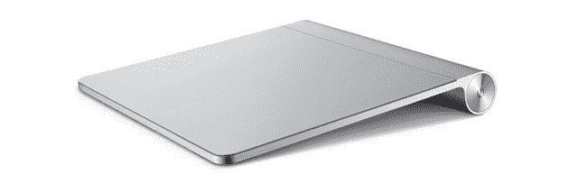
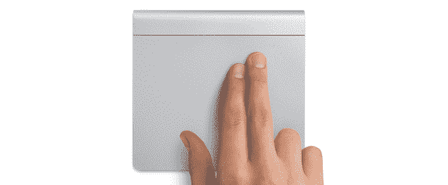

# 苹果的魔法轨迹板标志着鼠标时代的终结 TechCrunch

> 原文：<https://web.archive.org/web/https://techcrunch.com/2010/07/27/apple-magic-trackpad-mouse/>

毫无疑问，苹果今天发布的最有趣的东西是新的神奇轨迹板。本质上，它是每台 MacBook 和 MacBook Pro 附带的触控板的更大版本。但它是一个独立的产品，旨在与台式电脑一起使用。那么为什么苹果会觉得有必要做出这样一款产品呢？这是关于趋势和未来的。

“纵观全局，越来越多的用户在使用我们的触控板，因为笔记本用户比台式机用户多，”一名苹果代表今天在讨论 Magic Trackpad 时告诉我。一段时间以来，笔记本电脑一直是苹果最畅销的电脑。随着时间的推移，尽管今天推出了一些新的台式机产品，但我们可以预计笔记本电脑和台式机之间的差距将会加大。这意味着越来越多的用户习惯于通过这些触控板使用他们的计算机。因此，这款新产品对于有兴趣购买苹果台式机的用户来说也很有意义。

"*人们喜欢触控板。人们喜欢这些特点。所以我们想把这种设计带给我们的台式机用户*，”苹果公司的代表告诉我。因此，苹果设计了这款产品(与无线键盘一起)来将人们喜欢的关于触控板的一切带到桌面体验中。捏合缩放，惯性滚动，点击点击，一切尽在掌握。

但令人高兴的是，Magic Trackpad 实际上比 MacBook 上的任何触控板都大得多(表面积多 80%)。我问这是否意味着我们可以期待一些新的多点触控功能用于桌面体验，但苹果拒绝对此发表评论。

这款新的 Magic Trackpad 对苹果的整体发展趋势也很有意义。该公司已经承认它现在是一家“移动设备”公司。其中很大一部分不仅仅是笔记本电脑，还有 iPhone 和现在的 iPad。这两款设备显然都是完全基于多点触控的。没有老鼠。

苹果正在缓慢但稳步地走向一个大部分计算机交互都通过触摸手势来完成的地方。台式机仍然是键盘+鼠标组合的最后一个重要据点。但是现在苹果公司也在削弱这一点。首先，他们推出了多点触控魔法鼠标。现在我们得到了魔力轨迹板。

当我问这是否标志着鼠标的死亡时，苹果只说“*我们希望为用户提供选择。*“他们注意到苹果公司有很多人在使用神奇鼠标的同时也在使用神奇触控板*。“有些操作更适合鼠标，有些更适合触控板，”我被告知。*

也就是说，苹果承认，一些用户可能会放弃鼠标，转而使用这款新设备。虽然苹果将 Magic Mouse 作为台式电脑的标准配件，但每次购买新电脑时，都可以选择附赠 Magic Trackpad(当然，这取决于设备的价格)。

我知道，就我个人而言，这个神奇的触控板将取代我的鼠标。尽管我的台式机提供了两个巨大显示器的舒适性，但最近，我发现自己越来越多地使用笔记本电脑，只是因为我更喜欢触控板及其多点触控手势。现在，我可以在我的桌面上获得完整的体验，我肯定会这样做。

其他人根本不需要。他们将从笔记本电脑上的触控板开始，不会看到鼠标的点。而且[再往下](https://web.archive.org/web/20230203032737/https://techcrunch.com/2009/12/25/apples-tablet-islate/)，用户可能在触摸平板上长大，甚至不会理解鼠标的概念。

鼠标可能注定成为设计师等职业使用的精密工具。历史可能会证明，这个神奇的轨迹板是标志着这一结束的最后一个鼠标陷阱。

**更多** : [老鼠死了。我刚刚杀了它。现在我们能继续了吗？](https://web.archive.org/web/20230203032737/https://techcrunch.com/2010/07/27/the-mouse-is-dead/)

*【图片:flickr/* [*西蒙·沃什*](https://web.archive.org/web/20230203032737/http://www.flickr.com/photos/simthom/219462795/)