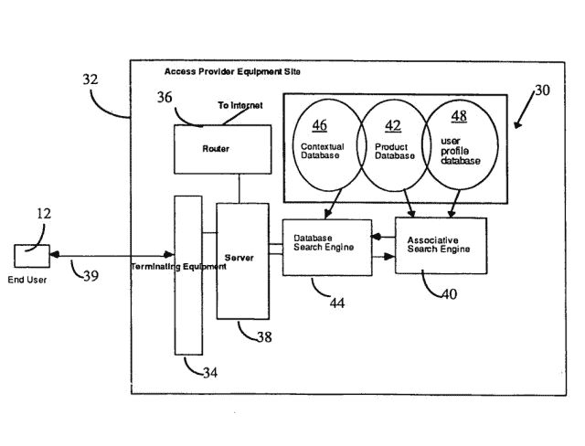

# 苹果、微软支持的 Rockstar 财团起诉谷歌、三星超过 7 项北电专利

> 原文：<https://web.archive.org/web/http://techcrunch.com/2013/10/31/apple-microsoft-backed-rockstar-consortium-sues-google-samsung-over-7-nortel-patents/>

# 苹果，微软支持的 Rockstar 财团起诉谷歌，三星超过 7 北电专利

Rockstar consortium 是一个由苹果、微软、黑莓、爱立信和索尼支持的组织。2011 年，在与谷歌的竞购战中，它从已倒闭的电信公司北电(Nortel)手中购买了专利。

现在，该财团已经就这些专利对谷歌、华硕、HTC、华为、LG、泛泰和中兴提起诉讼。该诉讼于今天在美国德克萨斯州东部地区法院提起。

“谷歌最初出价 9 亿美元收购诉讼专利和北电投资组合的其余部分。谷歌随后多次提高出价，最终出价高达 44 亿美元，”文件称。“这个价格不足以赢得拍卖，因为由 Rockstar 现有股东领导的一个团体以 45 亿美元的价格购买了该投资组合。尽管在试图收购诉讼专利的拍卖中失败了，但谷歌已经侵犯并继续侵犯诉讼专利。

众所周知，谷歌在拍卖结束前对一些不那么随机的数字进行竞价，[包括“pi”](https://web.archive.org/web/20230403160618/http://www.reuters.com/article/2011/07/02/dealtalk-nortel-google-idUSN1E7601QM20110702)。该诉讼还涉及 NetStar 公司的“联合搜索引擎” [6，098，065](https://web.archive.org/web/20230403160618/https://www.google.com/patents/US6098065?dq=6,098,065&hl=en&sa=X&ei=cetyUtqyCYmEyAGRxYCQCw&ved=0CDkQ6AEwAA) 专利的被许可人。

其他专利分别是美国[7236969](https://web.archive.org/web/20230403160618/https://www.google.com/patents/US7236969?dq=7,236,969&hl=en&sa=X&ei=MOxyUrTAD8ifyQGF74CIDQ&ved=0CDkQ6AEwAA)、[7469245](https://web.archive.org/web/20230403160618/https://www.google.com/patents/US7469245?dq=7,469,245&hl=en&sa=X&ei=RuxyUsuxJqWgyAG-8IGYDA&ved=0CDkQ6AEwAA)、[7672970](https://web.archive.org/web/20230403160618/https://www.google.com/patents/US7672970?dq=7,672,970&hl=en&sa=X&ei=VexyUv-nCoblyQHgoYHAAw&ved=0CDkQ6AEwAA)、[7895178](https://web.archive.org/web/20230403160618/https://www.google.com/patents/US7895178?dq=7,895,178&hl=en&sa=X&ei=Y-xyUtD_NKK0ygHix4HQAQ&ved=0CDkQ6AEwAA)、[7895183](https://web.archive.org/web/20230403160618/https://www.google.com/patents/US7895183?dq=7,895,183&hl=en&sa=X&ei=cuxyUt_JOaK6yQH2rYEY&ved=0CDkQ6AEwAA)和[7933883](https://web.archive.org/web/20230403160618/https://www.google.com/patents/US7933883?dq=7,933,883&hl=en&sa=X&ei=gOxyUrW2H8LcyQHu3YGIBQ&ved=0CDkQ6AEwAA)。它们大多是相当枯燥的东西，与数据库搜索、广告展示的相关性和数据排序有关，但正是这种东西让谷歌的特殊酱发挥了作用。我们不能说专利的强度，但它们显然是相关的。

谷歌在与 Rockstar 的激烈竞购战中失败，并继续收购摩托罗拉，这一举动被许多人归因于专利争夺，但这在很多方面也与硬件有关。

值得注意的是，HTC 与苹果在一些专利上有交叉许可协议，但显然不是这些。路透社今天首先报道了这起诉讼的消息。