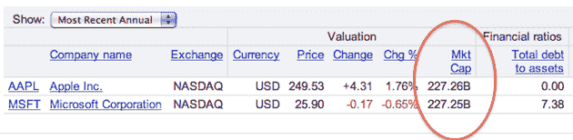

# 繁荣，的确:苹果市值超过微软 

> 原文：<https://web.archive.org/web/https://techcrunch.com/2010/05/26/apple-microsoft-market-cap-2/>

# 繁荣，的确:苹果市值超过微软

今年 3 月，微软的市值领先苹果 500 多亿美元。这一差距仍然很大，但这是几十年来两者在价值衡量方面最接近的一次。趋势很明显:[我预测苹果会超过微软](https://web.archive.org/web/20230130095920/https://techcrunch.com/2010/03/26/apple-microsoft-stock/)，这只是*何时*的问题。

连我都没想到会这么快。

今天，苹果的市值刚刚超过微软。现在，股票一直波动很大，所以这可能会在市场关闭前发生变化。但是现在，苹果已经领先了，而且已经领先了几分钟。

一些出版物报道这一里程碑[发生在 4 月](https://web.archive.org/web/20230130095920/https://techcrunch.com/2010/04/22/apple-microsoft-market-cap/)，但这是一个略有不同的指标。这是标准普尔 500 指数的市值，该指数使用浮动调整后的数字。今天的里程碑是直截了当的市值:发行在外的股票数量乘以股价。

当然，这个数字到底意味着什么还存在争议。事实是，从财务角度来看，一家公司的强弱并不意味着什么。但这是一个很好的趋势指标，显然也是股票表现的指标。这种趋势很明显，在过去五年左右的时间里，苹果一直在摧毁微软正在获得的股票价值。

在过去的五年里，微软的股票基本上停滞不前:上涨了约 4%。与此同时，苹果的股票同期上涨了约 550%。

无论今天市场如何收盘，你都可以期待苹果市值在未来几天飙升。下周一是史蒂夫·乔布斯在苹果 WWDC 发布会上的主题演讲。在那里，人们普遍预计他会推出新的 iPhone——毫无疑问还有其他一些东西。仅仅是对他将公布什么的猜测就会推高价格。与此同时，微软正在失去关键高管。

[轰](https://web.archive.org/web/20230130095920/http://www.youtube.com/watch?v=r8L39UwOS-Y)！粉丝们疯狂了。

**更新**:随着市场接近收盘时间，苹果现在领先微软将近 30 亿美元。

**更新 2** :果不其然，苹果的确比微软提前一天收盘:2220.7 亿美元对 2191.8 亿美元。

