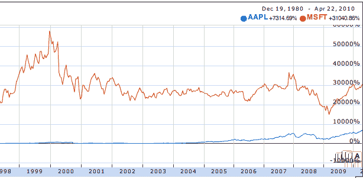

# 天哪，苹果的市值刚刚超过了微软！！！！等等。没有。

> 原文：<https://web.archive.org/web/https://techcrunch.com/2010/04/22/apple-microsoft-market-cap/>

# 天哪，苹果的市值刚刚超过了微软！！！！等等。没有。

今天，苹果公司的市值已经超过微软的消息在互联网上迅速传播。唯一的问题？这不是真的。

最近几周，我们一直在密切关注和的这一趋势。苹果确实正在迅速逼近微软的市值，我们相信它会在[超过](https://web.archive.org/web/20221006101817/https://beta.techcrunch.com/2010/03/26/apple-microsoft-stock/)，但不会是今天。苹果的股价为 266 美元，市值约为 2410 亿美元。微软的股价为 31 美元，市值约为 2750 亿美元。微软刚刚[宣布了它的收益](https://web.archive.org/web/20221006101817/https://beta.techcrunch.com/2010/04/22/windows-7-microsoft-profits-34-5/)，股价正在下跌(目前下跌了近 5%)，但它的市值仍达到 2630 亿美元左右，比苹果高出 200 多亿美元。

看起来不良信息的来源是 [MarketWatch](https://web.archive.org/web/20221006101817/http://www.marketwatch.com/story/apple-passes-microsoft-for-second-place-in-sp-500-2010-04-22?dist=afterbell) ，它在大约 30 分钟前发布了标题“苹果超越微软成为标准普尔 500 指数第二名”(从技术上讲，这是真的——更新中有更多相关信息)。Digital Daily 随后刊登了关于市值的报道(帖子已被删除)，然后 [VentureBeat](https://web.archive.org/web/20221006101817/http://venturebeat.com/2010/04/22/aapl-is-now-worth-more-than-msft/) 也进行了报道。有了这样的标题，显然，转发量传播得很快。

MarketWatch 还幽默地首次声明苹果的市值为 242 *百万*(提示邪恶博士)。

如果股价趋势继续下去，苹果的价值可能很快就会超过微软，但同样，这还没有发生。

**更新**:market watch[更新了](https://web.archive.org/web/20221006101817/http://www.marketwatch.com/story/apple-passes-microsoft-for-second-place-in-sp-500-2010-04-22?dist=afterbell)他们的故事，称苹果在 S & P 500 上超过了微软，因为它使用了浮动调整数字。按照这种计算方法，苹果的市值为 2415 亿美元，而微软为 2395 亿美元。但总体来说，微软仍然领先于苹果。

《数字日报》的约翰·帕茨科夫斯基告诉我，他只是为了纠正错误才撤下这篇文章，他确实这么做了。你可以在这里找到[。](https://web.archive.org/web/20221006101817/http://digitaldaily.allthingsd.com/20100422/apple-surpasses-microsoft-on-sp-500/)