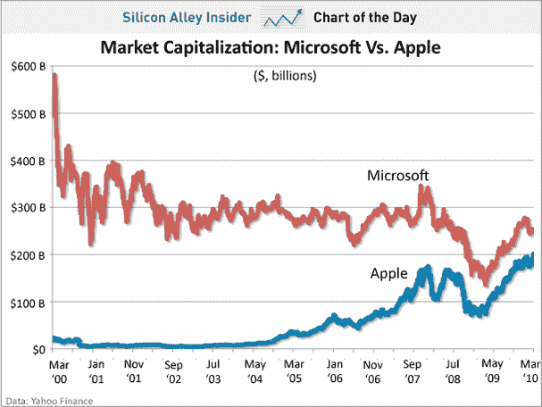

# 苹果在价值上超过微软会怎样？是的，什么时候。

> 原文：<https://web.archive.org/web/https://techcrunch.com/2010/03/26/apple-microsoft-stock/>

苹果公司的股票今天上涨了 3 美元，突破了每股 230 美元的大关。[微软的](https://web.archive.org/web/20230130114913/http://www.google.com/finance?q=NASDAQ:MSFT)下跌 0.25 美元，跌破每股 30 美元大关。虽然这种差异从表面上看是巨大的，但这并不意味着什么，因为市场上有更多的微软流通股(实际上是十倍以上)。这也是微软市值高于苹果的原因，尽管个股价格存在差异。但市值差距正在缩小。快点。

苹果看起来随时都有可能获得微软 500 亿美元的市值。目前，苹果的市值为 2087.6 亿美元，而微软为 2610.1 亿美元。虽然 500 亿美元似乎是一个巨大的鸿沟，但考虑到自 2009 年 12 月 31 日以来，仅仅几个月前，苹果的市值增加了约 200 亿美元，而微软则损失了约 100 亿美元。同样，差距正在迅速缩小。

当你看十年前的数据时，事情变得更加疯狂。当时，微软的市值接近 5900 亿美元。它是世界上最有价值的公司——到目前为止(第二名，通用电气，落后 1000 亿美元)。与此同时，苹果当时的市值只有 160 亿美元。它是世界上第 339 家最有价值的公司，比大众落后两位。

当然，那是不同的时代。除了 2000 年的飙升，微软的股票和市值基本上一直停滞不前。例如，它在 1999 年的市值是 2710 亿美元，比现在多 100 亿美元。与此同时，苹果公司当年没有上榜。但当时的股价约为 10 美元，它可能价值约 50 亿美元。但这才是重点。除了 2008 年底股市崩盘期间的下跌，苹果股票一直在飙升。在过去的 10 年里，增长了 500%以上。在同一时期，微软的股票下跌了近 50%(还是从 2000 年初的数字开始)。苹果已经超越惠普、甲骨文、IBM，最近又超越谷歌，进入美国最有价值公司的前五名。

同样，这是在 230 美元的股票价格。这是在之前的*，[的 iPad](https://web.archive.org/web/20230130114913/https://techcrunch.com/2010/01/27/ipad/) 已经发布。当然，你可能会说，如果这款设备没有大获成功，股票就会受到冲击(而且可能是相当大的冲击)。但如果它大受欢迎(早期预售数据表明很可能如此)，该股也有机会进一步飙升。事实上，一些金融分析师已经将销售价格目标提高到了顶点。例如，瑞士瑞信银行[今天把它设定为 300 美元](https://web.archive.org/web/20230130114913/http://blogs.barrons.com/techtraderdaily/2010/03/26/apple-credit-suisse-pounds-the-table-ups-target-to-300/)。*

现在，我通常对来自分析师的任何消息都保持警惕，但我们只能说苹果确实达到了每股 300 美元。请记住，他们在过去几个季度的表现非常出色，没有理由认为这种情况会停止，即使不考虑 iPad。因此，以每股 300 美元计算，假设股票数量保持不变，苹果将价值 2700 亿美元。是的，领先于微软(假设他们的市值在此期间保持不变)。

如果这种情况发生(我敢说*会*发生)，苹果粉丝会疯掉。不要介意上个季度，微软的收入仍然高于苹果(190 亿美元对 150 亿美元)，利润几乎是苹果的两倍(66 亿美元对 33 亿美元——不过，这在很大程度上要归功于早期的 Windows 7 销售)。人们的感觉是，苹果在过去几年里一直在打全垒打，而微软则在一些重大问题上停滞不前。

用另一个体育类比来说，苹果似乎只是选择了正确的时间来支持正确的马:移动。正如高管们最近所说，苹果现在认为自己是一家移动设备公司，因为他们的大部分收入都来自那里(包括笔记本电脑)。与此同时，微软几乎是离移动设备公司最远的公司。他们自己制造的唯一设备是 Zune，而他们的移动软件 Windows Mobile 在过去十年中确实犯了错误。他们现在正试图通过 Windows Phone 7 系列以及粉色手机和 Courier 等项目来捕捉一些苹果手机的魔力。

然而，这才是微软真正的问题。如果苹果的市值真的超过微软，我可以预见首席执行官史蒂夫·鲍尔默会失去它，这可能会把他的注意力从仍然被认为是他真正的敌人谷歌身上转移开。毕竟，是谷歌在直接攻击微软的核心品牌 Office 和 Windows，而微软几乎所有的收入都来自这两个品牌。谷歌应用程序和 Chrome 操作系统旨在做两件事:杀死 Office 和 Windows。

当然，苹果的 OS X 与 Windows 竞争，但苹果显然永远不会许可其操作系统(在 20 世纪 90 年代史蒂夫·乔布斯不在时曾灾难性地尝试许可)，所以它的市场份额只能与购买昂贵苹果机器的人一样大。[苹果只是更关心利润和控制高端市场，然后直接追赶 Windows。](https://web.archive.org/web/20230130114913/https://techcrunch.com/2009/11/11/while-rivals-jockey-for-market-share-apple-bathes-in-profits/)

实际上，如果双方都聪明，能够言归于好，微软和苹果合作可能是明智的。谷歌现在显然是这两家公司的敌人。(这有点奇怪，考虑到[曾经是苹果和谷歌联手](https://web.archive.org/web/20230130114913/https://techcrunch.com/2009/08/24/500-days-of-apple-and-google/)对抗共同的竞争对手微软。举例来说，如果微软真的想在搜索领域竞争，他们最好的行动可能是与苹果达成协议，成为 iPhone(和 iPad)的默认选项。

但我担心，如果苹果的市值超过微软，这种理性思维将会荡然无存。微软内部的争吵会阻止他们获得关注。或者，更确切地说，是当苹果的市值超过微软的时候。

*两只股票近几年的轨迹:* 

*这里有一张关于股票价格的图表:* 

*[Silicon Alley Insider 最近也做了一张](https://web.archive.org/web/20230130114913/http://www.businessinsider.com/chart-of-the-day-microsoft-vs-apple-market-capitalization-2010-3)两者市值大战的好看图表:*

*【图片:20 世纪福克斯】*