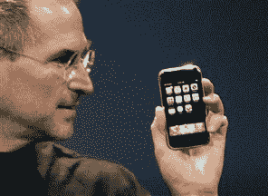

# 苹果的下一个重大战略机遇可能是移动支付 

> 原文：<https://web.archive.org/web/https://techcrunch.com/2010/11/01/apple-mobile-payments/>

当一位分析师在苹果公司[的最后一次收益电话会议](https://web.archive.org/web/20221002003155/https://beta.techcrunch.com/2010/10/18/apple-q4-2010-earnings/)上问史蒂夫·乔布斯，他打算如何处理苹果公司的 500 亿美元现金时，他回答说，他希望保持苹果公司的“火药干燥”,以防“一个或多个战略机会”。。。一起来。”人们立即开始猜测苹果能用这些现金收购谁:脸书、索尼、Adobe？

但苹果从不进行巨额收购。相反，它倾向于进行规模较小的人才和技术收购。

传闻中苹果对移动支付初创公司 BOKU 的兴趣就属于这种模式。苹果正在与博库进行并购谈判，这一事实并不意味着交易将会发生，但它确实意味着苹果对移动支付非常感兴趣。

无论是建设还是收购，或者两者兼而有之，移动支付在未来几年对苹果来说都是一个巨大的机会。

想象一下，如果你的 iPhone 变成了你的钱包？将手机变成钱包的梦想已经被许多公司追求了很长时间，但苹果在让移动支付更加主流方面处于独特的地位。苹果已经通过 iTunes 很好地处理了支付，iTunes 拥有 1 . 6 亿活跃的信用卡账户。PayPal 只有[9000 万](https://web.archive.org/web/20221002003155/https://beta.techcrunch.com/2010/10/20/thanks-to-paypal-ebay-reports-14-percent-increase-in-q3-net-income/)。

支付将从数字商品开始——歌曲、电影、应用和应用内购买。苹果已经通过 iTunes 做到了这一切，iTunes 是最好的微交易聚合系统之一。如果你可以把这些微交易记在你的电话账单上，就像记在你的信用卡上一样简单，会怎么样？

然后，苹果通过 iTunes 销售应用程序、歌曲和电影将变得更加容易，特别是对年轻客户或发展中国家可能没有信用卡的客户。(博库的强项就是那些运营商关系)。

随着时间的推移，这些支付可能会从数字和虚拟商品扩展到现实世界的购买。苹果不会考虑在[的下一代 iPhone](https://web.archive.org/web/20221002003155/http://www.techmeme.com/101101/p32#a101101p32) 中免费添加一个[近场通信(NFC)芯片](https://web.archive.org/web/20221002003155/https://beta.techcrunch.com/2010/08/17/apple-testing-proximity-prototypes-iphone-5/)。越多的人使用他们的 iPhones 实际购买商品，它就变得越不可或缺。

苹果会采取下一个合乎逻辑的步骤，自己成为支付处理器吗？如果它做到了这一点，它就能把运营商从移动支付等式中剔除出去。将运营商账单与 iTunes 交换，运营商收取的微支付费用就会消失。苹果可以开始收取这些费用，或者将节省下来的费用转给携带 iPhone 的消费者，这样他们就可以在 iTunes 商店和其他地方花更多的钱。你的 iPhone 可能就是你的钱包:出门在外不离不弃。