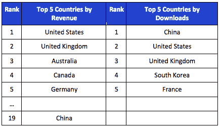

# 苹果报摊收入自推出以来翻了两番；iPad 收入是 iPhone 的 3 倍 TechCrunch

> 原文：<https://web.archive.org/web/https://techcrunch.com/2012/09/06/apple-newsstand-revenue-quadrupled-since-launch-ipad-revenue-3x-that-of-iphone/>

在 9 月 12 日预计的新 iPhone 发布会之前，应用分析公司 App Annie 已经关注了苹果报摊在收入和下载量方面的一些增长。[根据其数据](https://web.archive.org/web/20221224220143/http://www.appannie.com/blog/commercial-opportunities-on-apples-newsstand/)，美国是报刊亭应用产生收入最多的国家，但中国在下载量方面领先。App Annie 还发现，自推出以来，iOS 报刊亭的收入增长了四倍多，iPad 上的收入是 iPhone 上的三倍。

报刊亭应用产生的收入几乎全部来自整合到应用中的应用内购买。88%的报刊亭应用程序提供这一功能，并产生全球 99.5%的报刊亭收入。或者换句话说，12%没有应用内购买的报摊应用产生的全球收入不到 0.5%。

App Annie 发现，在阅读报摊应用程序时，iOS 用户也更喜欢 iPad，因为 iPad 报摊的收入是 iPhone 的三倍。这并不是说 iPhone 上的报刊亭采用率没有增长——自应用程序推出以来，iPhone 报刊亭的收入增长了 3200%以上。但是，尽管 iPad 的受众较少，App Annie 表示，出版商需要专注于从 iPad 用户身上赚钱，因为他们是主要的收入来源。

报刊亭也是老的印刷出版商扩大数字读者群的一种方式，而不是为新的创业公司提供一条获得突破的途径。下载量和收入排名前五的应用往往包括一些熟悉的名字，比如《纽约时报》、《Cosmopolitan》和《纽约客》。NYT 实际上占据了这两个排行榜的首位。然而，App Annie 将新闻集团支持的日报排在收入排行榜的第二位，这为该公司描绘了一个比可能存在的更光明的未来——嗯，至少根据[一些](https://web.archive.org/web/20221224220143/http://observer.com/2012/07/the-daily-layoffs-downsizing-07312012/)最近[关于此事的报道](https://web.archive.org/web/20221224220143/http://allthingsd.com/20120731/the-daily-lays-off-a-third-of-its-staff/?mod=atdtweet)来看是这样。(值得一提的是，该日报的总编辑在 7 月份回应称，关于该报即将停刊的传言是“误传”和“不真实的”)

从全球来看，西方国家的报刊亭每次下载收入领先，最高的是挪威、澳大利亚、瑞士和英国，美国排名第八。在前十名中，每个应用的收入为 0.97 美元，是世界平均水平 0.45 美元的两倍多。前十名中有七个是英语国家，九个是人均 GDP 排名前 25 的国家，五个是欧洲国家。与此同时，中国是下载量最多的国家，超过美国、英国、韩国和法国，位列前五。根据出版商的国别，下载量前 20 名的报刊亭应用中，谷歌占据了 7 个，其次是美国、英国和加拿大。

## 聚合器呢？

但对 iPad 发行商来说，这仍处于早期阶段。除了苹果通过报摊发布出版物的官方渠道，苹果应用程序商店还允许其他类型的新闻阅读应用程序出现，并独自获得关注。这些往往是聚合器——本质上是一种现代的、消费者友好的阅读 RSS 新闻的方式。Flipboard、Zite 和 Pulse 等应用程序呈现来自各种出版商的内容以及来自用户自己的社交网络的个性化内容，提供一些读者更喜欢的独特体验。考虑到由于网络永不停机的特性，人们每天都会消耗大量的信息，在这些新应用程序提供的聚合、个性化环境中，从一个出版物翻到下一个出版物可能更有意义。

一些出版商已经开始尝试报刊亭之外的其他盈利方式，比如 NYT 宣布计划通过 Flipboard 提供订阅服务。其他人[已经试水 HTML5](https://web.archive.org/web/20221224220143/http://www.reuters.com/article/2011/09/22/us-ft-idUSTRE78L49Q20110922) ，押注网络会全面胜出。每个人心中更大的问题是，是否有任何策略可以“拯救”出版业——但很明显，至少一些出版商没有放弃斗争。