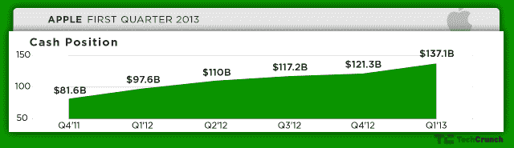

# 苹果现在有 1371 亿美元的现金，比惠普的年收入和越南的 GDP 还多

> 原文：<https://web.archive.org/web/https://techcrunch.com/2013/01/23/apple-now-has-many-billions-in-cash-more-than-hps-annual-revenue-and-vietnams-gdp/>

# 苹果现在有 1371 亿美元的现金，比惠普的年收入和越南的 GDP 还多

让我们再一次正确看待苹果惊人的手头现金数字。该公司现在拥有 1371 亿美元的现金，比上一次报告的 1213 亿美元增长了 12.9%。这么大的数字，很难意识到实际有多大。2012 年，惠普的年收入为 1204 亿美元。苹果凭借其现金略微超过惠普的收入*。更令人印象深刻的是，苹果公司的现金略多于 T4 1236 亿美元的名义 GDP。*

三星电子的年收入比这个数字略高，预计 2012 财年将达到 1800 亿美元左右。但在现金方面，苹果仍领先于其竞争对手。

苹果仍然是过去几年的盈利机器。只要这种趋势持续下去，就看不到尽头，苹果手头仍会有可观的现金(短期投资)。

然而，苹果正显示出疲软的迹象。增长似乎在放缓，三星正在成为科技的第五骑士

苹果的市值为 4800 亿美元，苹果的现金是过去 12 个月苹果股价一直非常高的部分原因。尽管围绕苹果股票有很多不确定性和波动性，但它的现金表明该公司可以非常容易地创新、收购和进入其他市场——并不是说该公司实际上为这些任务花费了大量闲置资金。

苹果公司的部分利润将用于向现有投资者发放股息，以增加承诺。

如果苹果公司想要投资数年的研发来创造一个新的产品线，该公司只需要利用其雄厚的现金。但到目前为止，该公司对大型投资和收购一直非常谨慎。2013 年是否会给该公司带来新的发展，仍有待观察。

【T2