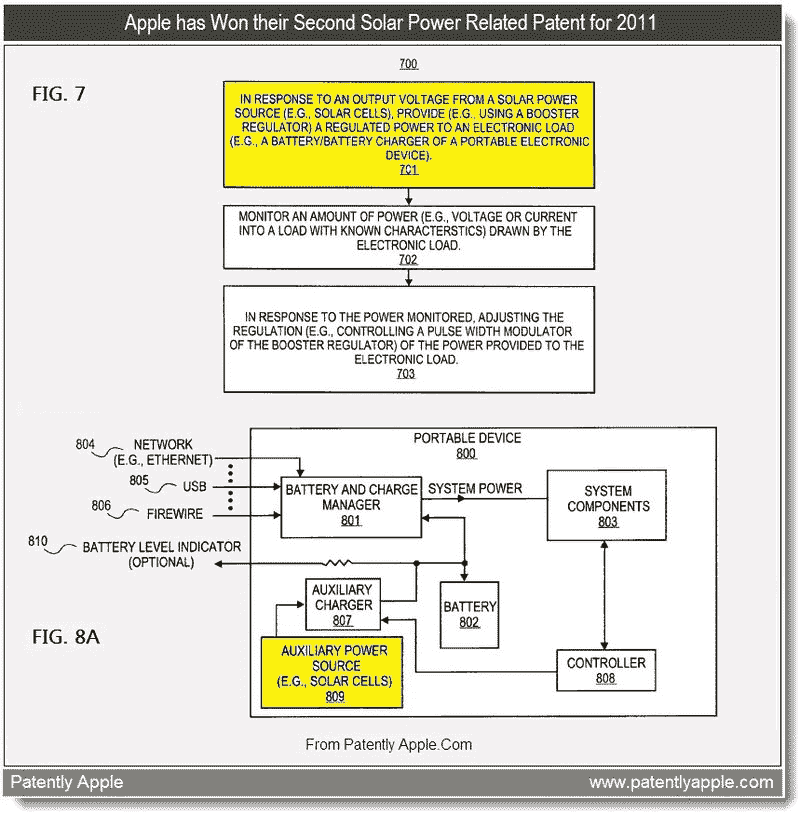

# 苹果专利描述太阳能 iPhone、笔记本充电器 

> 原文：<https://web.archive.org/web/http://techcrunch.com/2011/08/26/apple-patent-describes-solar-power-iphone-notebook-charger/>

# 苹果专利描述太阳能 iPhone，笔记本充电器

在美国专利商标局本周授予苹果的 16 项新专利中，[有一项相当有趣的专利](https://web.archive.org/web/20230205045744/http://patft.uspto.gov/netacgi/nph-Parser?Sect1=PTO1&Sect2=HITOFF&d=PALL&p=1&u=%2Fnetahtml%2FPTO%2Fsrchnum.htm&r=1&f=G&l=50&s1=8,004,113.PN.&OS=PN/8,004,113&RS=PN/8,004,113)描述了一种用于电子设备的太阳能充电系统。该专利详细介绍了一个系统，该系统包括一个电压转换器和控制器，可以与太阳能电源一起工作。

电压转换器将通过输入电缆连接到太阳能电源。它也可以通过输出电缆连接到“电子负载”上。该文件称，“电子负载”可能是一种“便携式电子设备”——这基本上意味着苹果制造的几乎任何东西，从 iPhones 到 MacBooks。

电压转换器被配置成监控设备在其输出端汲取的功率量，而控制器被配置成控制电压转换器，以便在随后汲取的功率量超过某个预定阈值时减少该功率量。换句话说，它是太阳能电子充电系统的关键部分。

苹果公司之前已经申请了一种[辅助太阳能电池](https://web.archive.org/web/20230205045744/http://www.appleinsider.com/articles/11/01/13/apple_continues_to_investigate_solar_power_for_mobile_devices.html)，可以作为移动设备的备用电源，以及一种将设备覆盖在太阳能电池中的方法[。然而，我们不太可能看到苹果(或任何人，就此而言)的太阳能设备，除非它们的生产成本降低。](https://web.archive.org/web/20230205045744/http://www.appleinsider.com/articles/10/01/21/apple_exploring_solar_power_parking_assistance_kinematic_input.html)

*图片来源:[Patently Apple](https://web.archive.org/web/20230205045744/http://www.patentlyapple.com/patently-apple/2011/08/apple-wins-solar-ios-camera-iphone-docking-patents.html)；[Tmcnet.com](https://web.archive.org/web/20230205045744/http://blog.tmcnet.com/blog/rich-tehrani/apple/solar-iphone-case-is-handy-and-useful.html)*