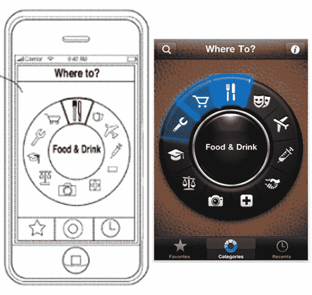
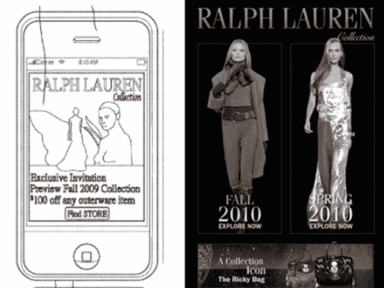
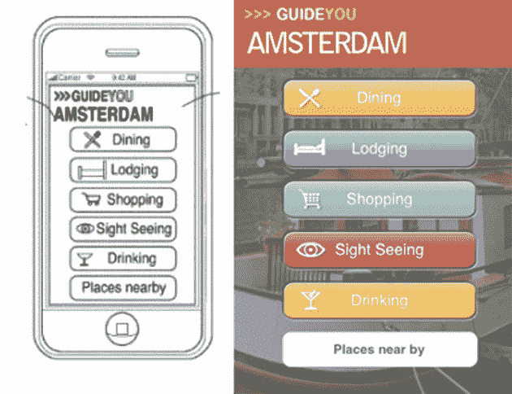

# 苹果专利图表向开发者传递了错误的信息

> 原文：<https://web.archive.org/web/https://techcrunch.com/2010/08/05/apple-patent-diagrams-send-the-wrong-message-to-developers/>

# 苹果专利图表向开发者传递了错误的信息

左边是苹果公司申请的一项旅游应用专利中包含的近期示意图。右边是现有第三方旅游应用程序[“去哪儿](https://web.archive.org/web/20221003030511/http://www.futuretap.com/home/whereto-en/)”的主屏幕界面，该应用程序自 2008 年以来一直在 app store 中。苹果公司的图表伴随着他们最近的旅行、酒店和购物[专利申请](https://web.archive.org/web/20221003030511/http://appft.uspto.gov/netacgi/nph-Parser?Sect1=PTO1&Sect2=HITOFF&d=PG01&p=1&u=%2Fnetahtml%2FPTO%2Fsrchnum.html&r=1&f=G&l=50&s1=%2220100190510%22.PGNR.&OS=DN/20100190510&RS=DN/20100190510)于 7 月 30 日公之于众[，但是直到丹·怀恩曼](https://web.archive.org/web/20221003030511/http://www.unwiredview.com/2010/07/30/apple-starts-patenting-mobile-app-ideas/)[在他的博客](https://web.archive.org/web/20221003030511/http://venomousporridge.com/post/908986088/whereto-patent)[毒粥上强调了这两个](https://web.archive.org/web/20221003030511/http://venomousporridge.com/post/908986088/whereto-patent)之间的相似之处，才有人将“去哪里”联系起来。

在处理在线财产时，知识产权法是模糊的(你不可能扔一块石头而不击中侵犯某种专利的互联网初创公司)，但是当考虑到苹果的历史[淘汰它认为具有威胁性的第三方应用](https://web.archive.org/web/20221003030511/https://beta.techcrunch.com/2009/07/27/apple-is-growing-rotten-to-the-core-and-its-likely-atts-fault/)时，很容易将如上图的引人注目的视觉变成在线煽动的踩踏。来自[未无线审查:](https://web.archive.org/web/20221003030511/http://www.unwiredview.com/2010/07/30/apple-starts-patenting-mobile-app-ideas/)

> “该死，但这是一个可怕的发展。想象一下，如果回到 1994-1996 年，有人决定坐下来，想想什么样的网络服务可以通过互联网提供，然后决定申请专利。你知道，像网上购书、买机票、预订酒店、提供购物比较服务、网上拍卖、网上电子邮件服务等

但是上面的图片需要一千多字的解释。专利申请中的艺术作品并不一定意味着一家公司试图对知识产权的特定领域提出要求。左上图是专利申请中许多现有的第三方应用程序屏幕中的一个，用来说明正在讨论的发明(与旅游、酒店和时尚零售有关的基于位置的通知)可能会被使用的应用程序。

仔细看看苹果还抄袭了哪些主屏，这让 Tumblr 首席开发者[马可·阿门特](https://web.archive.org/web/20221003030511/http://s3.amazonaws.com/data.tumblr.com/tumblr_l6pat7wszE1qzvxuio1_1280.png?AWSAccessKeyId=0RYTHV9YYQ4W5Q3HQMG2&Expires=1281149475&Signature=4MGz3Jc7bVTMQC%2FO8Wab0PImdag%3D)提出的论点更有说服力；最有可能的是，“去哪儿”、“拉尔夫·劳伦”和“引导你去阿姆斯特丹”的图像被用作与一个更大的概念相关的应用程序的例子，这个概念不会让开发商破产。

尽管这项专利申请本身并不能证明苹果正在准备推翻“去哪儿”，但逐字复制应用程序主屏幕显然不是缓解开发者工作安全担忧的最佳方式。《去哪儿》的制作者 FutureTap 在他们自己的[博客上发布了一个混乱的回应。](https://web.archive.org/web/20221003030511/http://www.futuretap.com/blog/the-patent-case-we-havent-called/)

> *“我们面临的情况是，我们不得不担心我们的主要商业伙伴试图“窃取”我们的想法和设计。那么如何应对呢？”*

处理这个问题的最好方法是，在你能够(希望)让你的公益专利律师追踪苹果之前，不要急于下结论。

毕竟，我真的无法想象苹果公司试图扼杀阿姆斯特丹的 GuideYou，更不用说拉尔夫劳伦了。我们已经联系了苹果公司寻求回应，但尚未得到回复。

上图:[丹·怀恩曼](https://web.archive.org/web/20221003030511/http://venomousporridge.com/post/908986088/whereto-patent)