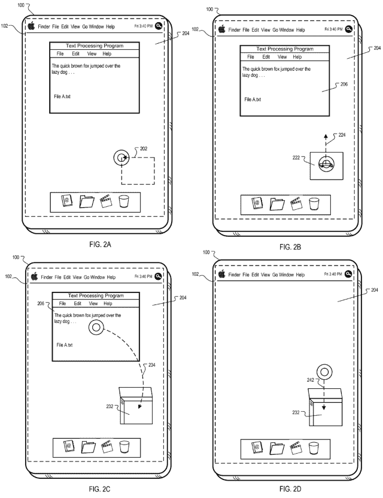
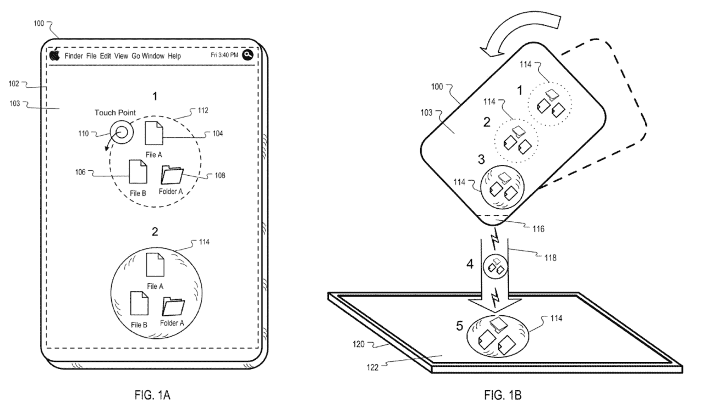
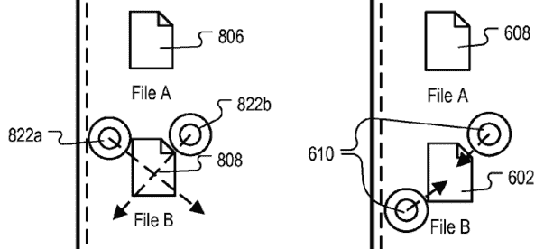

# 苹果专利暗示多部分手势，可触摸 OS X 

> 原文：<https://web.archive.org/web/https://techcrunch.com/2011/08/11/apple-patents-hint-at-multi-part-gestures-touchable-os-x/>

为触摸设计用户界面并不是一件容易的事情。至少，做好并不容易。当四个手指和一个拇指点击触摸屏时，大量多样的手势可能会导致开发和设计瘫痪。然而，我们看到实现的手势往往看起来如此简单和直观，以至于一旦我们执行了一次，我们就想知道怎么会有人在想出它时遇到困难。

苹果早期在 iPhone 上简单直观的手势取得的成功实际上在某种程度上与它背道而驰，因为添加手势会使以可访问性著称的用户界面变得过于复杂。另一方面，这阻止了他们提供更丰富的手势，如绘制形状、创建自发的 UI 项目等等。但我怀疑他们是否会停止调查。一些新发布的专利申请，虽然就可申请专利的想法而言是有问题的，但充满了有趣的想法和有前途的新 UI 概念。

[专利 20110197153](https://web.archive.org/web/20230203054024/http://appft.uspto.gov/netacgi/nph-Parser?Sect1=PTO2&Sect2=HITOFF&u=%2Fnetahtml%2FPTO%2Fsearch-adv.html&r=1&p=1&f=G&l=50&d=PG01&S1=20110197153.PGNR.&OS=dn/20110197153&RS=DN/20110197153) 被知识产权嗅探器[发现专利苹果](https://web.archive.org/web/20230203054024/http://www.patentlyapple.com/patently-apple/2011/08/apple-focused-on-advancing-ios-metaphors-to-a-higher-level.html)。该专利于 2011 年 2 月提交，涵盖了许多多部分手势，其中一个手势被用来创建或调用某个 UI 元素，然后使用该元素的第二个动作被启用。

例如，“挖坑”在这种情况下，你可以轻敲或“刮擦”屏幕几次，以创建一个“洞”，然后你可以将文件拖入其中，或者删除、隐藏，或者做任何你想做的事情。这个洞大概会自己填满，或者可以用第二个手势来完成。

另一个例子:通过绘制矩形来打开入口、活板门或窗户。这是一个类似的“拖放”概念，但由于手势和图形会有所不同，它可以实现不同的目的:创建文件夹或档案，或在电子邮件中添加附件。

在第二个专利申请( [20110193788](https://web.archive.org/web/20230203054024/http://appft.uspto.gov/netacgi/nph-Parser?Sect1=PTO1&Sect2=HITOFF&d=PG01&p=1&u=%2Fnetahtml%2FPTO%2Fsrchnum.html&r=1&f=G&l=50&s1=%2220110193788%22.PGNR.&OS=DN/20110193788&RS=DN/20110193788) )中描述了一个更复杂的手势，用户在一组文件周围画一个圆圈或斑点，然后这些文件将被包含在一个图形气泡中。然后，可以物理地倾斜该设备，并将冒泡的数据“倒入”第二个设备中。

我知道你在想什么。苹果怎么能指望为已经在*年*以类似的方式在游戏、应用程序和其他用户界面(例如使用鼠标)中使用的手势申请专利呢？我不得不想象在十万个 iOS 游戏中的某个地方，有一个你必须通过抓屏幕来挖一个洞。如果不是在 iOS 上，那么在 3DS 上，一个充满有趣的基于触摸的用户界面的平台。我们甚至在纽约的 Disrupt 上演示了数据从一个设备“倾泻”到另一个设备[。](https://web.archive.org/web/20230203054024/https://techcrunch.com/2011/05/23/churn-labs-gnonstop-gnomes/)

说实话，我真的不知道。该专利确实声称“挖一个洞，然后将一个项目拖到它上面进行处理”的方法，以及其他方法，并且它没有将它限制在管理文件表示或应用程序图标这样的具体事情上。苹果似乎想要一项挖虚拟洞并把东西放进去的专利。

这些 UI 元素的例子可以追溯到很久很久以前，即使我们有许可的专利系统，我也无法想象苹果的方法会因为是在触摸屏上完成的而被认为有足够的不同。在某个东西上画个 X 来删除它？他们有没有可能放飞它？我当然不希望如此。

* * *

抛开专利担忧不谈，从用户的角度来看，这些手势非常有趣。我一直提倡在平板电脑中实现丰富的触摸交互，但对平板电脑操作系统制造商拒绝实现只有触摸界面才有可能实现的东西感到失望。游戏在探索可能性方面比操作系统开发者做得好得多。很高兴看到有人超越了点击和拖动。鉴于苹果对触控板和触摸屏的关注，他们是第一批集成丰富手势的人，这是一个很好的赌注，即使他们甚至不是第一个创造这些手势的人。

有趣的是，该专利申请在其平板电脑插图中使用了非常 OS X 风格的图像。这不一定意味着什么；专利作者可能只是觉得用更传统的桌面界面来解释会更好。但事实远不止如此。套索文件，将它们传输到附近的设备，隐藏和删除文件和窗口——这些都不是你在苹果平板电脑上做的事情。它们是你在 OS X 中做的事情。

传送门？向你的另一个桌面发送一个窗口——在平板电脑的另一面，也许是 iOS 所在的地方？“活板门”是在两个不同区域之间传递东西的一个很好的比喻。还是为了以后保存东西——比如 Safari 里的阅读列表？

剔除物品怎么样？在 iOS 的很多地方都没有这样的空间——你通过滑动来删除列表中的项目，通过长按并调出图标的小 x 框来删除图标。此外，你如何在不滑动到另一个屏幕的情况下做出 X 呢？快速滑动被解释为定向扫动，而不是在触摸画布上的笔画。X 手势本身需要一个单屏幕的桌面，那里有没有互动的死角。同样的道理也适用于“捏”手势，这种手势要求物品的所有边都有负空间。在 iOS 上很少有这样的空间——但是你的 OS X 桌面却被它覆盖了。

将文件从一台设备共享到附近的另一台设备？听起来很熟悉——哦，对了，这是 Lion 的特色。在未锁定的设备上创建一个气泡是对文件传输的默许，无需进入任何菜单或选择网络。在另一个设备上冒泡一些文件，设备对，当你倒的时候，它传输。

这些是桌面概念，不是 iOS 概念。还是两者都有？Lion 将类似 iOS 的界面元素带到了 OS X，世界上一半的人认为我们现在已经有了可转换的触摸屏 MacBooks。不——苹果正在把 OS X 带到平板电脑上，当然，还没有完全实现。但我可以想象 iPad 的第二张“脸”,用于文件管理和共享，用更熟悉的桌面隐喻，用这样的手势更新。苹果似乎也在沿着这些路线想象一些东西，虽然这项专利仍然有很大的机会更多地是一个“为了安全起见”的有趣想法的集合，而不是实际实施，但你不得不承认，如果它们实际上被执行，你不得不考虑它们可能如何应用。