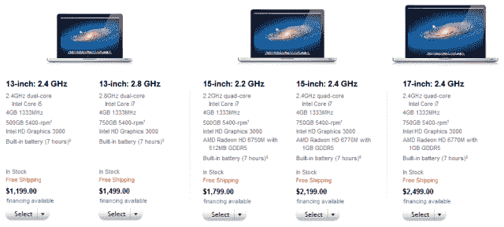

# 苹果悄悄调整 MacBook Pro 产品线，保持价格不变 TechCrunch

> 原文：<https://web.archive.org/web/https://techcrunch.com/2011/10/24/apple-quietly-tweaks-macbook-pro-line-up-leaves-prices-unchanged/>

# 苹果悄悄调整 MacBook Pro 产品线，保持价格不变

苹果在苹果商店更新了其 MacBook Pro 产品，报道[这是我的下一个](https://web.archive.org/web/20230203220836/http://thisismynext.com/2011/10/24/macbook-pro-specs-update-october-2011/)，在[9 到 5Mac](https://web.archive.org/web/20230203220836/http://9to5mac.com/2011/10/23/apples-new-macbook-pro-lineup-revealed-with-faster-processors-and-more-storage/) 早些时候泄露了笔记本产品阵容更新的细节。

不要期望看到惊人的变化，因为调整相对较小。它们包括更快的处理器、更大的存储空间和一些小的图形更新。

证实了新阵容的早期泄漏，入门级 13 英寸 MacBook Pro 现在配备了 2.4 GHz 双核处理器(之前为 2.3 GHz)和 500 GB 硬盘(之前为 320 GB)。

基本的 15 英寸 MacBook Pro 现在配备了 2.2 GHz 的四核处理器(之前为 2.0 GHz)，而 17 英寸 MacBook Pro 已经升级为 2.4 GHz 的四核处理器(之前为 2.2 GHz)。

15 英寸和 17 英寸的机器也进行了一些图形升级(变化:从 AMD 镭龙 HD 6750M 到 HD 6770M 了解更多[这里](https://web.archive.org/web/20230203220836/http://www.amd.com/us/products/notebook/graphics/amd-radeon-6000m/amd-radeon-6700m-6600m/Pages/amd-radeon-6700m-6600m.aspx))。

略有升级的车型价格没有变化。

