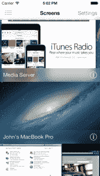
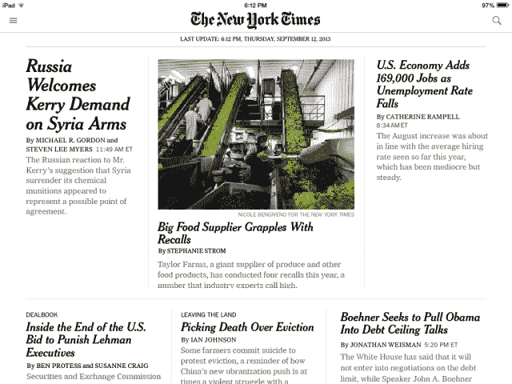
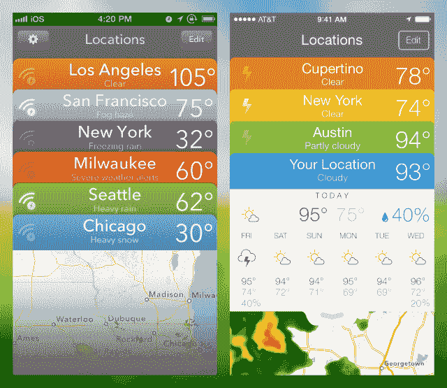
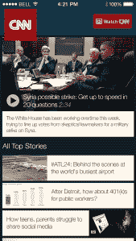
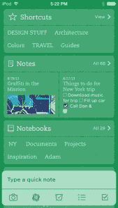

# 苹果用 iOS 7 重新发明轮子，带着开发者一起上路 TechCrunch

> 原文：<https://web.archive.org/web/https://techcrunch.com/2013/09/18/apple-re-invents-its-wheel-with-ios7-takes-developers-along-for-the-ride/>

今天发布了苹果有史以来最引人注目的 iOS 更新。更多的人将在比计算历史上任何时候都短的时间内经历这种变化。

Evernote 首席执行官 Phil Libin 说:“以在同样的 24 小时内将会看到巨大变化的人数来衡量，我认为 iOS 7 是科技史上最重要的一天。在宇宙的历史上，从来没有像今天这样的一天，亿万人将会看到他们已经习惯的东西发生巨大的变化。这种规模的事情从未发生过。”

为了让这句话有个背景，请记住六年前 Windows 主导了平台领域，OS X 拥有大约 5%的市场份额。现在，iOS 和 Android 的结合已经取代微软成为操作系统的最大市场。最近的一项测量显示，他们的统一计算设备份额为 45%,而 Windows 仅为 35%。即使这些数字有点偏差，但很明显，我们的大部分计算生活现在都是通过移动设备以及在这些设备上运行的软件来实现的。【T2

然后你开始思考我们如何看待这些平台的更新或变化。从发布之日起，Windows 版本之间的过渡可能需要数年时间。Windows 8 仍然在曲线的低端缓慢前行。在移动世界，更新更好的 Android 版本，如果冻豆，需要几个月，如果不是几年，才能达到有意义的市场份额。是的，与旧版本的谷歌操作系统相比，果冻豆更好看，更强大，非常非常好。但是根据[谷歌自己的数据](https://web.archive.org/web/20221206232222/http://developer.android.com/about/dashboards/index.html)，只有大约 45%的 Android 用户在他们的设备上看过它，而且它是在 16 个月前发布的。绝对最新版本的果冻豆还没有在谷歌的图表上注册。

然后我们有 iOS。由于苹果极其专注的设备战略和严格控制的模型，不理会运营商的让步和合作伙伴的许可，相比之下，iOS 的采用率高得惊人。移动应用性能管理公司 Crittercism 最近的预测估计(如果 iOS 7 遵循 iOS 6 的趋势)，新操作系统将在三个月内达到 80%的采用率。

最近，苹果公司表示，他们下个月销售的 iOS 设备将突破 7 亿台大关。显然，并不是所有的手机都兼容 iOS 7，但由于 iPhone 的销量在过去几年里呈指数增长，许多手机都会兼容。

所有这些加起来意味着，在接下来的几周内，将会有大量的人升级到 iOS 7。可能上亿。他们所有人都将接触到他们最个人化的电脑的一个令人震惊的不同的新版本。

它为开发苹果平台应用的开发者创造了完美的机会风暴，其中一些人正在充分利用这一机会。对他们来说，这是一个难得的机会——正如一位匿名开发者最近所说的那样——“重新竞争他们在宇宙中的位置。”

这种机会不会经常出现，许多大大小小的开发商都在趁热打铁升级。

### 是时候反思了

2012 年，当 Luc Vandal 和 Edovia 团队试图开发他们广受欢迎的[远程登录应用程序 Screens 3](https://web.archive.org/web/20221206232222/http://www.edovia.com/en/) 的下一个版本时遇到了障碍，他们把它放在了一边。直到关于 iOS 7 是一个重大更新的谣言开始冒泡，果汁才再次开始流动。由于他们不知道更新会带来什么，他们做了一些初步工作，并重写了应用程序的后端。

随后，WWDC 走过来，苹果推出了全新的操作系统外观和感觉。

“iOS 7 就像是 2008 年的重演，”汪达尔在苹果推出应用商店的那一年说道。“这是一个重新开始、重新思考你的应用、定位你的公司和应用的机会。如果你问我，这是一个很好的时机，因为 iOS 已经老了，想一遍又一遍地做同样的事情。”

Vandal 确信，这种对 iOS 外观和感觉的破坏让他们的工作变得更容易。无论是在证明重大重新设计的合理性方面，还是在将这些重大更新作为新的付费应用提供方面。这是许多开发者在 iOS 7 中采用的一种策略，因为设计工作不仅仅是重新换肤，很多时候还涉及从头开始重写应用程序。

“就 iOS 7 本身及其带来的变化而言，需要一段时间来适应它并理解其中的微妙之处，”Vandal 说。所以我们从内容为王的理念出发，努力把 chrome 降到最低。我们也试图适应分层哲学，这最终是有意义的。我们试图保持一致，从层次的角度来思考，牢记下面仍然有内容，必须保持某种有意义的上下文形式。我想我们做对了。"

Vandal 说，iOS 的另一个吸引人之处在于，它更容易证明它是最低版本，从而将旧版本的 iOS 甩在身后。这是通过 iOS 中改进的框架和类来实现的，这些框架和类用内置功能替换了大量的旧代码。然而，汪达尔仍然非常希望 iOS 的未来版本能够带来改进。目前的版本仍未全面启动，但他对苹果的发展方向感到满意。“我迫不及待地想看看 iOS 8 给我们带来了什么，”他说。

Screens 是一个非常有用的应用程序，新的 iOS 7 版本更干净，也更有目的性。屏幕本身成为界面元素，而不是像 iOS 6 版本那样，将它们封装在显示器的图形表示中。它速度快，反应灵敏，同时感觉既熟悉又新鲜。

打破你已经创造的结构并重新创造的机会也证明了对像美国航空公司这样的大品牌的吸引力。

当 iOS 7 的消息传出时，美国航空公司已经在考虑其广泛使用的航班跟踪和票务应用程序的新版本。最近的变化是，美国航空在应用程序中采用了新打造的制服和品牌。但是 iOS 7 提供了特殊的机会。

美国航空公司的移动应用主管菲尔·伊斯特说:“当它出来的时候，我们意识到这是一个以不同于‘09’的全新面貌出现的机会。”。“所以在 WWDC，我们看到了很多我们想玩的有趣的东西。”

最终，复活节和他的团队从 iOS 7 的发布中获得的最大收获是对数据的关注。

“以前，它是关于视觉糖果和屏幕上闪闪发光的物体。随着时间的推移，我们从微软[Windows Phone]那里看到的是，消费者需要数据，而我们非常受数据驱动，”伊斯特说。

事实上，在旅行前的 24 小时内，随着人们刷新和三次检查航班状态，美国航空公司的移动应用程序的流量是桌面应用程序的 10 倍。伊斯特说，因此应用程序呈现给用户的数据需要“简洁、快速”。“我认为 iOS 7 首先是关于数据的，而不是关于制作漂亮的图标。”

为了向用户呈现更多数据，AA 应用程序从主要由页面驱动的系统切换到“线性”数据显示，让你在主视图中向下滚动，以获得一目了然的状态。该设计是利用美国人认为更加数据驱动的 iOS 7 的工作成果，也是与苹果公司就帮助该应用真正实现 iOS 7 所需的调整进行的一些对话的结果。伊斯特说，在这一点上，美国人觉得他们有一个非常好的 iOS 7 的“第一个应用程序”，最重要的是，已经过很好的测试。

“有报道称……很多应用程序将会崩溃(在 iOS 7 上)，”伊斯特说。“航空应用受到重创，因为人们讨厌航空公司。所以，如果你不能用你的应用程序解决世界饥饿问题，你就有麻烦了。”

伊斯特说，该应用程序有 900 万次下载，他们根本无法承受第一天的灾难。“这些是旅行者，你知道，他们为服务付费，如果他们的应用程序不工作，我就会被扫地出门。”

伊斯特认为，在发布日可能会出现的一个问题是，苹果并没有真正发起一场运动，指导开发者在 iOS 7 上检查和重新测试他们的所有应用，为发布做准备。相反，苹果将它视为“任何其他 iOS 版本”，而不是 iOS 7 的重大变化。伊斯特说，美国人确实发布了兼容性更新，但表示该应用程序中仍有许多东西无法在 iOS 7 上运行。因此，看看推出后的前景会是什么样子，以及有多少开发者会在不知不觉中遭遇崩溃，这将是一件有趣的事情。

为了让用户了解 iOS 7 应用程序的新外观和感觉，美国航空公司正在整理一个教学视频，并发布在 YouTube 上。我有一种感觉，这将是一个有趣的转变，特别是对于像 American 这样多年来一直没有改变其应用程序外观和感觉的大品牌来说。

复活节还看到了苹果新蓝牙 iBeacons 在本地签到方面的一些有趣机会。伊斯特说:“苹果基本上扼杀了 NFC，这是(它)最后的机会了。”。这一点，加上 TouchID，可能会让美国人更愿意接受他们的“信用卡”在手机上的事实。

“我们的员工、资产和雇员总是在移动，”伊斯特说，“所以这种身份的概念，即我们可以在门口跟踪他们，为残疾人或未成年人服务……我对我们可以开始获得的数据感到非常兴奋。”

iOS 7 也让 AA 团队有机会专注于应用的可访问性方面。导致苹果的 Voiceover 辅助功能系统在整个应用程序中为视障人士启用。我们正在努力让这款应用程序更好地为其他残障人士服务。伊斯特表示:“就我们运送的人数而言，我们就像一个小国，所以这是我们人口中的一大块。”他认为苹果是无障碍努力的支持者。

新的应用程序做得很好，与旧的 AA 应用程序相比非常有吸引力。我使用它们已经有一段时间了，这个版本无疑是一个重大改进。当我第一次推出这款应用时，我被震惊了，因为美国航空公司充分利用了 iOS 7 的视差和边对边特性，推出了我见过或用过的最好看的航空应用。我只是摆弄了一下航空公司提供的一些样品航班，但是如果发射顺利的话，会让很多旅行者高兴的。

伊斯特还有一条建议，在我们跨平台的环境中很有趣。“许多企业使用除原生以外的工具，我认为[iOS 7]是这一理论的分界线，”他说。“如果你不进行本地开发，那么你将很难适应这个平台。”

“抽象并移植到移动平台的工具…你可以侥幸成功。但是当你看我们的应用程序时…你不可能把它抽象化。它只是提出了一个观点，如果你有钱投资…你的开发者需要是本地人。其他一些非本土商店可能会经历更艰难的时期，他们可能不得不完全本土化，以适应(iOS 7)。”

这样做的效果可能是建立在平台锁定的基础上，特别是对于没有 AA 资源的小商店。如果一家小公司只有几名开发人员，那么 iOS 7 可能是一个起点，一旦开始，将这些应用移植到其他平台将变得更加困难。

其中很大一部分是 iOS 7 迫使开发团队重新思考和评估他们的应用程序。一些较大的出版物看到了如此多的好处，以至于他们将所有的筹码都押在了 iOS 7 上。

### 切断联系

《纽约时报》iOS 版应用程序的下一个版本将只有 iOS 7，这是一份关于公司对苹果出货能力的信心的重要声明。NYT 高级软件工程师 Chris Ladd 表示，这使得时报不仅可以利用新的设计，还可以利用 iOS 7 中的新 API。

“当我们去 WWDC 的时候，我们正在进行两个应用的重新设计项目，”Ladd 说。“坐下来重新思考，我们已经有了这些应用，它们是好的应用……但让我们坐下来重新思考‘我们在 iOS 上看起来像什么？’

最初的计划是在六个月内重新设计应用程序，并于 2014 年在 Q1 的时代品牌上看到新的应用程序。但是当团队在 WWDC 看到 iOS 7 时，他们做了一些测试和原型制作。反响如此积极，以至于《纽约时报》决定加快重新设计的速度，而这原本只需要六周的时间。

结果是对应用程序的重新思考，而不是重新设计，就像我们在许多 iOS 7 之前的应用程序更新中看到的那样。如果不是 iOS 7，我们不可能这么快就看到这个新版本。

“那么，iOS 7 改变了我们的开发方式吗？当然，”拉德说。

此前，NYT 支持 iOS 5 和 iOS 6。专门转到 iOS 7 让他们能够利用 iOS 7 的新功能，并摆脱许多旧功能的束缚。Ladd 给出了几个支持 iOS 7 只会让《泰晤士报》应用受益的原因。

首先，苹果提供了促销机会。众所周知，该公司的特色应用程序全力支持最新版本的操作系统，并立即利用新的应用程序接口和功能。不能保证《泰晤士报》会被苹果占据，但这增加了可能性。

“支持一个版本，一个主要版本的软件更便宜，”拉德指出。“你最终会把自己绑在开发的节点上，用所有你正在做的很酷的事情来写所有旧的 API。”

当团队选择只使用 iOS 7 时，它也能够丢弃“成千上万行代码”，这减轻了应用程序的结构，使其成为一个更精简的产品，并且不太难以为团队工作。《纽约时报》是 iPad 上最早的应用之一。Ladd 说，当它还是一个秘密项目的时候，应用团队被派去在一个安全的无窗房间里工作，可以接触硬件。其中一些代码仍然存在于应用程序中，所以 iOS 7 是一个扫除障碍的机会。

苹果最近[推出的“应用复活”功能](https://web.archive.org/web/20221206232222/https://beta.techcrunch.com/2013/09/17/apples-app-resurrection-feature-great-for-customers-but-opaque-to-developers/)也是拉德和他的团队一直在办公室测试的一项功能。它应该允许顽固分子为他们的设备下载最新兼容版本的应用程序，如果他们没有更新 iOS 的话。

当然，iOS 的巨大采用曲线也没有坏处。随着超过 85%的用户在最新版本发布后的几周内使用，该应用程序仍将吸引大多数读者。

“iOS 7 最令人兴奋的事情之一…是自动更新的概念，”拉德说。尽管《纽约时报》的应用程序更新速度很快，但自动更新应该会让它更快。“只要知道我们将能够完善和更新这个应用程序，并且它将很快提供给用户，这对我们来说就是一个巨大的胜利，”他补充道。

“实际上，我自己也发现这很神奇，”拉德说。“当我在工作时，我会创建并运行一个新的应用程序……但当我周末在家时……我会拿起我的 iPad 打开它，新闻就在那里。而且我知道打开之后就没更新过。我不知道他们到底是怎么做到的。我想这一定是当你拿起设备时的动作加上时间..因为不规律。作为用户，这是 iOS 7 最神奇的地方之一。”

在 iOS 7 中，苹果将后台更新捆绑在一起，以最大限度地减少 CPU 和无线电活动，节省电池寿命，并以更有效的方式让应用程序在你打开时“准备就绪”。然而，这些更新是如何触发的还没有完全定义。据我们所知，这是一系列因素的组合，包括根据您之前启动应用程序的时间来预测您下次启动应用程序的时间。它会在发布前不久进行后台更新，在你发布时给你新的数据。开发者还可以通过推送通知触发后台更新，但 iOS 不会立即对其采取行动，而是等待将其与其他更新捆绑在一起。

拉德说，这证明了苹果处理这类问题的方式。它平衡了开发者的愿望和可用性问题。这一点从开发者在后台不断更新应用程序的方式，以及苹果用一个(理论上)更高效的系统来回答这一问题的方式中显而易见。

“当有人向你要东西时，”拉德说，“他们可能不是在问他们真正想要什么……他们真正想要的是你为他们解决一个问题。苹果真的很擅长后退一步，问一问这里的实际问题是什么，以及最简单、最便宜的解决方法是什么。”

当然，正如我们看到的“旧应用”功能，这种平衡并不总是正确的，对用户来说太过错误，让开发者陷入困境。但是，在这种情况下，后台 API 似乎像宣传的那样工作。

“我们希望《纽约时报》在 iOS 上绝对有宾至如归的感觉……但最终我们希望它看起来像我们一样，”Ladd 说。“我们设计思维的很大一部分包括你在报纸上看到的更多细微的排版，杂志的全出血封面和杂志的字体。”

完全剥离应用程序的设计和保持应用程序的焦点之间的矛盾是我们在开发者身上看到的一个反复出现的主题。

### 设计挑战

我们采访过的许多开发人员都表示，在保留应用核心的同时重新诠释他们的应用是 iOS 7 最大的困难。感觉上的变化如此彻底，又如此微小，以至于本能的反应是简单地将应用程序筛选到最基本的元素。

“虽然许多交互与 iOS 6 相似，但 iOS 7 看起来和感觉上都很新鲜。比扬戈的 T2 马克·爱德华兹说:“很多用户可能会认为没有利用 iOS 7 设计队列的应用程序陈旧过时。”尽管完全使用普通的 UI 部件并不能解决问题——我认为保持你的应用程序的个性是很重要的。所以，这是一个平衡的过程，而且相当艰难。"

爱德华兹引用状态栏作为一个特殊的挑战，状态栏现在与每个应用程序合并，以创建一个统一的感觉。

“在 iOS 6 中，状态栏被视为自己的实体，经常融入硬件中。爱德华兹说:“iOS 7 将状态栏和导航条合并为一个单元，这给应用程序开发人员带来了问题——我们现在必须围绕一系列繁忙的图标和文本进行设计，而且我们对它的外观几乎没有控制。”“如果我想在 iOS 8 中做一件事，那就是让状态栏恢复到 iOS 6 中的状态，或者找到更好的解决方案。”

[大卫·巴纳德](https://web.archive.org/web/20221206232222/https://twitter.com/drbarnard)将他的[新品牌对比](https://web.archive.org/web/20221206232222/http://contrast.co/perfect-weather/)和新应用[完美天气](https://web.archive.org/web/20221206232222/https://itunes.apple.com/app/perfect-weather/id695709241)的发布时间定在了 iOS 7 的发布时间。

“谢天谢地,《完美天气》是少数几个只需调整视觉效果就能让它在 iOS 7 上如鱼得水的例子之一。巴纳德说:“我们已经确定了一种基于手势的用户界面，它以类似于 iOS 7 的方式使用深度和物理学，所以我们实际上不必重新考虑 iOS 7 的应用程序。”“很多开发人员可能会说同样的话，但他们是错的，但我认为时间会证明，完美天气在 iOS 7 的新用户界面范例中是站得住脚的。”

巴纳德还指出，今年发布一个稳定的版本变得更具挑战性，因为苹果最近发布的 iOS 7 Gold Master 版本中一些“明显”的错误没有得到解决。“我们一直在努力解决一些问题，这些问题太明显了，以至于我们以为通用汽车已经解决了，”他说。

巴纳德和他的团队认为 iOS 可能“最小化”的程度与 iOs 7 的最终设计进行了比较，这表明苹果在 WWDC 推出的变化是多么令人惊讶:

但是对一些开发者来说，强行推动这些改变无疑会使他们在发布前很难将所有的改变都做好。一些知名开发者，如 Tapbots 的保罗·阿达德，表示他们将继续开发他们的软件，直到他们对质量感到满意，然后再发布“iOS 7”版本。

“我强烈反对把一个应用程序锯掉每一个微小的阴影和渐变，”苹果设计奖获得者 Ryan Orbuch 说。Orbuch 和 [Michael Hansen](https://web.archive.org/web/20221206232222/https://twitter.com/mhansend) 致力于给待办事项应用 [Finish](https://web.archive.org/web/20221206232222/https://itunes.apple.com/us/app/finish./id558559470?mt=8) 一个新的外观，同时不剥离所有的个性。 

“没有人希望 iOS 7 上的每个应用程序看起来都一样，事实上，即使是苹果也不希望如此——我认为这经常被误解，”Orbuch 说。“我们在过去版本的 Finish 中远离了 iOS 6 UIKit 元素，以提供我们自己独特的感觉和功能，仅仅因为这些元素发生了变化就切换回股票元素完全没有意义。我重新构建了我们的界面，进行了许多细微和重大的改变和改进，让我们感觉更干净、更轻便，我对此感到非常兴奋。”

普遍的共识是，iOS 7 实际上比 iOS 6 更难设计，即使它的界面元素本质上更简单。事物的简单性使得每一个选择都极其重要，当答案远非如此简单时，诱惑设计师满足于“最小化”。iOS 7 的第一波应用可能是一个“树脂”和真正“重建”应用的混合体。

但也有一些公司利用 iOS 7 作为催化剂，开启全新的品牌形象。其中之一是 CNN。

### iOS 7 的影响

CNN 正处于桌面、移动和移动网络“平台再造”的努力中。iOS 7 的设计线索将告知所有其他平台，因为它改变了向客户展示内容的方式。

无论 iOS 7 如何，iOS 应用程序的重新设计都将发生，但现在他们能够利用审美的突破，创建新的调色板，在应用程序中使用半透明和动态，并利用背景 API 更快地传递新闻。

如果出现突发新闻警报，CNN 会向应用程序上的内容发送刷新，这样当用户点击突发新闻警报时，他们可以立即访问头条新闻页面上的最新内容。以前，除非应用程序在过去 10 分钟内运行过，否则需要刷新应用程序。

应用程序的新[设计也更符合 CNN 下一次更新在网络和移动网络上推出的响应设计。CNN 表示，iOS 7 的布局对这种模块化思维更加友好，当与 CNN 提供的响应式网络版本一起使用时，应该会使应用程序更具凝聚力。](https://web.archive.org/web/20221206232222/https://itunes.apple.com/us/app/cnn-app-for-iphone/id331786748?mt=8)

事实上，iOS 7 正在影响一个品牌机制的其他组成部分，这也是与开发者交谈的一个常见话题。

Evernote 首席执行官 Phil Libin 表示，iOS 7 应用程序的重写是“我们做过的最具戏剧性的开发项目”，并指出这将影响其他平台上的其他版本的应用程序。

Evernote 的这个版本和之前的 iOS 版本之间几乎没有代码共享。利宾称之为“每 5 年一次的大扫除”。

“我们想这样做，因为这是一个机会，”利宾说。“iOS 7 最重要的一点是，它给人的感觉快了很多。在 iOS 7 中做事感觉更直接了…最大限度地减少了动作和手势以及视觉噪音。所以我们的主要目标是让它感觉更快，在现实中更快，但也感觉更快。”

为此，Evernote 摆脱了之前使用的所有物理隐喻，以拥抱新的动态 UI。利宾说，这些东西增加了应用程序的“重量”，它们必须被删除。在未来一年左右的时间里，这些选择将会影响 Evernote 明年推出的应用版本。

但这并不容易，利宾说，他们在最初的几个星期里一直在为此挣扎。他在他的主要设备上使用 iOS 7，他们试图感受“这个平台想要成为什么，它想要我们做什么，”他说。利宾说，主要的挑战是时间，因为这是一个巨大的变化。"这可能是我们做过的最难的项目。"

【T2

Libin 说，与之前的任何版本相比，这个项目将在更短的时间内被更多的人看到。Windows 和 Android 需要一年或更长时间来改变许多人的个人平台。“这在 24 小时内是闻所未闻的，”他说。

Libin 还提到 64 位架构对 Evernote 未来的应用非常重要，因为这将允许他们在客户端而不是服务器端做更多的事情。Evernote 也在使用 Airdrop，并计划让它和 iBeacon 为用户增加更多功能

“我已经很久没有对一个新平台如此兴奋了，在接下来的几个月里，它会以多快的速度让我们的应用程序变得更好，”Libin 说。

### 震惊和敬畏

在过去的几个月里，我听到许多开发者以这样或那样的方式重复说，iOS 7 会让用户感到“震惊和敬畏”。我不认为这个词完全是褒义的。简而言之:iOS 7 是一个如此大的变化，以至于大多数开发者都不知道用户会对它做出什么反应，也不知道他们会对符合其审美的应用做出什么反应。

一切都是不稳定的，iOS 上的移动领域已经被分裂成一堆微小的碎片。这是平台上的开发者罢工、发表声明的时候了。此时，新的赢家将崛起，旧的领导者将倒台。iOS 7 现在的机会从未如此之大，甚至连李斌颇具戏剧性的说法听起来也是真的——至少在 iOS 社区内部是这样。

最后，这也是对苹果的一个考验。它的用户更新到新的 iOS 会像他们以前的版本一样快吗？该框架易于升级，但人们会利用它吗，即使它将彻底改变他们的设备和应用程序的外观？他们知道会这样吗？

即使用户选择升级，他们会有什么反应仍然是个问题。这里为开发者创造的重新想象他们的应用的机会是否也会导致他们疏远那些对六年来没有改变的 iOS 的整体感觉感到舒服的人？

到目前为止，只有一些问题，以及大大小小的开发商的大量押注。接下来的几周应该会给我们一些答案。