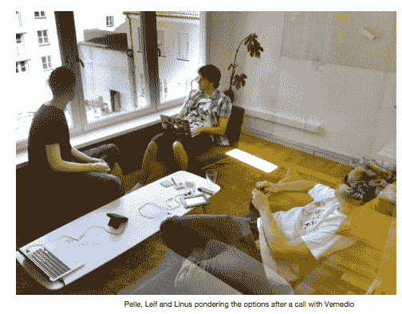

# 苹果拒绝集成微支付服务 Flattr 的应用程序，该公司声称“这不是终结”

> 原文：<https://web.archive.org/web/https://techcrunch.com/2012/05/28/apple-rejects-apps-integrating-micro-payments-service-flattr-company-claims-its-not-the-end/>

这可能不是结束，但预后看起来不太好。社交微支付平台 [Flattr](https://web.archive.org/web/20221005143752/http://flattr.com/) 在其博客上详细描述了[今天上午在移动领域的未来增长机会方面受到了不利的打击。在二月份被整合到流行的第三方播客管理器](https://web.archive.org/web/20221005143752/http://blog.flattr.net/2012/05/apple-rejected-flattr-but-its-not-the-end/) [Instacast](https://web.archive.org/web/20221005143752/http://vemedio.de/) 之后，苹果在五月初决定从 iTunes 应用商店拒绝该应用，因为它整合了 Flattr。结果呢？Instacast 重返应用商店的唯一方法是改变应用程序中的用户流，将实际的“flattr”(微支付过程的名称)改为在 Safari 网络浏览器中进行。苹果承认，这不是一个理想的用户体验，但这是 App Store 审查指南所要求的。

对于那些不熟悉的人来说，Flattr 让用户点击直接向内容创建者捐赠资金。TechCrunch 的 Mike Butcher 曾经这样评价这项服务。要使用 Flattr，用户需要决定他们每月想要花多少钱，然后，只要他们在网络或手机上看到 Flattr 按钮，他们就会点击捐赠。月底，Flattr 会统计你所有的点击量，然后平均分配资金。该公司在本月初与网络视频巨头 Dailymotion 达成了高调的合作关系，目标是 daily motion“motion makers”类别中的顶级内容创作者。(不过，Butcher[还是质疑了](https://web.archive.org/web/20221005143752/https://beta.techcrunch.com/2012/05/02/flattr-finally-lands-big-dailymotion-deal-but-its-business-model-still-sucks/) Flattr 当时的商业模式)。

通过 [Instacast 集成](https://web.archive.org/web/20221005143752/http://blog.flattr.net/2012/04/instacast-the-podcatcher-that-gives-back/)，flattr 功能允许听众在听完节目后“Flattr”(捐赠给)播客创建者。还有一个“自动 flattr”选项，允许用户在剧集开始播放后自动 flattr 播客。

根据 [Flattr 的社区构建者 Siim Teller](https://web.archive.org/web/20221005143752/http://blog.flattr.net/2012/05/apple-rejected-flattr-but-its-not-the-end/) 的说法，苹果在 5 月 6 日拒绝了 Instacast，引用了 App Store 指南 21.2，内容是:*“捐款的收集必须通过 Safari 中的网站或短信完成。”*当然，Flattr 允许应用内捐赠。苹果公司自己说:*“我们明白，把你的用户引导到你的应用程序之外可能不是你更愿意提供给你的用户的用户体验。然而，这是各种 iOS 应用程序的常见体验。”*

苹果公司 5 月 24 日的最终裁决对 Flattr 不利。Instacast 的制造商 Vemedio 被迫移除应用程序内的 Flattr 集成，以便将其应用程序的关键漏洞修复程序推送到应用程序商店。

尽管 Flattr [的博客文章](https://web.archive.org/web/20221005143752/http://blog.flattr.net/2012/05/apple-rejected-flattr-but-its-not-the-end/)标题为“*这不是结束*”，但事情看起来并不顺利——至少在 iOS 方面是这样。指导方针很明确。尽管 Teller 报告说 Vemedio 将“继续与苹果就 Flattr 集成进行对话”，并且他承诺 Flattr 将继续测试不同的集成方式，但苹果很可能不会改变主意。

正如今日博客 burning up [Hacker News](https://web.archive.org/web/20221005143752/http://news.ycombinator.com/item?id=4033636) 所指出的，在处理了愤怒的父母的余波后，苹果可能只是在保护自己的背部，这些父母的孩子通过应用内购买积累了巨额 iTunes 账单。尽管 Flattr 用户自己设置每月捐赠金额，并且必须手动启用集成，但混乱的对话框或 UX 流可能会导致意外捐赠。

然而，更重要的是，flattr 可能会成为苹果自己的应用内购买系统的替代品，允许用户“Flattr”来交换虚拟商品。考虑到苹果削减 30%的应用内购买是其应用业务的主要收入来源，这将是*的一大禁忌。苹果决定打破用户体验，而不是用 Flattr 集成来监管所有未来的应用。开发者、用户和内容创作者可能不喜欢这个决定，但最终结果对 Flattr 生态系统来说是比苹果更坏的消息。*