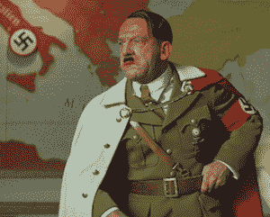
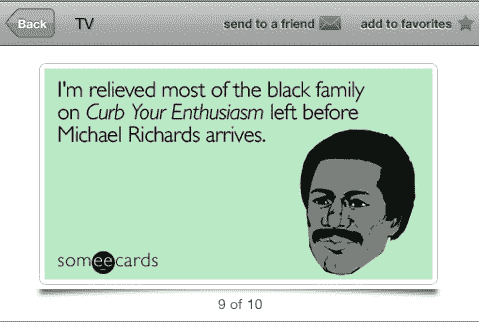
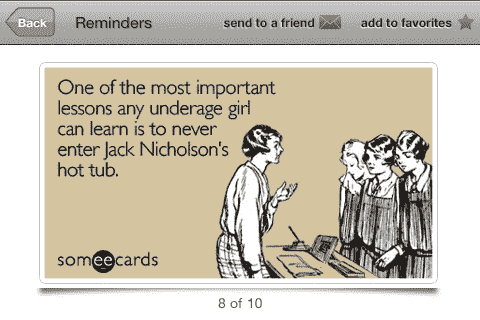
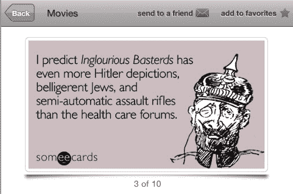

# 苹果拒绝 Someecards 应用程序，因为它充满了 Someecards 内容 

> 原文：<https://web.archive.org/web/https://techcrunch.com/2009/10/07/apple-rejects-someecards-app-for-being-full-of-someecards-content/>

# 苹果拒绝 Someecards 应用程序，因为它充满了 Someecards 内容

 [Someecards](https://web.archive.org/web/20230124164848/http://someecards.com/) 太他妈搞笑了。太搞笑了，显然对苹果来说。

这是一个令人惊讶的举动，因为苹果公司在荒谬的应用程序拒绝方面越来越好，苹果公司已经[拒绝了](https://web.archive.org/web/20230124164848/http://someecards.wordpress.com/2009/10/07/someecards-iphone-app-rejected-for-making-fun-of-celebrities/)一些 iPhone 应用程序，理由是它“*包含令人反感的内容和嘲笑公众人物的内容。任何访问过一些电子贺卡的人都会知道这是标准做法，也是这个网站如此有趣的原因之一。*

那些公众人物是谁？一个是希特勒。另一个是迈克尔·理查兹(来自《宋飞正传》的克莱默)。第三个是罗曼·波兰斯基(通过杰克·尼克尔森)。

嘲笑希特勒应该不需要解释(平心而论，苹果可能不太在乎这个，但可能更在乎犹太人的说法——顺便说一下，这是指*无耻混蛋*，一部很棒的电影)。迈克尔·理查兹因为几年前的种族主义爆发而被嘲笑。和罗曼·波兰斯基关于他的法定强奸罪(发生在 20 世纪 70 年代杰克·尼克尔森的房子里)。

这是苹果公司在给几十年前的卡片的回复中提到的三张他们觉得不合适的图片。现在，可以肯定的是，所有这些笑话都最适合成熟的观众，但有些人确实将他们的应用程序评为 17+。更重要的是，所有这些显然都是讽刺作品，是受第一修正案保护的。

最棒的是，这又是一个苹果拒绝一个包含内容的应用程序的案例，你可以通过将你的 Safari 网络浏览器定向到 someecards.com，轻松地在你的 iPhone 上获得这些内容。主要的区别在于，应用程序有一定程度的保护(如果父母选择打开它)来阻止孩子使用它。在 iPhone 网页版上，欢迎所有人！

你可能还记得，苹果曾一度拒绝了一款包含巴拉克·奥巴马著名的谢泼德·费尔雷“希望”照片的应用程序。理由也是它“嘲笑公众人物”。苹果[最终改变了它的调子](https://web.archive.org/web/20230124164848/http://techcrunch.com/2009/08/21/apple-continues-to-right-app-store-wrongs-obama-hope-app-is-go/)，希望他们在这里也一样。讽刺就是讽刺，而且都在网上，很搞笑。放松点，苹果。

