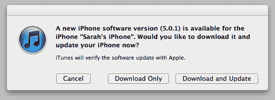
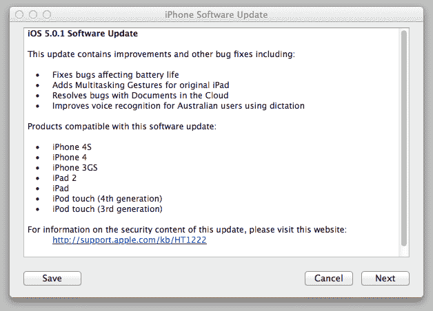

# 苹果发布 iOS 5.0.1 修复 iOS 5 电池问题 

> 原文：<https://web.archive.org/web/http://techcrunch.com/2011/11/10/apple-releases-ios-5-0-1-to-fix-ios-5-battery-issues/>

# 苹果发布 iOS 5.0.1 修复 iOS 5 电池问题

还记得那些令人沮丧的 [iOS 5 电池问题](https://web.archive.org/web/20230205045840/https://techcrunch.com/2011/10/31/iphone-4s-battery-life-bugs-got-you-down-try-this/)吗？看起来它们即将成为过去，因为苹果刚刚发布了 iOS 移动操作系统 iOS 5.0.1 的更新，旨在解决这个问题。软件更新还包括其他一些调整，包括通过 iCloud 同步文档的错误修复，为 iPad 1 添加多任务手势，以及为澳大利亚用户改进语音识别。

在客户投诉[充斥](https://web.archive.org/web/20230205045840/https://discussions.apple.com/message/16581689#16581689)苹果支持论坛后，公司[承认](https://web.archive.org/web/20230205045840/http://allthingsd.com/20111102/apple-some-ios5-bugs-prompting-iphone-battery-issues/)发现“一些影响电池寿命的 bug ”,并承诺很快更新。很难确定电池电量耗尽的原因，因为[许多可疑的罪魁祸首](https://web.archive.org/web/20230205045840/https://techcrunch.com/2011/10/31/iphone-4s-battery-life-bugs-got-you-down-try-this/)被点名，包括日历错误、时区错误和 iOS 5 的定位服务问题。

不管确切的原因是什么，看起来我们很快就会知道苹果是否已经永久解决了这个问题。如果 iTunes 中没有弹出更新，请点按“更新”按钮，强制 iTunes 从 iPhone 的摘要页面中检查更新。

iTunes 下载的大小为 790 MB，目前下载大约需要 10 分钟。还有一个 44.6 MB 的 OTA delta 更新，将在今天的某个时候向连接到 Wi-Fi 的用户显示，如果它还没有显示的话。

