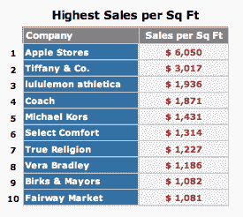

# 苹果零售店每平方英尺的销售额是其他商店的两倍多技术危机

> 原文：<https://web.archive.org/web/https://techcrunch.com/2012/11/13/apple-retail-does-more-than-twice-the-business-of-other-stores-in-sales-per-square-foot/>

# 苹果零售店每平方英尺的销售额是其他商店的两倍多

苹果再次在对美国顶级实体零售连锁店的零售分析中名列前茅。2012 年，苹果零售在美国每平方英尺的销售额约为 6050 美元。这比名单上的下一家连锁店，奢侈品零售商蒂芙尼&公司高出一倍多。总的来说，苹果正在与蔻驰、维拉·布拉德利和卢勒蒙等精品公司合作，这符合苹果作为高端品牌的形象。

蒂芙尼每平方英尺的销售额为 3017 美元，而像好市多和山姆会员店这样的大盒子商店的销售额最高，这可能是因为他们不加区分地进行了广泛的库存选择。然而，就每家商店的销售额而言，苹果仍然位列前 10 名，令人印象深刻，因为它本质上是榜单上唯一一家在其个别地区没有占据大量零售足迹的公司。总体而言，苹果每家商店的平均收入为 5114.8 万美元。

 苹果每平方英尺的销售额比去年平均每英尺 5626 美元有所增长。在最近一次季度电话会议上，讨论了该公司零售业绩的整体改善，当时该公司披露，第四季度零售销售额为 42 亿美元。苹果在 2012 年还新开了 33 家门店，使苹果在全球的零售点总数达到 390 家。明年，它计划开设大致相同的数量。

尽管苹果今年的零售表现强劲，但该公司最近决定放弃约翰·布劳伊特，他是英国连锁店 Dixons 挖来的负责人，今年年初被任命为苹果的零售 SVP。[布劳伊特的离开据说是失策的结果](https://web.archive.org/web/20221207111106/https://beta.techcrunch.com/2012/10/29/reports-claim-forstall-and-browett-were-asked-to-leave-apple-following-crucial-missteps/ "Reports Claim Forstall And Browett Were Asked To Leave Apple Following Crucial Missteps")，包括人事流程的改变，这被证明对公司来说是尴尬的，苹果现在正在积极寻找新的零售主管。

有人想打赌微软商店明年会出现在这些排名中的什么位置吗？