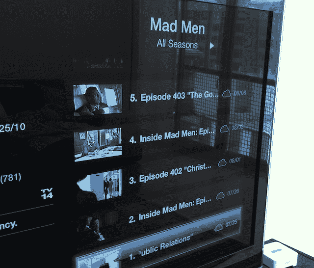

# 电视节目租赁失败后，苹果电视转向购买 TechCrunch

> 原文：<https://web.archive.org/web/https://techcrunch.com/2011/08/01/apple-tv-television-show-rentals-purchases/>

今天早上苹果电视的一个安静的更新，似乎预示着一个相当大的战略变化。当然，苹果绝不会这么说，但现在重点又回到了购买上，可以肯定地说电视节目租赁模式是失败的。

需要说明的是，该设备上仍有可用的租赁服务。但这仍然是几个月来一直在上演的有限剧集——欢乐合唱团、骨头、24 小时等等。苹果甚至没有一个突出显示你可以实际租赁的部分。

这是一个很大的改变。以前，你只能在这个设备上*租*电视节目。这有点奇怪，因为苹果有更多的电视内容可供购买。但为了获得它，你必须在你的电脑(或 iPhone/iPad/iPod touch)上购买，然后将其传输到 Apple TV。现在不再是这样了。Apple TV 今天的更新带来了在 iTunes 上购买任何电视内容的能力。你也可以通过云轻松访问你之前购买的内容——尽管看起来这些节目仍在推出过程中，[约翰·格鲁伯指出](https://web.archive.org/web/20230205044310/http://daringfireball.net/linked/2011/08/01/apple-tv-purchased-shows)。

公平地说，也许苹果公司在考虑这个[已经有一段时间了](https://web.archive.org/web/20230205044310/https://techcrunch.com/2010/09/03/new-apple-tv-cloud/)。因为最新的苹果电视型号只有足够的存储空间来缓冲，以前购买电视没有意义。但有了 iCloud，内容现在可以直接从苹果的服务器传输到你的苹果电视。这个很好用。我刚刚从苹果电视上购买了一季 *The Wire* ，实际上不需要下载任何东西。只有当我点击一集来观看时，设备才开始从云端调用它。

人们不得不想象这种模式也将适用于电影。不过目前，苹果电视上的电影仍然只能租赁。

有趣的是，我买的《火线》(The Wire)并没有在任何地方下载整季，甚至没有在我的电脑上下载 iTunes(尽管如果我愿意，我现在可以在那里下载)。这也指向了 iTunes 的未来。[我已经说了一段时间了](https://web.archive.org/web/20230205044310/https://techcrunch.com/2010/08/03/cloud-video/)不是音乐，而是视频，对于服务来说[是一种站不住脚的模式](https://web.archive.org/web/20230205044310/https://techcrunch.com/2009/09/08/the-inevitable-move-of-itunes-to-the-cloud/)。因为电影和电视节目的高清版本会占用数十亿字节的存储空间，你下载的越多，就越有可能用光空间，即使是在标准的台式电脑上。

整季的高清电视节目可以轻松占用超过 50 GB 的存储空间。再说一次，那只是*一*节目的*一*季。在某种程度上，唯一可行的方法是在具有无限存储量的云中。当你需要把什么东西拉下来带走的时候，你可以这样做。这就是苹果公司现在在电视变革中采用的模式。

我的同事[马特·伯恩斯称这是对有线电视盒](https://web.archive.org/web/20230205044310/https://techcrunch.com/2011/08/01/apple-announces-a-full-assault-on-the-cable-box-with-the-streaming-of-purchased-tv-shows/)的全面攻击，也是苹果公司让苹果电视超越“业余爱好”设备的第一次真正行动。我同意，这是朝着那个方向迈出的第一步。但在我看来，此举更多的是将 iTunes 过渡到正确的模式，以便能够充分利用 iCloud。苹果电视正在出现，是展示这一变化将如何发生的完美前端。

它显示了电视租赁有多不成功。一年前，人们开始谈论苹果试图说服电视网提供 0.99 美元的电视节目租赁服务。这听起来很棒，但最终却差得很远，因为只有福克斯和美国广播公司参与其中。不像音乐、书籍、电影，甚至电视节目购买，苹果从几个合作伙伴开始，最终让所有的主要合作伙伴都参与进来，电视节目租赁没有发生这种情况。总的选择太有限了，这种模式永远不会成功。今天的 Apple TV 更新似乎完全承认了这一点。

