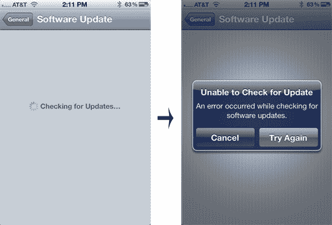
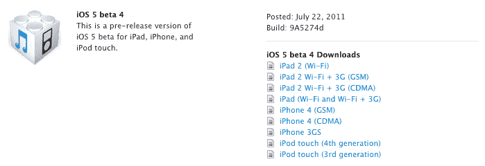
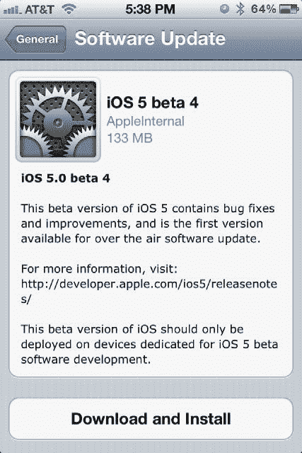

# 苹果 iOS 5 Beta 4 更新现已发布，首次以无线方式发布 

> 原文：<https://web.archive.org/web/http://techcrunch.com/2011/07/22/apples-ios-5-beta-4-update-now-available-first-to-be-released-over-the-air/>

# 苹果 iOS 5 Beta 4 更新现已发布，首次以无线方式发布

距离苹果向开发者发布 iOS 5 的 Beta 3 只有 11 天，但一个新的 Beta 版已经在空中了——真的。iOS 5 Beta 4 刚刚上线，它似乎是第一个支持通过 iOS 5 新的空中更新系统安装的更新。

实际上，我们现在无法通过无线方式获得*工作*的更新，但补丁说明明确将其定义为一个选项。引用一下:

*“如果你正在进行从 beta 3 到 beta 4 的 OTA 软件更新，你将需要把你的照片与 iTunes 重新同步。”*

如果你还没有在 iOS 5 开发者测试版上尝试一下，你不会错过太多:

幸运的是，如下图所示，仍然可以手动下载更新并通过 iTunes 安装。目前还不能 100%确定苹果是否计划在今天发布 OTA 更新*(就在 Lion 之后一天，目前通过 App Store 独家发布。对苹果新云服务器进行压力测试的方法！)，但是看起来肯定是不应该长的。*

**更新:**评论中的读者和 Twitter 上的人们报告说，他们让 OTA 更新工作了。下面是它实际工作时的样子，你知道，*工作*(感谢 [@FungBlog](https://web.archive.org/web/20230203041307/https://twitter.com/#!/FungBlog/status/94570671841091584) )！

# 有什么新鲜事吗？

正如任何后期测试版应该做的那样，它主要是*错误修复和小调整——但这里有一些我们听到的更大的东西:*

*   前述 OTA 安装支持
*   默认情况下，所有应用程序和网站中的视频内容都应该支持 AirPlay
*   无线同步现在适用于 Windows

该列表将随着新报告的出现而更新。