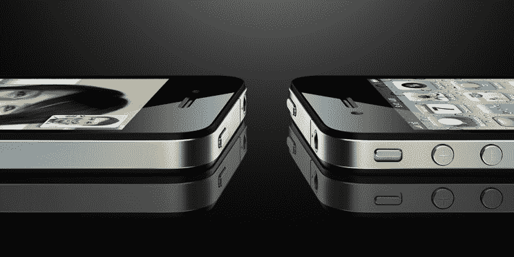

# 苹果将在 2011 年放弃 iPhone 的 4G 网络——对不起，威瑞森和美国电话电报公司

> 原文：<https://web.archive.org/web/https://techcrunch.com/2010/10/11/apples-iphone-4g-2011/>

早在八月[我在](https://web.archive.org/web/20230318112308/http://stevecheney.posterous.com/why-the-verizon-iphone-rumors-are-truecdma-ip)爆料说苹果正在从高通排队购买几百万个芯片组的组件，用于一月份到期的基于 CDMA 的威瑞森 iPhone。两个月后的上周，华尔街日报[证实了这个故事](https://web.archive.org/web/20230318112308/http://online.wsj.com/article/SB10001424052748703735804575536191649347572.html)。

现在人们终于在庆祝 iPhone 即将登陆威瑞森，[猜测已经转移到了](https://web.archive.org/web/20230318112308/http://online.wsj.com/article/SB10001424052748704696304575538191080781392.html)1 月份的机型是否会利用威瑞森的“4G”网络。4G(不要与 iPhone 4 混淆)指的是第四代蜂窝标准，威瑞森和 AT & T 都在 2011 年公开发布了基于 [LTE](https://web.archive.org/web/20230318112308/http://en.wikipedia.org/wiki/3GPP_Long_Term_Evolution) 的 4G 网络发布计划。

即将到来的从 3G 到 4G 的转变代表了 iPhone 专营权统治的一个重要转折点。苹果是马上转向 4G，还是等待网络成熟？回想一下，苹果等了整整一个周期才支持 3G，选择在美国电话电报公司成熟的 2.5G EDGE 网络上发布第一代 iPhone，尽管 3G 在 2007 年初就已广泛应用。

这种情况反映了 2011 年 LTE 正在发生的事情，随着这些问题成为前沿和中心，我有一些关于苹果计划的非常有趣的消息要分享。

首先——将于明年 1 月上市的 iPhone CDMA 型号不支持 LTE。但有趣的是，消息来源告诉我，2011 年年中的苹果手机更新也不支持 LTE。取而代之的是，苹果将生产一款包含 3G 风格的 GSM 和码分多址的双模式苹果手机，在全球所有运营商上运行。如果这是真的，苹果将不会支持 LTE 标准，直到 2012 年的某个时候。

很多人不会对这个消息感到非常高兴，因为支持 4G 的安卓手机已经存在于 Sprint 的 WiMAX 网络中，支持双模 LTE 的安卓手机将于明年上半年开始在威瑞森的新网络中使用。

但是当我们突破长期演进的炒作时，我相信苹果的等待决定可能是正确的。虽然运营商承诺将 LTE 作为一种升级途径，推动新的应用和更高的速度，但现实是，4G 部署所需的时间比运营商允许的要长得多。

苹果不想弄乱第一代 LTE 芯片组，因为它们体积庞大且耗电。取而代之的是，苹果将打造一个在所有运营商的 3G 网络中都能运行的统一模型，并通过像 NFC T3 这样的令人难以置信的新功能进行创新，这些新功能反映了他们在苹果手机 4 上通过 face time T5 实现的 T4 功能。

苹果只是不想成为尚未准备好黄金时段的新 LTE 网络的试验品，史蒂夫·乔布斯知道不要相信运营商对 4G 的大肆宣传。事实是，3G 网络还有很多年的寿命，向 LTE 的过渡将会比运营商希望你相信的要慢得多(LTE 甚至还没有完善其语音标准)。

这就是为什么美国电话电报公司正在升级其基站中的调制解调器卡，以支持被称为 HSPA+的 3G 的最新版本，这也是为什么有传言称威瑞森正在致力于版本 A 上的语音的原因，该版本将允许同时进行数据和语音。这些升级极大地延长了 3G 网络的寿命，并阻止了向长期演进的过渡。苹果正在推动运营商扩展 3G。

所以，如果你在等待一款能在 4G 运营商网络上运行的苹果手机，这可能需要一段时间。我相信，随着时间的推移，我们会听到更多关于这个故事的消息，尤其是明年夏天的苹果手机接近“工程验证测试”阶段。但基于我对供应链和网络基础设施的了解，我非常有信心这将是它的发展方向。

_________________________

撰稿人[史蒂夫·切尼](https://web.archive.org/web/20230318112308/http://twitter.com/stevecheney)是一名企业家，之前是一名工程师&程序员，专攻网络和移动技术。