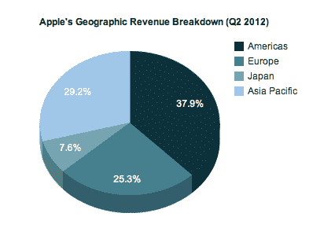
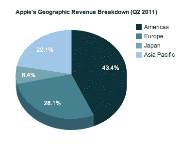

# 苹果 iPhone 在中国的销售“令人难以置信”，给中国带来 79 亿美元的收入 

> 原文：<https://web.archive.org/web/https://techcrunch.com/2012/04/24/apples-iphone-sales-in-china-are-up-by-fivefold-from-a-year-ago/>

# 苹果 iPhone 在中国的销售“令人难以置信”，给中国带来 79 亿美元的收入

北京愤怒的暴民没有说谎。苹果的 iPhone 4 在中国引起了轰动，使该公司在中国的手机销量比一年前增长了五倍。这款设备直到上个季度才在美国上市，几个月后才在美国上市。

在中国的收入达到创纪录的 79 亿美元，同比增长三倍。这使得苹果本财年上半年在中国的收入达到 124 亿美元。这几乎是苹果公司上一财年在中国赚得的 133 亿美元。

苹果首席执行官蒂姆·库克在财报电话会议上表示:“我们能做得这么好，真是令人难以置信。”。

库克在之前的电话会议中已经说过，按收入计算，中国是该公司仅次于美国的第二大市场。现在，这个市场重要性的上升意味着亚太地区的收入首次超过了欧洲。

对 iPhone 4 的需求如此之大，以至于在北京东部三里屯购物中心发生骚乱的威胁下，该公司不得不关闭零售店的销售。但苹果在那里仍面临一些阻力。它不属于中国最大的运营商中国移动，而且该公司正与唯冠就“iPad”名称陷入商标纠纷，这意味着它无法在中国销售新款 iPad。

[库克在 10 月份的收益电话会议上说:“对中国来说，前途无量。我从未见过这么多人跻身中产阶级，渴望购买苹果产品。它很快成为我们收入最高的国家中的第二名。”](https://web.archive.org/web/20221208075702/https://beta.techcrunch.com/2011/07/19/apples-tim-cook-china-was-very-key-to-our-results/)

以下是一些图表，展示了与去年同期相比，苹果本季度按地区划分的收入明细。我排除了零售收入:

