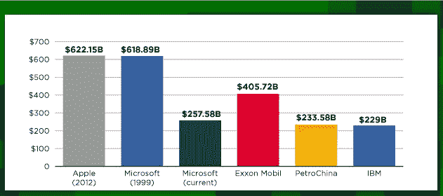
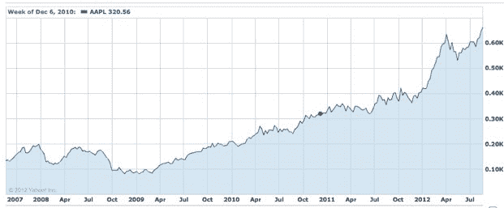

# 苹果公司市值达到 6210 亿美元，现在是有史以来最有价值的上市公司

> 原文：<https://web.archive.org/web/https://techcrunch.com/2012/08/20/apples-market-cap-reaches-621b-now-the-most-valuable-public-company-of-all-time/>

# 苹果的市值达到 6210 亿美元，现在是有史以来最有价值的上市公司

苹果现在是有史以来最有价值的公司，这家总部位于库比蒂诺的公司的市值高达 6210 亿美元。该公司的股票交易价格为每股 664.12 美元，并在今天的交易中达到了创纪录的每股 664.74 美元。

微软之前在 1999 年 12 月创下了上市公司估值 6189 亿美元的记录。

然而，这并没有考虑到通货膨胀。[考虑到通货膨胀，微软在 1999 年的市值约为 8500 亿美元。](https://web.archive.org/web/20230306141817/https://twitter.com/asymco/status/237591396847063040)

苹果公司的股票因 iPad mini 投入生产和更强大的苹果电视版本的传言而上涨。当然，iPhone 5 的即将发布引发了一场狂热。

