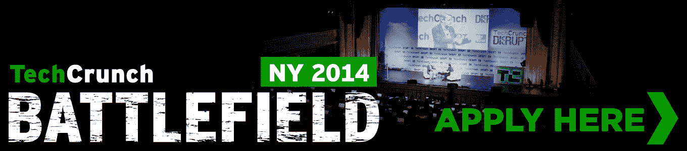

# TechCrunch 的“世界创业大赛”纽约战场现已开始接受申请

> 原文：<https://web.archive.org/web/https://techcrunch.com/2014/01/17/applications-for-the-battlefield-nyc-the-world-series-of-startup-competitions-are-now-open/>

# “世界创业大赛”纽约战场现已开始接受报名

继 CES 上令人兴奋的开局之后，我们 TechCrunch 正忙着为我们今年最大的东海岸奇观[颠覆纽约市](https://web.archive.org/web/20221209021000/https://beta.techcrunch.com/events/disrupt-ny-2014/)做准备。战场应用从现在到 2 月 20 日开放。我们正在寻找最酷、最具创新性、我敢说是最具颠覆性的公司，与我们一起在纽约的舞台上发布。

为什么要申请？除了在技术领域最显眼的舞台上推出 5 万美元的现金奖励和我们的 Disrupt Cup，我们的战地团队还可以在幕后获得更多精彩内容。首先，公司从我们的员工和一些业内最有头脑的人那里接受指导(仅举几个例子，如红杉、早期鸟资本和植物科技基金)，以确保他们的推销能让我们的评委大吃一惊。

在 Disrupt，他们将在 [startup alley](https://web.archive.org/web/20221209021000/https://beta.techcrunch.com/events/disrupt-ny-2014/tickets/) 的战场部分获得一个免费摊位，展示他们的荣耀之路，并有机会在 VIP 活动中与我们的演讲者和评委交流。

参与团队还可以期待未来的额外福利，如 [Disrupt conferences](https://web.archive.org/web/20221209021000/https://beta.techcrunch.com/event-type/disrupt/) 的门票、我们[见面会](https://web.archive.org/web/20221209021000/https://beta.techcrunch.com/event-type/meetups/)的 VIP 通道，当然还有 TechCrunch 的赠品。

Bre Pettis 还在 CES 上为我们的硬件战场提供了一个免费的 Makerbot，所以你永远不知道会发生什么。

**规则**

为了在初创企业的战场上竞争，在提交申请时，初创企业必须存活不到三个月。

在选择最终参赛者时，我们将优先考虑在 TechCrunch Disrupt 上首次向公众和媒体发布**的公司。我们认为现有公司的新产品意义重大。由于舞台上的竞争位置数量有限，推出新功能集的公司没有资格成为发布公司。比赛将在纽约举行，但欢迎全球各地的团队提交他们的创业公司供考虑。**

在其他公开发布活动中展示过的公司没有资格参加 Startup 战地。如果您正在选择不同的发布平台，并需要尽早做出决定，请申请并发送电子邮件至 battlefield@beta.techcrunch.com，我们将优先审核您的申请。