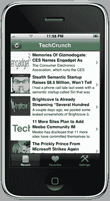

# AppLoop 将博客转变为原生 iPhone 应用 

> 原文：<https://web.archive.org/web/https://techcrunch.com/2008/10/20/apploop-transforms-blogs-into-native-iphone-applications/>

# AppLoop 将博客转化为原生 iPhone 应用程序

两人创业公司 [AppLoop](https://web.archive.org/web/20221005194328/http://www.apploop.com/) 通过推出 [App Generator](https://web.archive.org/web/20221005194328/http://apploop.com/dev/setup/generator) 为[增加了一套针对 iPhone 开发者的自助服务](https://web.archive.org/web/20221005194328/http://www.beta.techcrunch.com/2008/07/01/location-based-mobile-ad-network-apploop-launches/)工具，该工具可以自动将任何带有 RSS 提要的博客转化为模仿[纽约时报](https://web.archive.org/web/20221005194328/http://www.nytimes.com/ref/membercenter/iphonefaq.html)的原生 iPhone 应用。

要创建应用程序，您只需回答应用程序生成器设置向导的一系列问题。这些信息包括你博客的地址、名字、图标和标志，以及你想为你的应用收取多少费用(如果有的话)和你想使用什么样的配色方案。一旦你完成表格(并验证你确实是有问题的域名的所有者)，AppLoop 将把你的申请提交给苹果公司批准，一旦批准，你就可以开始向你的读者推广它。

这些自助服务应用的第一版相当基础。你可以浏览最近帖子的列表，保存你最喜欢的帖子，并通过电子邮件、脸书或 Twitter 与朋友分享帖子。博客内容也会被缓存，这样当你发现自己处于蜂窝盲区时就可以阅读。

AppLoop 计划在未来增加几个高级功能，包括多个订阅源的类别、评论和评级、存档搜索，甚至位置感知，这样你就可以看到你所在地区的其他人在阅读和保存什么。他们甚至可能推出对媒体 RSS 的支持，这样你就可以像《纽约时报》一样展示一个图片库。随着 T-Mobile G1 的即将到来，AppLoop 将很快让你同时为 iPhone 和 Android 平台创建应用程序。

我们已经使用 AppLoop 提交了 TechCrunch 的申请，一旦获得批准，我们将宣布它的可用性。

[http://vimeo.com/moogaloop.swf?clip_id=1980009&server = Vimeo . com&show _ title = 1&show _ byline = 1&show _ portrait = 0&color = 00 adef&full screen = 1](https://web.archive.org/web/20221005194328/http://vimeo.com/moogaloop.swf?clip_id=1980009&server=vimeo.com&show_title=1&show_byline=1&show_portrait=0&color=00ADEF&fullscreen=1)
iPhone 应用生成器演示从 [AppLoop](https://web.archive.org/web/20221005194328/http://vimeo.com/apploop?pg=embed&sec=1980009) 上 [Vimeo](https://web.archive.org/web/20221005194328/http://vimeo.com/?pg=embed&sec=1980009) 。