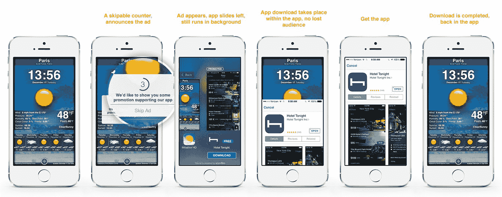

# Appsfire 的第一个广告单元“Ura Maki”是 iAd 做对了 

> 原文：<https://web.archive.org/web/https://techcrunch.com/2013/12/19/appsfires-first-ad-unit-ura-maki-is-iad-done-right/>

上周，app discovery 初创公司 [Appsfire](https://web.archive.org/web/20221207063205/http://appsfire.com/) 让所有人感到惊讶的是，[从 App Store 下架](https://web.archive.org/web/20221207063205/https://beta.techcrunch.com/2013/12/13/appsfire-exits-the-app-discovery-business-to-focus-on-mobile-advertising-native-ads/)其应用，完全专注于移动原生广告。第一个 iOS 广告单元在这里——Ura Maki 是一种强调应用发现和用户体验的广告形式。

与苹果的 iAd 或 AdMob 不同，Ura Maki 不依赖于屏幕底部的微小横幅。这是一种全屏体验，试图避免被侵犯。首先，你会看到一个弹出窗口，就像那些烦人的“评价这个应用”框。它让你可以选择取消即将到来的全屏广告。

几秒钟后，一个本地动画模仿多任务屏幕。在左边，您的应用程序仍在运行，在右边，您会看到一个已升级的应用程序的屏幕截图。同样，你可以像在多任务视图中关闭应用程序一样，通过简单地滑动右边的屏幕截图来消除广告。

如果你点击截图，你会看到完整的应用商店描述和截图。UI 是应用商店页面的完美复制品。然而，与 iAd 不同，一切都是原生的——它不仅仅是一个带有大量 JavaScript 的 UIWebView。最后，你可以下载推广的应用程序，而无需离开你的应用程序。

应用程序开发人员可以选择这些应用程序何时出现(当你启动应用程序时，在游戏结束时…)。对于广告商来说，注册非常容易，因为所有资产都来自 Appsfire 的应用基因组，即该公司的应用商店数据库。而如果你的手机上已经有了推广的应用，你就看不到广告了。

创建一个全新的广告单元总是有风险的，尤其是当你是一个新人的时候。但 Appsfire 正试图让广告客户和开发者都非常容易。如果你是一个开发者，你不必奉献屏幕房地产，如果你是一个广告商，你不必创建广告资产。现在，下一个重大挑战将是在新平台上与应用开发商和广告商签约。

你可以在公司的[博客](https://web.archive.org/web/20221207063205/http://blog.appsfire.com/true-native-ads-introducing-the-ura-maki/)上找到更多细节。

*披露:Appsfire 联合创始人兼首席执行官奥里尔·奥哈永曾负责 TechCrunch France。我当时不在 TechCrunch 工作，所以我们从来没有合作过。*

[https://web.archive.org/web/20221207063205if_/https://www.youtube.com/embed/O3e34OZh26k?feature=oembed](https://web.archive.org/web/20221207063205if_/https://www.youtube.com/embed/O3e34OZh26k?feature=oembed)

视频