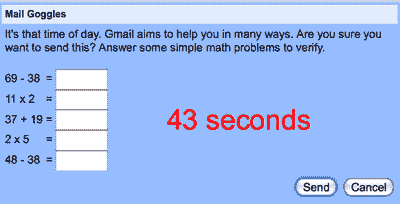

# 愚人节检查:谷歌真的发布了邮件护目镜吗？

> 原文：<https://web.archive.org/web/https://techcrunch.com/2008/10/07/april-fools-check-did-google-really-release-mail-goggles/>

# 愚人节检查:谷歌真的发布了邮件护目镜吗？

我看了[博客文章](https://web.archive.org/web/20230210093740/http://gmailblog.blogspot.com/2008/10/new-in-labs-stop-sending-mail-you-later.html)，然后我看了日期。不，这是 T3，不是愚人节 T4，没错，谷歌刚刚发布了一款新产品，由乔恩·珀洛创造，叫做邮件护目镜。这个新功能是根据“啤酒护目镜”(Beer Goggles)这个词开发的(Beer Goggles 指的是喝得酩酊大醉，没有魅力的人看起来很有魅力)。它的目标是帮助你清除那些有时会在深夜和周末出去的疯狂的醉酒电子邮件。

如果启用，Gmail 会要求你在邮件发出前的有限时间内完成一些“简单”的数学问题。

该产品有两个问题。首先，我讨厌数学。第二，如果我想发一封喝醉的电子邮件，而我和成功之间只有几个数学问题，我会去找那个计算器。

> 我发送不该发送的信息。就像那次我通过短信告诉那个女孩我暗恋她。或者有一次我给前女友发了一封深夜邮件，说我们应该复合。Gmail 不能总是阻止您发送您以后可能会后悔的邮件，但今天我们推出了一个我写的名为 Mail Goggles 的 Labs 新功能，可能会有所帮助。
> 
> 当您启用邮件护目镜时，它会检查您是否真的确定要发送周五深夜的电子邮件。还有什么比让您在单击“发送”按钮后解决一些简单的数学问题来验证您的精神状态是否正常更好的方法呢？