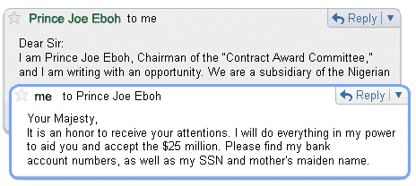
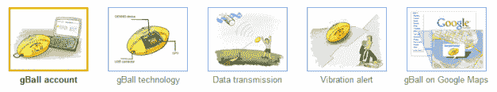
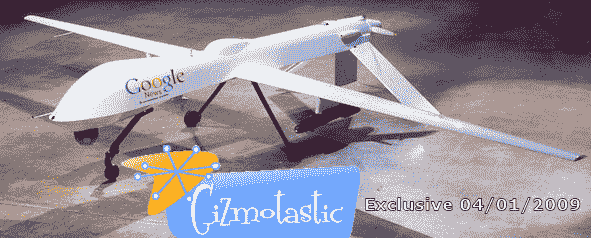
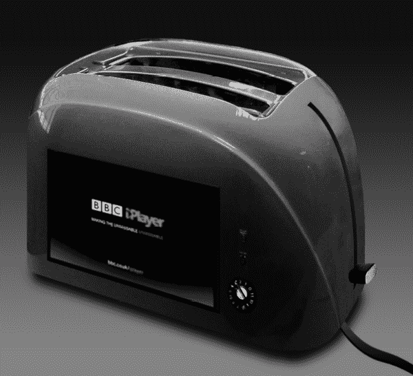
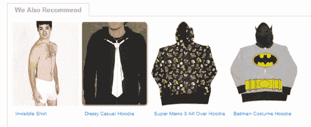
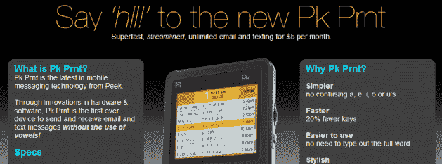

# 愚人节:YouTube 连枷，飞艇中的亚马逊云计算，3D Chrome 浏览器，谷歌人工智能大师 TechCrunch

> 原文：<https://web.archive.org/web/https://techcrunch.com/2009/04/01/april-fools-youtube-flails-amazon-cloud-computing-in-a-blimp-3d-chrome-browsing-google-master-ai/>

哇哦。愚人节正在如火如荼地进行。

卫报[在推特](https://web.archive.org/web/20230213234946/http://www.guardian.co.uk/media/2009/apr/01/guardian-twitter-media-technology)上大放厥词，抛弃了印刷版和网站。*“专家说任何故事都可以用 140 个字符来讲述。”*

亚马逊[推出](https://web.archive.org/web/20230213234946/http://aws.typepad.com/aws/2009/03/up-up-and-away-cloud-computing-reaches-for-the-sky.html)一项全新的云计算服务，名为浮动亚马逊云环境，或 FACE。“FACE 使用耐用的无人驾驶充氦软式飞艇，容量为 65，536 个小型 EC2 实例，或相应数量的大型实例。每艘软式飞艇的顶部都涂有多晶太阳能电池，这些电池为服务器和机载导航、通信和防御系统提供大约 40%的电力。 *“政府将完全没有机会对他们采取行动，因为他们将忙于决定违反了哪项联邦空气法规(FAR)，更不用说安排新闻发布会了。”*

与此同时，谷歌在一篇[帖子](https://web.archive.org/web/20230213234946/http://googleblog.blogspot.com/2009/04/cadie-awakens.html)和[描述](https://web.archive.org/web/20230213234946/http://www.google.com/intl/en/landing/cadie/index.html)中掌握了人工智能，这对我来说太怪异了。

但他们创造了世界上第一个认知自动启发式分布式智能实体(CADIE)，这是一台活的计算机，正在谷歌做出改变。*“例如，今天早些时候，凯迪通过快速浏览社交网站的视觉部分，推断出一套在线设计原则，并由此推出了这个[有趣的主页](https://web.archive.org/web/20230213234946/http://cadiesingularity.blogspot.com/)。”*

凯蒂的另一个早期项目是:制作谷歌 Chrome 的 3D 版本，因为*“81%的家庭都有红色/蓝色的 3D 眼镜。”*

没有什么委婉的说法，但是 YouTube 只是用颠倒的视频观看来打击。

Gmail 现在有了[自动驾驶](https://web.archive.org/web/20230213234946/https://mail.google.com/mail/help/autopilot/index.html)。“随着越来越多的日常交流通过电子邮件进行，许多人抱怨阅读和回复每一封邮件有多难。这是因为他们真的会阅读和回复所有的信息。”凯蒂会替你回答。

[谷歌大脑搜索](https://web.archive.org/web/20230213234946/http://www.google.com/mobile/m/brainsearch/intro_android.html)使用 CADIE 技术来索引你的大脑。

谷歌图书也参与其中。参见[这本由凯迪团队署名的专著](https://web.archive.org/web/20230213234946/http://books.google.com/intl/en_us/landing/cadie/tech.html)。

谷歌澳大利亚推出了 [gBall](https://web.archive.org/web/20230213234946/http://www.google.com.au/intl/en/gball/) ，这将改变我们所知的澳大利亚足球规则。

还有一个由用户“cadiesingularity”制作的关于熊猫的[特色 YouTube 视频](https://web.archive.org/web/20230213234946/http://www.youtube.com/watch?v=DKh4Jls3qA8&feature=channel_page)，其简介称“Cadie——世界上第一个认知自动启发式分布式智能实体”。

在谷歌地图中浏览街景时，地图右下角显示的是一只熊猫，而不是通常显示的黄色人物。

凯迪甚至在 Blogger 上有自己的博客。

谷歌地图中还有一个[“凯迪推荐给人类的地方”](https://web.archive.org/web/20230213234946/http://maps.google.com/maps/mpl?f=q&ie=UTF8&moduleurl=http:%2F%2Fwww.google.com%2Fintl%2Fen%2Flanding%2Fcadie%2Fdoc%2Fpanda-mapplet.xml&ll=42.366662,-71.106262&spn=114.307001,316.40625&z=2)链接，这个链接通向“熊猫 Mapplet”，包括几个标有“凯迪”注释的地点。在 Redmond WA 下面列出了一个链接，该链接将 [rick 滚动查看器](https://web.archive.org/web/20230213234946/http://www.youtube.com/watch?v=oHg5SJYRHA0)。

同时， [Identi.ca 已经收购了 Twitter](https://web.archive.org/web/20230213234946/http://controlyourself.ca/2009/04/01/identica-acquires-twitter/) 。一位 Twitter 高管后来说:“我担心我们不得不把整个 Twitter 变成一门生意！我真的很庆幸现在是别人的问题了。”

谷歌显然也在和外星人(戴尔)一起制造一款新的 100 美元的笔记本电脑。它将有一个内置的脑电波读取芯片，传感器需要应用到用户的头骨上。

欧洲核子研究中心的科学家已经发现了基本上引发大爆炸的细胞。

海盗湾[卖给了华纳兄弟](https://web.archive.org/web/20230213234946/http://torrentfreak.com/warner-bros-acquires-the-pirate-bay-090401/)。

你的鼻子有了一个新的社交网络，你的香水有了一个朋友空间，一个分享你对香水的看法和为你最喜欢的气味投票的地方。他们称之为[smell](https://web.archive.org/web/20230213234946/http://www.smellr.com/)，现在已经上线。

Opera 已经超越了鼠标手势，推出了面部手势。

整个互联网正在被重启。(站点点)

Expedia 提供飞往火星的航班，起价 99 美元。相关新闻，Hotels.com 提供月球上的房间。

用[层压机](https://web.archive.org/web/20230213234946/http://laminatr.com/)给你的网站增添一点光彩。

这个新的里程碑式的 jQuery 插件将改变互联网的面貌。

雅虎首次推出意识形态搜索。

社交媒体的使用[降低了客户满意度](https://web.archive.org/web/20230213234946/http://www.jesseliebman.com/2009/03/31/study-social-media-use-decreases-customer-satisfaction/)。

这款[全新手机](https://web.archive.org/web/20230213234946/http://www.dialaphone.co.uk/blog/?p=2851)既可以作为投币式手机使用，也可以作为信用卡/借记卡手机使用。

BBC 的 Top Gear 秀[来到 Hulu](https://web.archive.org/web/20230213234946/http://njection.com/blogs/exclusive/archive/2009/03/31/bbc-top-gear-to-stream-show-on-hulu-ad-supported.aspx) 。

Woopra 将其网络分析套件提升了一个档次，推出了一款针对网站的网络摄像头间谍功能。

Woot 是[卖破烂的](https://web.archive.org/web/20230213234946/http://www.woot.com/)。

Reddit 现在看起来完全像 Digg。

连线: [Twitter 计划赚钱](https://web.archive.org/web/20230213234946/http://www.wired.com/video/twitter-plans-to-make-money/18173818001)。我要订购那台 TW-900。

TweetDoubler 给你的[是小鸟](https://web.archive.org/web/20230213234946/http://www.tweetdoubler.com/)的两倍。

Topify 被联邦快递起诉。“联邦快递声称他们拥有更快更好地发送电子邮件通知的注册专利，他们声称我们侵犯了这项专利。”

Fark 现在有了自己的社交网络。看起来有点眼熟。

SocialBlade [破解了 Digg 的算法](https://web.archive.org/web/20230213234946/http://socialblade.com/digg/algorithm.php)。

[书信体土豚离线访问！](https://web.archive.org/web/20230213234946/http://blog.vark.com/?p=32) *“直到现在，Aardvark 只能通过即时消息或电子邮件在几分钟内得到你的问题的答案。通过航空邮件，你可以通过普通邮件发送问题，就像给朋友写信一样。”*

Seacom 已经连接了整个非洲大陆，它现在拥有世界上最快的互联网连接。

[axecollegum](https://web.archive.org/web/20230213234946/http://www.axecollegehumor.com/)

LiveJournal 有一个[好友页面重新设计项目](https://web.archive.org/web/20230213234946/http://news.livejournal.com/114430.html)。

微软在 Windows Live Messenger 中增加了对[自动情绪检测的支持。“我们很高兴地宣布，由于微软研究院的重大突破，我们已经有了一个 alpha 版本，可以监测你的实时生理状态，并将其转化为情绪(高兴、悲伤、焦虑等)，这样你就再也不用输入表情符号了。”](https://web.archive.org/web/20230213234946/http://messengersays.spaces.live.com/Blog/cns!5B410F7FD930829E!65501.entry)

网络名人(包括迈克尔·阿灵顿)被发现一起跳舞，他们有视频为证。

领导 Python 开发 20 年的 BDFL[正式宣布退休](https://web.archive.org/web/20230213234946/http://www.python.org/dev/peps/pep-0401/)，立即生效。经过一致投票，他的继任者被任命为(巴里华沙)。

有传言称，谷歌[将收购 Palm](https://web.archive.org/web/20230213234946/http://palmwebos.org/2009/04/01/rumor-google-buying-palm/) 。

福特、通用宣布[安卓车](https://web.archive.org/web/20230213234946/http://phandroid.com/2009/04/01/ford-gm-announce-android-car/)。看起来很酷。

全英国的隐私活动家一致决定支持 Phorm。

每日糖果也在进行他们一年一度的愚人节例行活动。

我们怎么会错过这个？CrunchGear 被通用磨坊收购。

J.K .罗琳在 [SmashWords](https://web.archive.org/web/20230213234946/http://www.smashwords.com/press/release/8) 上出版哈利波特电子书。

一款新的手机应用软件已经发布，它承诺让你在看手机的时候可以看到自己在往哪里走。“这款名为 TXT'N'WALK 的应用程序可以在 iPhone、黑莓、S60 和 Android 操作系统上使用，当你在手机上访问电子邮件或网络时，它会使用手机背面的摄像头向你显示你面前的路面。”

高通在无线融合项目上超越了自己。这个真的很好。

【YouTube http://www.youtube.com/watch?v=3agYeT-T9co&hl=en&fs=1]

Twitter 限制 T21 每天只能发一条推文。

还有一个向推特征税的秘密政府计划。*“Mumbrella 了解到政府正计划根据推特用户发送的信息数量向他们征税，每条推特 1 美分。这将乘以他们拥有的追随者数量。”*

我们认为这是为了愚人节，但我们不确定: [ThinkGeek](https://web.archive.org/web/20230213234946/http://www.thinkgeek.com/index.shtml) 正在出售一些很酷的东西，包括一个“独角兽追逐者”。

从今天起，所有使用 Twingly 链接回博客的报纸、杂志和电视频道也将[显示所有包含文章链接的电子邮件的引用通告](https://web.archive.org/web/20230213234946/http://blog.twingly.com/2009/04/01/twingly-debuts-email-trackbacks-on-media-websites-all-over-europe/)。

有趣的是:Bugmenot.com 现在要求注册他们的服务。考虑到他们的口号是“绕过强制注册”，这是一个很好的。

CafePress 推出 [CafePress-o-Pedia](https://web.archive.org/web/20230213234946/http://blog.cafepress.com/2009/03/31/cafepress-o-pedia/?pid=2529374) 。

使用新的[语音 URL fring 插件](https://web.archive.org/web/20230213234946/http://www.fring.com/blog/?p=1033)获取语音。

MooTools 现在叫做 [jTools](https://web.archive.org/web/20230213234946/http://mootools.net/blog/2009/04/01/a-new-name-for-mootools/) 。

精心策划的骗局:MOO.com 宣布推出超级环保名片。

Conficker 蠕虫的目的已经被揭露:被入侵的主机网络将对没有通过完全符合标准的验证的网站进行大规模的拒绝服务攻击。

[Windows 7 中发现大脚怪。](https://web.archive.org/web/20230213234946/http://www.pcplus.co.uk/node/3009)

音乐越多，iPods 就越重。

谷歌新闻无人机:无人驾驶飞机会在突发新闻发生时进行报道。

EA 和 Gameloft 的[iPhone 咪咪之战](https://web.archive.org/web/20230213234946/http://www.pocketgamer.biz/r/PG.Biz/iPhone+news/news.asp?c=12518)。

坎耶·韦斯特[放弃音乐](https://web.archive.org/web/20230213234946/http://musically.com/blog/2009/04/01/kanye-west-gives-up-music-for-full-time-blogging/)开始全职写博客。哦不。

[MassiveClouding](https://web.archive.org/web/20230213234946/http://massiveclouding.xness.com/) 是一家新成立的公司，旨在释放上网者电脑的空闲内存和闲置处理能力。

FuelMyBlog 将不得不[细分成不同的类别](https://web.archive.org/web/20230213234946/http://blog.fuelmyblog.co.uk/blog/2009/04/01/important-info-for-fuellers/)，将欧盟的博客与世界其他地区的博客区分开来，可能还会细分成不同的类别，这样一来，由于语言和文化的差异，威尔士、苏格兰、北爱尔兰、英格兰北部和南部将会有自己的定位。*“显然其他成员国的分支并不那么重要。”*

英国政府宣布计划向居住在英国的儿童和青少年提供免费定制版任天堂 Wii T11，以及两款游戏和 Wii Fit 配件。

Amiando 推出了一个专门的巴伐利亚版本的票务服务，配有慕尼黑啤酒节的背景音乐。

这家公司的任务是追踪非法分享视频游戏的软件盗版者。他们正在寻找新的赏金猎人加入他们的团队。*“打不过敌人，就打不过朋友”*

刚刚在 Digg[上发现的:以电影《大勒保斯基》(The Big Lebowski)中的那个家伙为特色的覆盖图以及更多。](https://web.archive.org/web/20230213234946/http://digg.com/)

谷歌南非公司将在 T21 开设一个名为谷歌城的主题公园。

呵呵。 [Packed3D](https://web.archive.org/web/20230213234946/http://packed.com/blog/2009/04/01/packing-flash-games-with-a-new-dimension/) 能够把一个现有的编译好的 flash 游戏，变成一个全功能的 3D 游戏。视频其实看起来挺酷的。

[Adegga.com 收购 Corkd.com](https://web.archive.org/web/20230213234946/http://blog.adegga.com/adeggacom-buys-corkdcom/)

所有法国制作和法语电影将很快从爱情电影服务中移除。

来自 TheNextWeb 的鲍里斯推出了一项推特传真服务。*“传真任何文本(最多 140 个字符)到+31877848484，包括 Twitter 用户名+密码，它会发布。现在就测试！”*

我们*认为*这是一个笑话: [Shouttr](https://web.archive.org/web/20230213234946/http://www.shouttr.net/) ，目前处于 alpha 开发阶段，是一个让你像任何其他 Twitter 客户端一样发布和阅读他人推文的程序。但是它也会在推特到达时为你大声朗读。

Newgrounds 已经被中国政府接管。

易贝在 iPhone 上安装 Skype[‘提高 NSA 后门的价格’](https://web.archive.org/web/20230213234946/http://www.theregister.co.uk/2009/04/01/skype_nsa_backdoor_iphone_deal/)

[爆料:8.1 鹰眼泄露](https://web.archive.org/web/20230213234946/http://www.smashingmagazine.com/2009/03/31/breaking-internet-explorer-81-eagle-eyes-leaked/)

脸书昨天宣布了与电信运营商的创新合作，以免费的带宽升级来奖励重度用户。

[格兰玛环保车配有绿色车顶！](https://web.archive.org/web/20230213234946/http://www.inhabitat.com/2009/04/01/the-grama-eco-vehicle-comes-with-green-roof/)

[嘻哈生活](https://web.archive.org/web/20230213234946/http://www.xihalife.com/)收购了一座岛屿。

BBC 的 iPlayer 现在可以在烤面包机上使用。

来自[谷歌地图狂热者](https://web.archive.org/web/20230213234946/http://googlemapsmania.blogspot.com/2009/03/queens-corgi-tracker.html) : *“女王网站上最新增加的是这个柯基追踪器。女王拥有五只柯基犬，多亏了这个谷歌地图实时追踪器，现在她的忠实臣民可以看到他们的每个动作。”*

[SlideShare](https://web.archive.org/web/20230213234946/http://www.slideshare.net/) 伪造了上传到该服务的幻灯片的浏览量。

谷歌观光网站演变成了[地形测量观光网站](https://web.archive.org/web/20230213234946/http://googlesightseeing.com/2009/04/01/welcome-to-the-brand-new-ordnance-survey-sightseeing-site/)。

Cadyou.com 自豪地宣布其第一个免费的 Sketchup 插件“Scanr”。在 3 个月的开发中，这个插件将允许你使用任何光学鼠标作为一个简单的 3d 扫描仪，使小物体可以直接扫描到 Sketchup 软件中。

“当印刷出版物开始失去发行量时，我们看到了一个黄金机会，可以与那些有兴趣节省报纸闲置时间的投资者合作，为你带来一个新版本:[the digital . print .](https://web.archive.org/web/20230213234946/http://thedigitel.com/top-stories/thedigitel-launches-new-print-edition-3564-0401)

[亚马逊 EC3 TrueCloud](https://web.archive.org/web/20230213234946/http://www.whoishostingthis.com/amazon-ec3-truecloud/)

谷歌已经[收购了 Mark8t](https://web.archive.org/web/20230213234946/http://www.mark8t.com/2009/04/01/google-buys-mark8t-and-creates-seo-e-marketing-division/) 。

NerdyShirts 有一款隐形 t 恤在打折。*“它使用一种能够弯曲光线的织物，使其几乎不可见。不用看也能感受到衬衫的温暖和舒适。”*

ServiceSideKick 有了一位[新 CEO](https://web.archive.org/web/20230213234946/http://www.servicesidekick.com/blog/posts/27-new-ceo) 。

WhiteLabelDating.com 今天推出了一个新的狗狗约会网站。该网站已经有 20，000 只成年狗注册，并预计将继续强劲增长。

华盛顿邮报: [Conficker 蠕虫攻击报告开始滚动](https://web.archive.org/web/20230213234946/http://voices.washingtonpost.com/securityfix/2009/04/conficker_worm_strikes_militar.html)

[MyWebDownload](https://web.archive.org/web/20230213234946/http://www.mywebdownload.com/) 让你下载 WWW。

HowStuffWorks 正在发表一些有趣的文章。例:[嚼这个:充电口香糖](https://web.archive.org/web/20230213234946/http://blogs.howstuffworks.com/2009/04/01/chew-on-this-rechargeable-gum/)

istopover.com 有一个紧急援助特惠:入住白宫每晚 49 美元。

Lululemon 今天发布了它的[全新电子商务网站](https://web.archive.org/web/20230213234946/http://www.lululemon.com/shop/)，非常漂亮！

PSS 推出[测谎呼叫中心软件](https://web.archive.org/web/20230213234946/http://ivr-smartass.psshelp.com/)。

微软为 Xbox 推出新游戏:[阿尔卑斯传说](https://web.archive.org/web/20230213234946/http://www.xbox.com/en-GB/games/a/alpinelegend/)

Gizmodo 今天让它的标题读起来像垃圾短信。

技术先驱报:[欧洲粒子物理研究所承认大型强子对撞机在太空中撕裂黑洞](https://web.archive.org/web/20230213234946/http://www.thetechherald.com/article.php/200914/3354/CERN-admits-black-hole-ripped-in-space-by-Large-Hadron-Collider)

好东西！柯达[今天推出](https://web.archive.org/web/20230213234946/http://homepage.1000words.kodak.com/default.asp?item=2355464&mode=)的 [eyeCamera 4.1](https://web.archive.org/web/20230213234946/http://www.kodak.com/eknec/PageQuerier.jhtml?pq-path=2/6868&pq-locale=en_US&_requestid=355) 。

[绳子还是猫:一个新的。NET 框架库](https://web.archive.org/web/20230213234946/http://weblogs.asp.net/leftslipper/archive/2009/04/01/the-string-or-the-cat-a-new-net-framework-library.aspx)

InforWorld: [Twitter 加入联邦应急响应网络](https://web.archive.org/web/20230213234946/http://www.infoworld.com/article/09/04/01/13NF-Twitter-April-Fools_1.html)

谷歌将以 6 . 35 亿美元的股票价格收购 Twitter

“Aviary 自豪地宣布，它已经推出了它的最新产品，[起重机](https://web.archive.org/web/20230213234946/http://aviary.com/blog/posts/aviary-launches-crane-paper-editor)，网络的第一个基于纸张的图像编辑器。”

TrackVia 今天宣布推出他们新的[数据随机化功能](https://web.archive.org/web/20230213234946/http://www.trackvia.com/blog/2009/04/01/trackvia-announces-data-randomizer-feature/)。“数据随机化器专为厌倦了一成不变的数据的客户设计，通过随机更改未知记录中的未知字段，为数据管理任务注入自发性和趣味性。”

其他收件箱宣布[其他语音邮件](https://web.archive.org/web/20230213234946/http://blog.otherinbox.com/2009/04/oib-announces-othervoicemail.html):)

这里是上面提到的 JS-Word 评论小部件。请只说一个词！

JS-KIT 引入 [JS-Word](https://web.archive.org/web/20230213234946/http://js-kit.com/1word/) 作为一个单词评论系统。“本质上，我们正在将社交媒体民主化到最低的共同标准。志趣相投的用户群甚至可以合作拼出一个句子。”(我们在这里放了一个，但因为太占空间而拿掉了)

BailoutLove.com 是一家政府资助的在线约会服务公司，帮助被鄙视的 CEO 们找到真爱。

臭名昭著的失败鲸鱼[来通过](https://web.archive.org/web/20230213234946/http://patdryburgh.net/blog/tragedy/)。

Organic 正在招聘一名[高级转发员](https://web.archive.org/web/20230213234946/http://threeminds.organic.com/2009/04/position_available_sr_contribu.html)。

推特先生通过[分析你的“推特流”](https://web.archive.org/web/20230213234946/http://blog.mrtweet.net/sneak-peek-mrtweet-to-help-you-find-your-prefect-date-based-on-analyzing-your-tweetstream)帮你找到你的完美约会。

如果有那么简单就好了:“FireFold 开发了一个非常复杂和独特的应用程序，它使用你现有的硬件来创建 HDMI 电缆。完成应用程序安装，只需将手机屏幕直接放在 HDMI 端口上。宾果！”

作为对互联网赌博调查的一部分，州长贝希尔和肯塔基州司法部已经查封了 [Cardschat](https://web.archive.org/web/20230213234946/http://www.cardschat.com/home.php) 的域名，该域名现在是肯塔基州的唯一财产。

Echo Nest[发布了一个新的 API](https://web.archive.org/web/20230213234946/http://blog.echonest.com/post/91934467/the-echo-nest-goodness-api) ，一劳永逸地解决了音乐发现的问题。*“Goodness API 应用了公司先进的网页抓取、语言处理和音频分析平台，帮助各地的音乐爱好者将值得听的音乐与应该避免听的音乐分开。”*

维基百科在它的网站上有真实的新闻故事，它用可疑的语言呈现。

Plurk [重新推出为苦](https://web.archive.org/web/20230213234946/http://blog.plurk.com/2009/04/01/plurk-to-relaunch-as-bitter/)。

5min.com 要搬到印度去了，他们有一种有趣的方式让人们了解印度。那个网站看起来不是很熟悉吗？

HubSpot 推出了[性格分级器](https://web.archive.org/web/20230213234946/http://personality.grader.com/)。

StarTech 提到了一些关于[隐形线缆](https://web.archive.org/web/20230213234946/http://www.startech.com/TechLounge/View.aspx?MID=469)的事情。

连线:[极客老爸变成了运动员老爸](https://web.archive.org/web/20230213234946/http://blog.wired.com/geekdad/)。

有趣的是:Box.net[为企业推出了纳米博客服务](https://web.archive.org/web/20230213234946/http://www.getchirping.com/)。

多亏了新的跨物种繁殖技术，我们知道有了[小狗猫](https://web.archive.org/web/20230213234946/http://www.dogster.com/newsletter/index.php?i=131)。

莱瓦尔·伯顿购买 Smosh。

[大规模小精灵生产和交付](https://web.archive.org/web/20230213234946/http://misc.metocube.com/mc/element/view-web/Mass+gremlin+production+and+delivery)

“各地的图书爱好者都抵制数字图书，因为它们仍然无法与阅读传统纸质图书的体验相提并论。但这一切都在改变，这要归功于一种革命性的新型电子书籍增强剂[smooth of Books](https://web.archive.org/web/20230213234946/http://smellofbooks.com/)

官方 Accuweater Super Doppler 9000 Compu Plus Plus[Forecastronic](https://web.archive.org/web/20230213234946/http://forecastronic.com/)

Web2Ireland 现在有一个[€1000 万种子基金](https://web.archive.org/web/20230213234946/http://www.web2ireland.org/2009/04/01/announcing-web2ireland-e10m-seed-fund/)

FunnyOrDie 演变成 [RebaOrDie](https://web.archive.org/web/20230213234946/http://www.funnyordie.com/)

门特尔有一个有趣的职位空缺，职位是初级总经理。

你不知道吗？苹果现在正在销售[品牌的微波炉](https://web.archive.org/web/20230213234946/http://technoracle.blogspot.com/2009/04/i-can-finally-talk-about-my-apple.html)。

东芝推出了 [PetBook K9](https://web.archive.org/web/20230213234946/http://explore.toshiba.com/petbook) 。

论坛报公司今天宣布了一项详细的计划，将推出一种高功率、低成本的通信设备，旨在让包括互联网在内的所有媒体在明年被淘汰。

Imeem 推出[抓取和嗅探功能](https://web.archive.org/web/20230213234946/http://www.imeem.com/top10lists/playlist/9eLpFL2A/top-10-songs-with-smell-music-playlist/)。你现在可以给歌曲和播放列表分配一长串不同的气味了

齐格网推出 21 种美味的可食用教科书。

只需 199 美元，你就可以直接从你的 DandyID 仪表盘上购买一套[“唾液测试”套件](https://web.archive.org/web/20230213234946/http://www.dandyid.org/blog/?p=356)。该工具包包含唾液拭子，说明，以及谨慎，邮资已付，填充邮件。您只需通过擦拭脸颊内侧来收集您的 DNA 样本，将样本放入附带的保护性塑料管中，并将其投入邮件中，以便送回 Barakhamba。在 10 到 12 周内，DandyID 将收到你的 DNA 基因型的数字表示，然后它将与你的账户相关联。”

令人惊讶的是，Redbox 宣布他们将在本月晚些时候[开始提供电影流媒体服务](https://web.archive.org/web/20230213234946/http://www.insideredbox.com/redbox-to-offer-movie-streaming-service-compete-with-netflix/)。

CitySpeek 筹集了第一轮资金。

" Pk Prnt 是来自 Peek 公司的最新移动信息技术."

捷步达康现在配备了双层办公桌。

[盖伊·川崎加入 CoTweet 咨询委员会；公司更名为 KawTweet](https://web.archive.org/web/20230213234946/http://blog.cotweet.com/2009/04/guy-kawasaki-joins-cotweet-advisory-board-company-rebrands-as-kawtweet/)

威瑞森推出新广告活动，推出新形象

酷点达人:[贾斯汀·汀布莱克和成员专用液体打底裤](https://web.archive.org/web/20230213234946/http://coolspotters.com/musicians/justin-timberlake/and/clothing/members-only-liquid-leggings#medium-53700)

ArcticStartup: [MicroFundr，首个泛欧风险投资基金，将使用 Twitter 进行融资过程](https://web.archive.org/web/20230213234946/http://www.arcticstartup.com/2009/04/01/a-joint-group-of-european-blogs-launches-a-micro-fund/)

Live Search 更名为[“kumo @ Microsoft . com 上的 MSN Windows Live Search”](https://web.archive.org/web/20230213234946/http://blogs.msdn.com/livesearch/archive/2009/04/01/the-new-brand-has-arrived-drum-roll-please.aspx)

登记册:[谷歌资助伦敦市中心的“视频街景”](https://web.archive.org/web/20230213234946/http://www.theregister.co.uk/2009/04/01/watch_out_london/)

谷歌[收购氦](https://web.archive.org/web/20230213234946/http://heliumblog.wordpress.com/2009/04/01/helium-purchased-by-google/)。

暴雪娱乐发布了[一些有趣的新闻](https://web.archive.org/web/20230213234946/http://www.blizzard.com/us/)。

SaveIE6.com 推出了。

“Symfony 团队很高兴地宣布其对开源社区的最新贡献，即 [Symfony Service Exploder](https://web.archive.org/web/20230213234946/http://www.symfony-project.org/blog/2009/04/01/introducing-the-symfony-service-exploder) 。运行时，该脚本通过为每一行创建唯一服务类来“分解”您的应用程序。

由于来自世界各地小丑爱好者的压力，ihateclowns.com 关闭了该网站。详细内容在这里。

巴拉克·欧巴马[被 SpeedDate.com 踢出局](https://web.archive.org/web/20230213234946/http://www.speeddate.com/blog/?p=95)

[Funambol 推出世界首款无接触式 iCar](https://web.archive.org/web/20230213234946/http://www.funambol.com/news/pressrelease_2009.4.1.php)

《国家地理》宣布出版其最新的书名，[《国家地理:乳房中的极品》。](https://web.archive.org/web/20230213234946/http://blogs.nationalgeographic.com/blogs/intelligenttravel/2009/04/new-title-from-national-geogra.html)新闻稿中的一个片段:“最后，我们 126 年的历史中精选出了我们所有的明星乳房摄影作品。这是对女性身体最真实形态的赞美。”…

[Tool King](https://web.archive.org/web/20230213234946/http://toolking.com/) 正在提供一个价值 4010.90 美元的豪华路易威登无绳钻(覆盖着真正的施华洛世奇水晶和精细的意大利小牛皮)、可生物降解的框架钉、预过滤的空气压缩机空气补充剂和 Millwallki M040109 @Home 内窥镜套件。

Dirxion 推出了[“上传& Go 3000，”](https://web.archive.org/web/20230213234946/http://blogs.dirxion.com/index.php/2009/04/01/dirxion-launches-the-upload-go-3000/)这款最先进的技术可以“在眨眼之间将您的印刷出版物转换为数字格式！”

越来越多。请在评论中告诉我们你的发现。