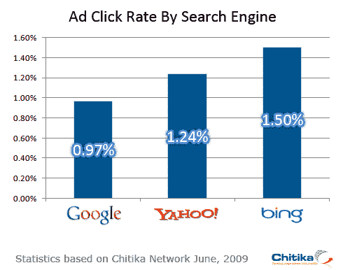

# 必应用户点击广告的可能性比谷歌用户高 50%吗？

> 原文：<https://web.archive.org/web/https://techcrunch.com/2009/07/24/are-bing-users-are-twice-as-likely-to-click-on-an-ad-than-google-users/>

# 必应用户点击广告的可能性比谷歌用户高 50%吗？

在必应上搜索的人比谷歌搜索者更商业化吗？根据搜索广告网络 [Chitika](https://web.archive.org/web/20221207202259/http://chitika.com/) 的一项研究，通过必应上的有机搜索结果到达网站的访问者点击广告的可能性比来自谷歌的访问者高 55%。

Chitika 研究了 7 月份一周内超过 5 万个网站的 3200 万次广告展示的点击率。必应的访问者平均点击广告的时间为 1.5%，而谷歌访问者的点击率为 0.97%，雅虎的点击率为 1.24%。

对这些数据的一种解读可能是，Bing 用户更容易受到广告的影响，事实上，可能是因为微软到处张贴的 Bing 广告，他们才开始使用 Bing。(有点让你想知道当广告预算消失后会发生什么)。

但一个更可能的解释是，谷歌代表了绝大部分的流量，准确地说是 83%。必应只代表了 8%。这里有一个大数定律在起作用。来自任何一个来源(如谷歌)的流量越多，点击率就可能越低。如果市场份额反过来，必应无疑会有更低的点击率。

但这仍然留下了一个问题，Bing 上的这些人到底是谁？

|  | **印象** | **点击** | **CTR** | **%更多点击量(Bing)** |
| **谷歌** | 26,929,367 | 260,518 | 0.97% | 55.11% |
| 雅虎 | 3,157,648 | 39,008 | 1.24% | 21.47% |
| **兵** | 2,236,366 | 33,558 | 1.50% |  |
|  |  |  |  |  |
| 总数 | 32,323,381 | 333,084 | 1.03% |  |