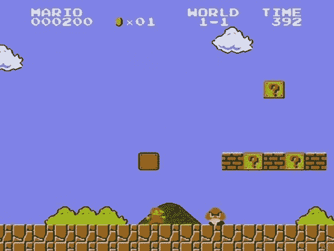

# 电子游戏是艺术吗？

> 原文：<https://web.archive.org/web/https://techcrunch.com/2010/04/19/are-video-games-art/>

我很犹豫写这个，因为，真的，*谁在乎*？我的意思完全不是消极的、愤世嫉俗的，而是实际的。显然，有些人喜欢玩电子游戏，正如有些人喜欢创作电子游戏一样。为什么这些人要关心一个 67 岁的老人[罗杰·伊伯特](https://web.archive.org/web/20230320210528/http://blogs.suntimes.com/ebert/2010/04/video_games_can_never_be_art.html)，他不知道魔兽世界*和塞尔达传说*的区别，如果你用大师之剑的钝端打碎他的脸，他是否“认可”他们的消遣或职业？**

 **艾伯特先生，我们不要忘记，电影并不总是被认为是艺术。电影怎么能像小说一样讲述一个故事呢？当然，电影只不过是对戏剧的拙劣模仿——当他们可以坐在离演员本人只有几英尺远的地方，观看现场直播时，谁会坐在屏幕前观看糟糕的录音呢？

后来，一旦电影强行进入主流文化，不是有一场关于严肃电影是否会有声音，或者是否会有色彩的辩论吗？(同样的争论正在 3D 电影上发生。)

所以，我们不要假装电影总是被神圣化了——或者它们被认为是艺术作品。

“艺术”到底是什么意思？它[最终通过拉丁语进入英语](https://web.archive.org/web/20230320210528/http://www.merriam-webster.com/dictionary/art)，意思是“手臂”也就是说，它仅仅是你(用你的手臂)做的事情。“很好的画，那一定是艺术。很好的诗，那一定是艺术。你雕刻的很好的椅子，一定是艺术。你写的很好的代码，一定是艺术。”

真正伟大的运动员不都算艺术家吗？难道像里奥·梅西或者 T21·勒布朗·詹姆斯这样的人做的事情不被认为是“艺术”吗？

更重要的是，为什么游戏玩家(以及制作游戏的人，想必他们也是游戏玩家)要担心当今一代的批评家是否认为他们的作品是艺术？再说一次，艾伯特先生是一位年长的绅士，可以说他在这场比赛中并没有真正的马。你给他看大雨，他看到的只是 T2 的加拉加。当*知道*世界是平的时，试图说服他世界是圆的是没有意义的。

我在里面混合了 800 个隐喻，我不在乎。

“游戏是艺术吗？”

是的，很明显，但是我们不应该觉得我们必须通过贴上一个方便的标签——艺术——去做我们喜欢做的事情来给任何人留下印象。

做好自己的事情，仅此而已。不要担心这个男人是否会认可你。

但我怀疑艾伯特只是在钓鱼。干得好，那么。**