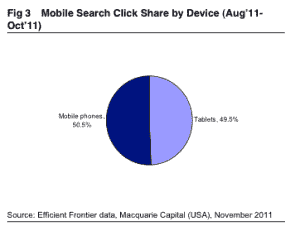

# 我们正处于移动搜索的拐点吗？

> 原文：<https://web.archive.org/web/http://techcrunch.com/2011/11/09/are-we-at-an-inflection-point-for-mobile-search/>

# 我们正处于移动搜索的拐点吗？

来自搜索营销平台 [Efficient Frontier](https://web.archive.org/web/20230203150452/http://www.efrontier.com/) 和[麦格理集团](https://web.archive.org/web/20230203150452/http://www.macquarie.com/mgl/com)股票分析师 Ben Schachter 的新数据表明，移动搜索广告正处于一个重要的转折点，可能会在明年起飞。据 Efficient Frontier 的客户表示，移动搜索目前占美国搜索广告收入的 6%。这是 2010 年的 2.7 倍。但到明年年底，预计移动搜索可能会占到总搜索广告支出的 16%至 22%。

如果移动搜索的增长率持续下去，这将是一个保守的预测，如果它加速，可能会接近 22%。Schachter 预计“随着越来越多带有完整互联网浏览器的移动设备进入市场，这一增长将在 2012 年及以后加速。”

另一个有启发性的数据点是，搜索广告的点击率在手机上实际上比在桌面上要高。手机点击率高出 66%，平板电脑高出 37%。这是有道理的，因为你只有在寻找合适的东西时才会在手机上搜索，所以你通常会有更高的购买或了解商业产品的意愿。或者也许我们只是更倾向于点击小屏幕上的链接。

尽管手机点击率更高，但平板电脑在搜索广告点击和支出中占据了不成比例的份额。平板电脑已经占到了移动搜索广告点击量的 50%，以及高效前沿公司客户搜索广告支出的 43%。平板电脑不占移动浏览设备市场的 50%(如果你算上所有智能手机和平板电脑的话)，但它们有望获得搜索广告支出的最大份额。在一些垂直行业，比如零售业，平板搜索广告已经占到了所有移动搜索支出的 77%。