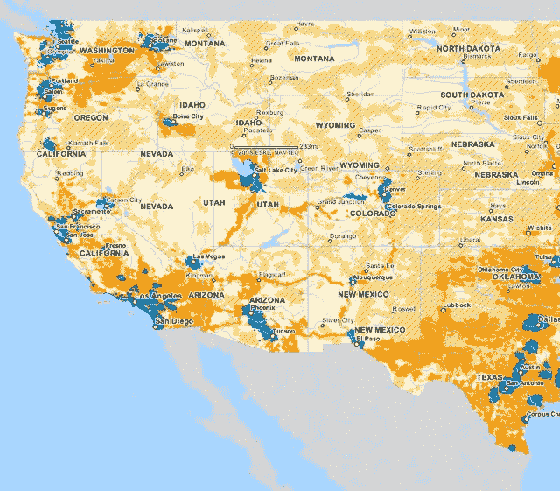

# 你在美国电话电报公司 3G 覆盖区吗？

> 原文：<https://web.archive.org/web/http://techcrunch.com/2008/07/10/are-you-in-an-att-3g-coverage-area/>

 
东海岸是最佳海岸

David Pogue 在[中提到他对那款设备](https://web.archive.org/web/20230307051723/http://www.crunchgear.com/2008/07/08/baig-mossberg-and-pogue-review-the-iphone-we-sit-quietly-weeping/)的评论说[在美国的 3G 覆盖](https://web.archive.org/web/20230307051723/http://www.wireless.att.com/coverageviewer/)仍然有点不稳定。这张方便的地图——蓝色显示了哪里有 3G 覆盖——准确显示了哪里可以使用高速网络。正如你所料，大多数大城市都被覆盖了。

不过，那些住在阿拉斯加、爱荷华、缅因、蒙大拿、内布拉斯加、新墨西哥、北达科他、南达科他、佛蒙特和怀俄明的人现在可以忘掉 3G 了。美国电话电报公司甚至没有在这些州的任何一个城市提供 3G 服务。

请记住，美国电话电报公司说它每天都在扩大 3G 的覆盖范围，所以目前没有 3G 的地方不会永远没有 3G。

我现在在纽约州的达奇斯县，这里肯定没有 3G 覆盖，我们距离纽约市北部只有 70 英里。那么，为什么会有人在这里排队等待那个设备，而它只提供 GPS 作为一个新功能呢？众所周知，真正的热门是新的固件和[应用商店](https://web.archive.org/web/20230307051723/http://www.crunchgear.com/2008/07/10/dont-want-to-break-the-moratorium-but-techcrunch-has-a-video-about-some-sort-of-app-store/)，可以在该设备的原始版本上使用(以及 10 美元的 iPod touch)。

现在我把问题抛给你们:你们被高速 3G 的温暖覆盖了吗？如果不是，你还会在明天早上 8 点起床吗？

via [硅巷内幕](https://web.archive.org/web/20230307051723/http://www.alleyinsider.com/2008/7/apple-iphone-att-3g-dead-zones)