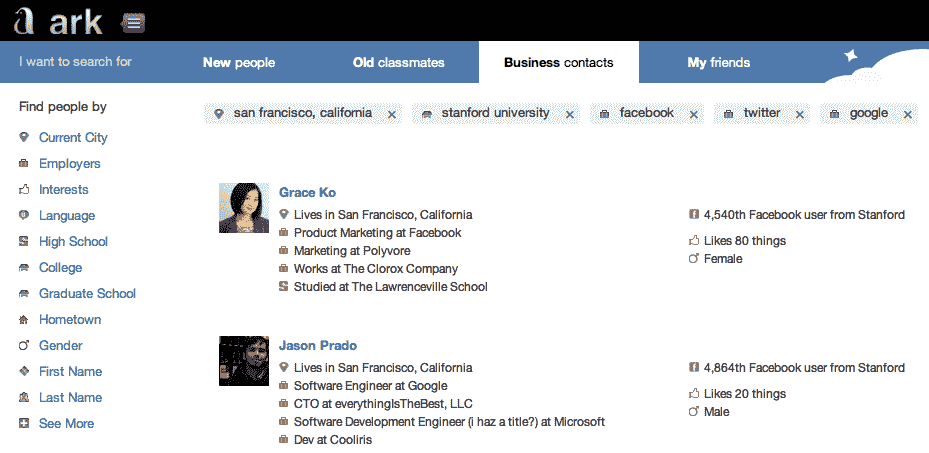
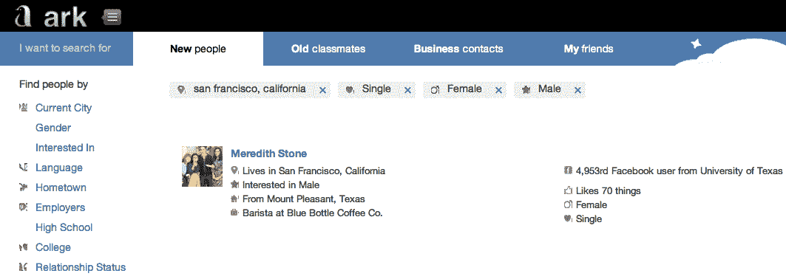

# 用 YC 的方舟人物搜索找到你在谷歌或脸书找不到的人

> 原文：<https://web.archive.org/web/https://techcrunch.com/2012/03/25/ark-people-search/>

谷歌和脸书不能帮你找到你的哪些朋友是单身，或者住在纽约，喜欢电台司令，但是 [Ark](https://web.archive.org/web/20230222195804/http://ark.com/) 可以。今天， [Y Combinator](https://web.archive.org/web/20230222195804/http://www.ycombinator.com/) 支持的[Ark.com](https://web.archive.org/web/20230222195804/http://ark.com/)进入私人测试阶段，希望成为网络上最好的人类搜索网站。通过各种可分层的过滤器，Ark 可以让你在脸书、谷歌、LinkedIn 和其他网络上搜索你朋友的公开资料和私人数据。它还有过滤功能，可以很容易地发现老同学和新的业务联系人。

Ark 可以让搜索远离谷歌和脸书，扰乱像 Classmates.com 这样的专门网站，给我们一个比广播“我知道谁在做这个”更好的寻人方式 TechCrunch 的读者可以通过下面的说明提前获得测试版。

乍一看，脸书和谷歌在人民搜索方面如此失败，这似乎是绝对荒谬的，但这归结于政治。两者都不会轻易给对方或他们的竞争对手发送流量。谷歌的 Search Plus Your World 显示出它乐于支持 Google+列表，脸书不想悄悄帮你结识新朋友，也不想让它的服务过于复杂。相关人员搜索结果可以来自任何网络，通过不将它们浮出水面，科技巨头为像 Ark 这样的初创公司铺平了道路。

Ark 给了你一系列过滤器来减少网络人口，而不是先输入某人的名字。这些选项远远超出了脸书标准的当前城市、家乡、雇主和教育。此外，性别、关系状况和性偏好也会影响约会搜索；音乐、电影等一般兴趣和特定类别寻找活动伙伴；通过电子邮件、电话和名字搜索联系信息，重新联系你见过的人。过滤器可以堆叠起来，以便锁定某个特定的人。

每个搜索结果都显示了大量信息，所以你不必挖掘每个结果来找到合适的人。只需再点击一下，Ark 上来自脸书、Google+、LinkedIn、Foursquare、Myspace、Orkut、Meetup、Vkontakte 和任人的所有兴趣和其他数据就会展现出来。

Ark 在其索引的网络上坚持隐私设置，所以你只能看到公共数据，直到你与脸书连接，然后捆绑你可以访问的私人数据。找到你要找的人后，你可以查看他们的公开照片，点击查看他们在脸书或其他网络上的个人资料，或者将他们保存在 Ark 上，以后再连接。当然还有一个移动界面。

在尝试了[几个其他想法](https://web.archive.org/web/20230222195804/http://ark.com/fund/)之后，Ark 的创始人帕特里克·莱利和刘一鸣告诉我“我们想象如果谷歌和脸书不打仗，他们会一起建设什么。有人需要成为瑞士，在所有社交网络的基础上建立一个搜索引擎，为寻找彼此的人们彻底改造。”这家两人公司正在进行一轮 25 万美元的种子投资，投资方分别是 [Y Combinator](https://web.archive.org/web/20230222195804/http://www.crunchbase.com/company/y-combinator) 、[尤里·米尔纳](https://web.archive.org/web/20230222195804/http://www.crunchbase.com/person/yuri-milner)、 [SV Angel](https://web.archive.org/web/20230222195804/http://www.crunchbase.com/financial-organization/sv-angel) 和[安德森·霍洛维茨](https://web.archive.org/web/20230222195804/http://www.crunchbase.com/financial-organization/andreessen-horowitz)。

赖利告诉我，除了像 Rapleaf 这样的数据抓取器，他在专门的人员搜索方面几乎没有看到竞争。虽然它只是为了找到人，但它把与他们联系的事情留给了你，Ark 可能会破坏为寻找老校友或当地单身人士而设计的臃肿、笨拙和昂贵的网站。Ark 仍然需要提高在用户注册后处理数据的速度，斯巴达式的设计可能需要一些改进，但这项服务对于刚刚脱离 alpha 的用户来说还是不错的。

虽然它可能永远不会像 Ark 一样跨网络或培养新的联系，但我仍然认为这家初创公司最大的威胁来自脸书改进其内部搜索工具。但考虑到对人才收购的偏好，以及赖利和刘是柏克莱大学信息检索专业的博士生，方舟公司可能会成为收购目标。目前，Ark 将所有渴望免费的公共信息整合起来，以满足消费者的需求。人肉搜索不再中断了。

*在[Ark.com](https://web.archive.org/web/20230222195804/http://ark.com/)注册并向[techcrunch@ark.com](https://web.archive.org/web/20230222195804/mailto:techcrunch@ark.com)发送空白邮件的前 500 名 TechCrunch 读者将在未来几天内加入测试版。这里有一些有趣且有用的人物搜索，你可以试试:*

*   你目前所在的城市+活动:篮球=可以一起投篮的人
*   我的朋友标签+关系状态:单身+你感兴趣的性别+对你的性别感兴趣的人=你已经成为朋友的潜在约会对象
*   你正在游览的城市+喜欢在那里演出的乐队的人=可以一起去听音乐会的人
*   为 TechCrunch、VentureBeat 或 GigaOm =向其推销你的创业公司的人工作
*   我的朋友标签+生日:在四月=你应该得到礼物的朋友
*   住在柏林+在你的大学或高中学习+会说英语和德语=有人在你出差时帮你练习说德语
*   名字艾米丽+三月生日+在 NYU 学习=你昨晚在酒吧她的生日派对上遇到的那个可笑的纽约女孩
*   在谷歌、脸书或苹果工作，住在三藩市=你可以雇佣的聪明人，因为他们讨厌通勤