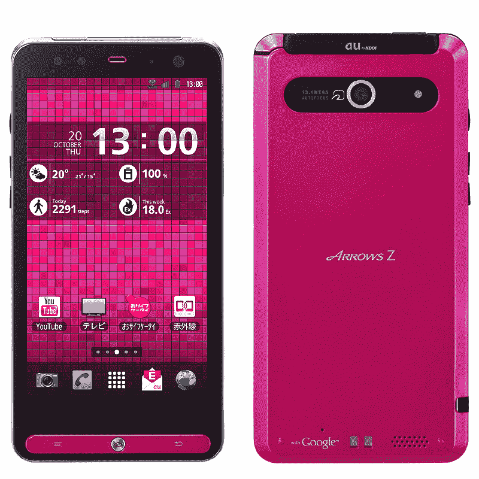
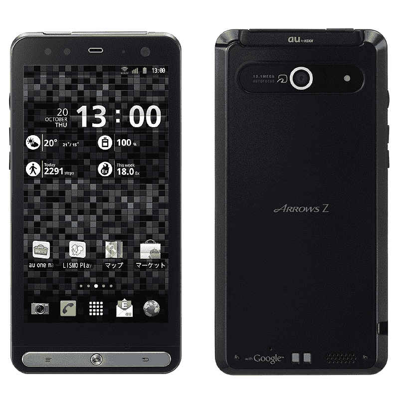

# ARROWS Z:富士通-东芝推出带 Wimax、1300 万像素摄像头的防水安卓手机 

> 原文：<https://web.archive.org/web/http://techcrunch.com/2011/09/26/arrows-z-fujitsu-toshiba-outs-waterproof-android-phone-with-wimax-13mp-camera/>

# 箭头 Z:富士通-东芝 Outs 防水安卓手机，带 Wimax，1300 万像素摄像头

日本五大手机制造商*真正开始向美国和其他地区运送智能手机可能还需要几个月的时间，但在日本本土市场，所有迹象都指向安卓的未来。*

 *例如，日本第二大运营商 KDDI au，[今天为其冬季阵容推出了总共六款新的 Android 手机，富士通-东芝移动的 ARROWS Z ISW11F 可能是最有趣的型号。](https://web.archive.org/web/20230203153046/http://www.kddi.com/corporate/news_release/2011/0926f/)

该设备具有以下特性:

*   安卓 2.3.5
*   分辨率为 1，280×720 的 4.3 英寸液晶显示屏
*   全球微波接入互操作性（World Interoperability for Microwave Access）
*   Wi-fi IEEE802.11b/g/n(可以共享)
*   防水车身
*   1300 万像素 CMOS 摄像头( [Exmor R for mobile](https://web.archive.org/web/20230203153046/http://www.sonyericsson.com/product/xperiaarc/video/exmorr/) ，ISO25600)
*   130 万像素副摄像头
*   1080p 视频录制
*   双核 TI OMAP4430 CPU (1.2GHz)
*   1GB 内存
*   8GB 只读存储器
*   HDMI 接口，microSDHC 卡插槽(最大 32GB。)，microUSB 端口
*   蓝牙 2.1+EDR
*   红外线的
*   电子钱包功能
*   数字电视调谐器
*   GSM、CDMA
*   尺寸:64×128×10.1 毫米，重量:131 克

KDDI 计划在 11 月开始向日本用户提供 ARROWS Z ISW11F。*