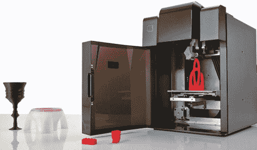

# 随着硬件初创公司的起飞，材料和技术市场 Inventables 筹集了 300 万美元 

> 原文：<https://web.archive.org/web/https://techcrunch.com/2013/06/16/as-hardware-startups-take-off-materials-and-technology-marketplace-inventables-raises-3m/>

# 随着硬件创业公司的起飞，材料和技术市场 Inventables 筹集了 300 万美元

总部位于芝加哥的 Inventables 是一个为开发者和设计师提供技术和材料的市场，已经筹集了 300 万美元的新资金，由 Tim Draper(通过 Draper Associates)牵头，Dundee Venture Capital、Richard Yoo(Rackspace 的创始人)、Georges Harik 和 True Ventures 参与其中。这使得 Inventables 的资金总额达到 500 万美元。

Inventables [于 2010 年推出](https://web.archive.org/web/20221209021344/https://beta.techcrunch.com/2010/01/27/technology-and-material-marketplace-inventables-scores-2-million-from-true-ventures/)，作为软件、硬件和材料的市场，供制造商、设计师和制造商创建原型和小批量生产。本质上，Inventables 销售许多硬件开发商或制造商制造产品所需的零件、机器和材料。

该市场本身与任何其他购物网站相似，你可以在网上购买供应品，几天内就会发货给你。但是 Inventables 增加了一些对制造商友好的功能。例如，在一个产品的页面上，你会看到其他设计师用这种材料做了什么，或者他们如何用它来开发产品。您还会看到发布的关于该产品的问题(和答案)。

此外，Inventables 还开发和销售自己的产品，包括一台名为 Shapeoko 的数控铣床，制表商用它来设计和制造皮革和木制手表。这种机器允许顾客在电脑上数字化地创造产品，然后将它们下载到一台数字化制造机器上，在那里进行实际的生产和制造。Inventables 还拥有最大的丙烯酸板选择之一。随着 3D 打印的起飞，Inventables 销售 3D 打印机(包括 Makerbot)，并为这些打印机提供 24 种颜色的灯丝选择。

正如创始人兼首席执行官扎克·卡普兰解释的那样，Inventables 正在帮助新一代个人和公司制造和销售自己的产品，而无需外包生产。随着我们看到更多的硬件初创公司进入市场，Inventables 已经成为购买构建这些产品所需组件的目的地。

当然，卡普兰承认这是一个竞争激烈的市场，发明家将与亚马逊供应商正面交锋。但他认为 Inventables 可以通过其设计师、制造商和企业家群体脱颖而出。围绕 Inventables 提供的一些产品和功能，已经有了一个热情的社区，该公司甚至开源了铣床背后的软件和硬件。

Inventables 将利用新投资的一部分在芝加哥扩建一个 25，000 平方英尺的新工厂，产品开发、工程和分销将集中在这里。卡普兰正在雇佣一个更大的工程团队来开发额外的专有软件和硬件。